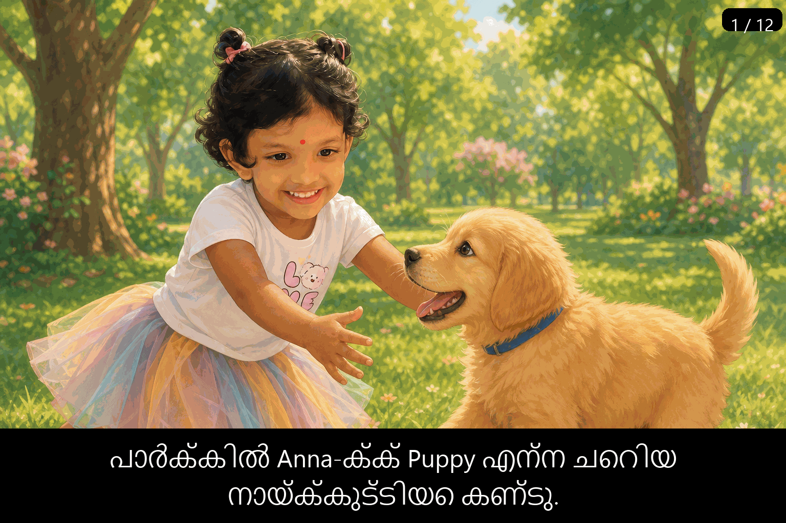

# Anna and Puppy at the Park

## On this page

- [The story](#the-story)
- [Watch the animation](#watch-the-animation)
- [Malayalam captions](#malayalam-captions)
- [Gallery](#gallery)

One sunny morning, little **Anna** put on her colorful tutu and her white **LOVE** shirt. Mummy said, “Today we are going to the park!”

At the park, Anna saw a friendly golden puppy named **Puppy**. Puppy wagged his tail and trotted over. Anna knelt on the soft grass and gently patted his head. Puppy liked that very much.

Anna found a small red ball. She held it up, took aim, and threw it high across the grass. The ball flew through the air. Puppy ran fast, jumped, and caught it in his mouth. Then he trotted back to Anna. Anna clapped her hands and laughed.

Anna threw the ball again. Puppy chased it, picked it up from the grass, and brought it back. They sat together on the lawn, happy and tired. When it was time to go home, Anna waved goodbye. Puppy watched from the gate until she was out of sight.

## Watch the animation

Each slide shows a **slide number** (top right) and a **Malayalam caption** (bottom). The full loop has **12 slides**, **10 seconds** each.

- [Open the animated GIF](./assets/anna_park_playing_with_dog.gif)
- [See Anna’s original photo](./assets/anna_original.png)

## Malayalam captions

| Slide | Caption |
|-------|---------|
| 1 / 12 | പാർക്കിൽ Anna-ക്ക് Puppy എന്ന ചെറിയ നായ്ക്കുട്ടിയെ കണ്ടു. |
| 2 / 12 | Anna Puppy-യെ സ്നേഹത്തോടെ തലോടിച്ചു. |
| 3 / 12 | Anna ചുവന്ന പന്ത് കയ്യിൽ പിടിച്ച് എറിയാൻ തയ്യാറായി. |
| 4 / 12 | Anna പന്ത് ഉയർത്തി എറിഞ്ഞു; അത് അകലേക്ക് പോയി. |
| 5 / 12 | Puppy ഓടിവന്ന് പന്ത് വായിൽ പിടിച്ചു. |
| 6 / 12 | Puppy പന്തുമായി Anna-യുടെ അടുത്തേക്ക് വന്നു. |
| 7 / 12 | Anna സന്തോഷത്തോടെ കൈയടിച്ചു; Puppy-യും സന്തോഷിച്ചു! |
| 8 / 12 | Anna വീണ്ടും പന്ത് എറിഞ്ഞു. |
| 9 / 12 | Puppy വേഗത്തിൽ പന്തിന്റെ പുറകെ ഓടി. |
| 10 / 12 | Puppy പുല്ലിൽ നിന്ന് പന്ത് വായിൽ എടുത്തു. |
| 11 / 12 | Anna-യും Puppy-യും പുല്ലിൽ ഒരുമിച്ച് ഇരുന്നു. |
| 12 / 12 | Anna വീട്ടിലേക്ക് പോകുമ്പോൾ Puppy-യോട് വിട പറഞ്ഞു. |

## Gallery

| Moment | Slide |
|--------|-------|
| Meeting Puppy | [Slide 1](./assets/anna_park_slide01.png) |
| A gentle pat | [Slide 2](./assets/anna_park_slide02.png) |
| Ready to throw | [Slide 3](./assets/anna_park_slide03.png) |
| Throwing the ball | [Slide 4](./assets/anna_park_slide04.png) |
| Puppy catches the ball | [Slide 5](./assets/anna_park_slide05.png) |
| Puppy brings it back | [Slide 6](./assets/anna_park_slide06.png) |
| Happy claps | [Slide 7](./assets/anna_park_slide07.png) |
| Throwing again | [Slide 8](./assets/anna_park_slide08.png) |
| Puppy chases the ball | [Slide 9](./assets/anna_park_slide09.png) |
| Puppy picks up the ball | [Slide 10](./assets/anna_park_slide10.png) |
| Sitting together | [Slide 11](./assets/anna_park_slide11.png) |
| Goodbye | [Slide 12](./assets/anna_park_slide12.png) |

    <a href="../README.md">Home</a>

