# Anna and Puppy at the Park

ഒരു വൈകുന്നേരം പാർക്കിലൂടെ നടക്കുമ്പോഴാണ് ആ കുഞ്ഞു നായ്ക്കുട്ടിയെ അന്നമോൾ കാണുന്നത്; സ്നേഹത്തോടെ അവൾ അതിനെ 'പപ്പി' എന്ന് വിളിച്ചു.

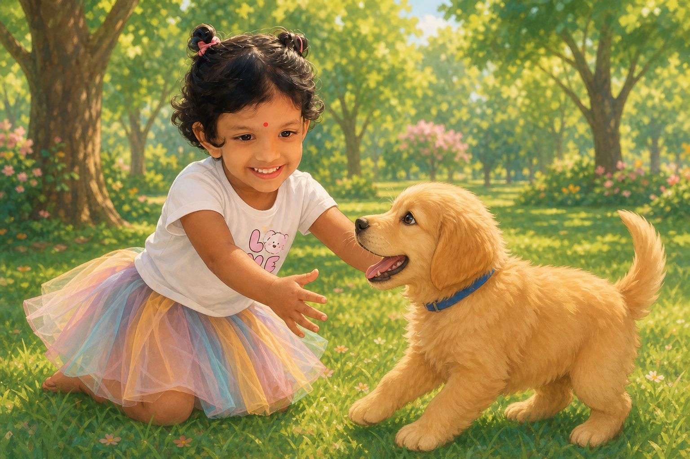

അന്നമോൾ പപ്പി-യെ സ്നേഹത്തോടെ തലോടി.

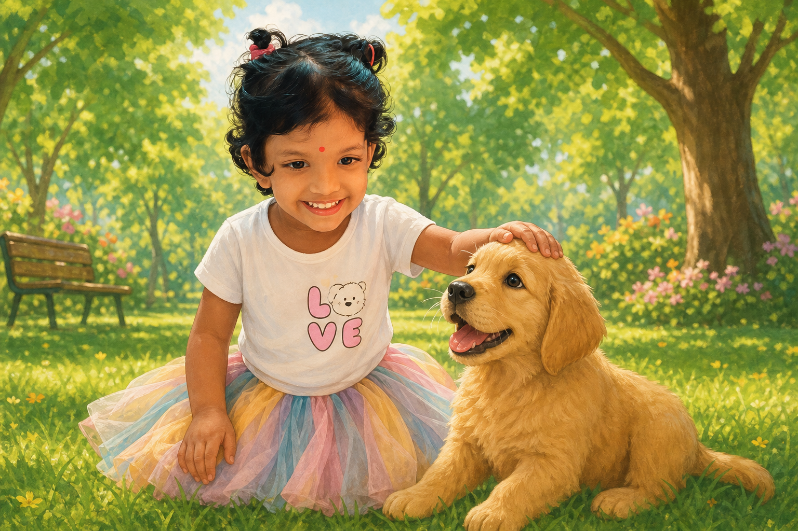

അവളുടെ കയ്യിൽ ഒരു പന്തുണ്ടായിരുന്നു. അത് അവൾ എടുത്തു കൊണ്ടു വന്നു. ആ ചുവന്ന പന്ത് ദൂരേക്ക് എറിയാനായി അന്നമോൾ തയ്യാറായി നിന്നു.

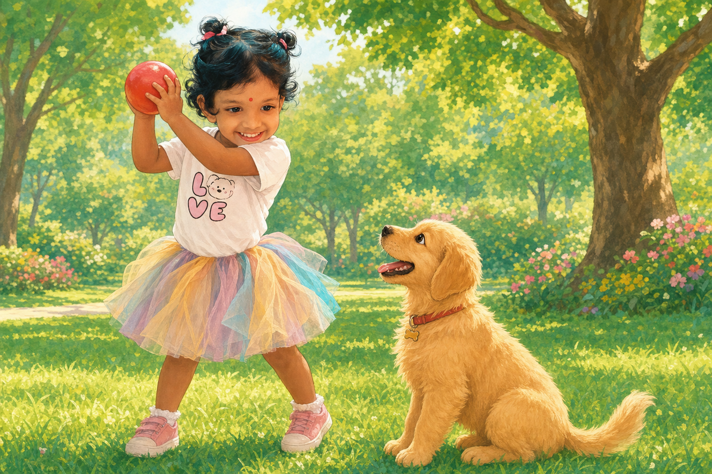

എന്നിട്ട്, അവൾ ആ പന്ത് ഒറ്റ ഏറ് വച്ചു കൊടുത്തു!; അത് അകലേക്ക് പോയി.

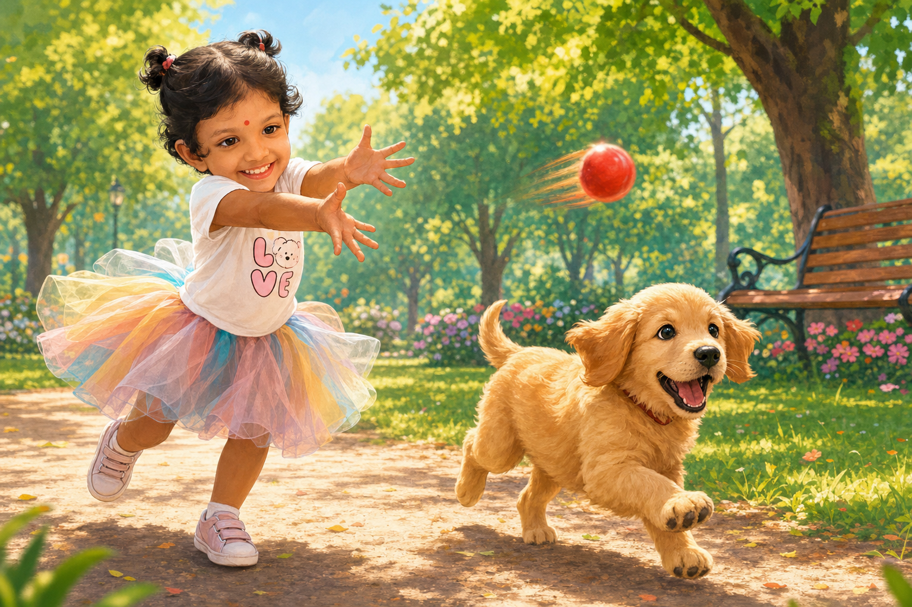

പന്ത് ഉയർന്നതും പപ്പി അതിനു പുറകെ ഒറ്റ ഓട്ടം! ഓടിച്ചെന്ന് ആ പന്ത് കടിച്ചുപിടിച്ച്, സന്തോഷത്തോടെ അത് അന്നമോളുടെ അടുത്തേക്ക് തന്നെ തിരിഞ്ഞോടി വന്നു.

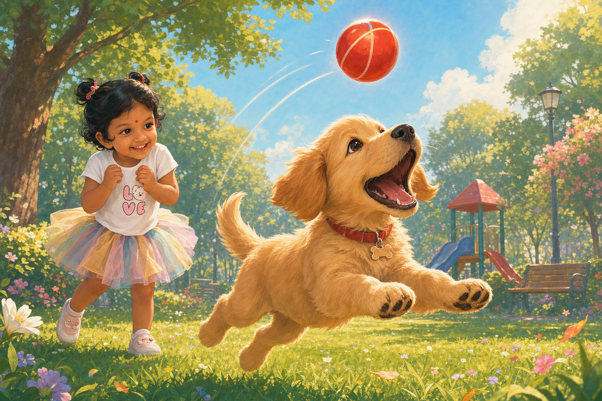

അന്നമോൾ കൊഞ്ചലോടെ പപ്പിയോട് പറഞ്ഞു: 'എനിക്ക് പന്ത് താ... പപ്പീ, ആ പന്ത് ഇങ്ങു താ...

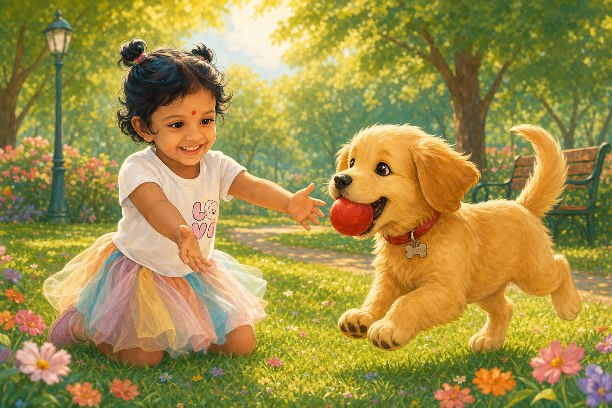

അന്നമോൾക്ക് സന്തോഷം സഹിക്കാനായില്ല; അവൾ ആവേശത്തോടെ കൈയടിച്ചു! അത് കണ്ട് പപ്പിയും തുള്ളിച്ചാടി.

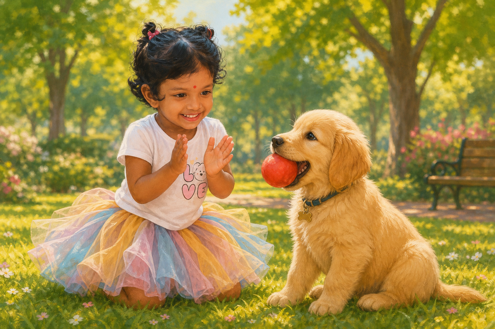

അന്നമോൾ വീണ്ടും ആ ചുവന്ന പന്ത് ദൂരേക്ക് എറിഞ്ഞു കൊടുത്തു! വേഗം പോയി അത് എടുത്തു കൊണ്ടുവരൂ പപ്പീ...' എന്ന് അന്നമോൾ ഉറക്കെ വിളിച്ചു പറഞ്ഞു.

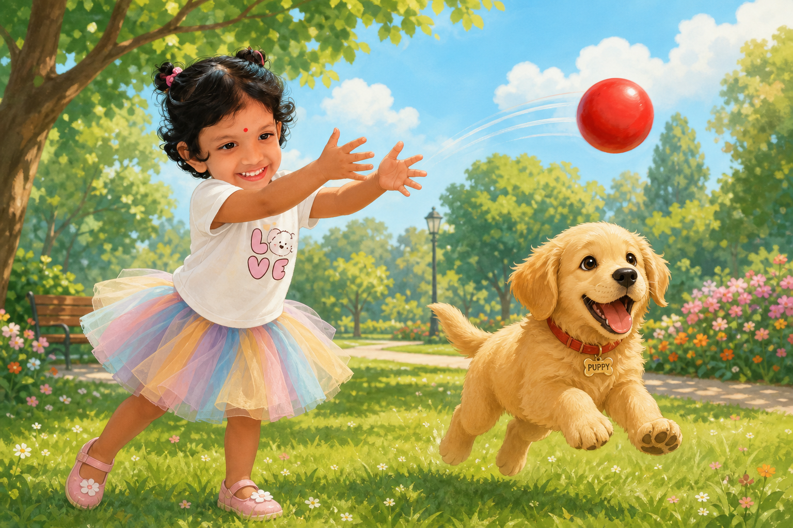

അത് കേട്ടതും പപ്പി പന്തിന് പിന്നാലെ പാഞ്ഞു!

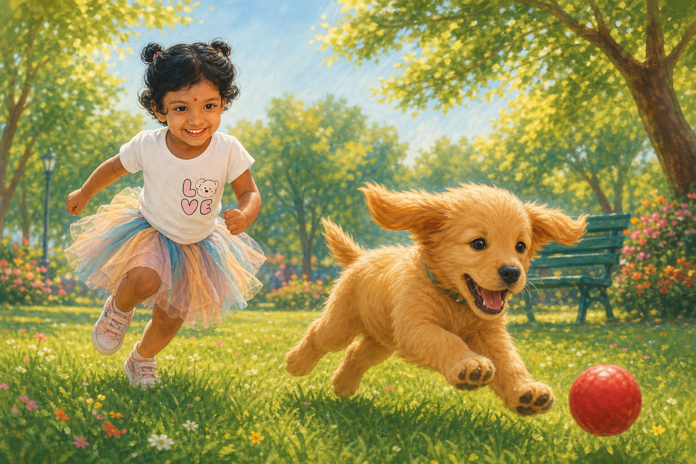

പന്ത് പുല്ലിൽ വീണതും പപ്പി അതിനു മുകളിലേക്ക് ഒറ്റ വീഴ്ചയായിരുന്നു! എന്നിട്ട്, തക്കാളി തിന്നുന്ന പോലെ ആ ചുവന്ന പന്ത് കടിച്ചു പിടിച്ച് പന്തുമായി വീണ്ടും അന്നമോളുടെ അടുത്തേക്ക് കുസൃതിയോടെ ഓടിവന്നു.

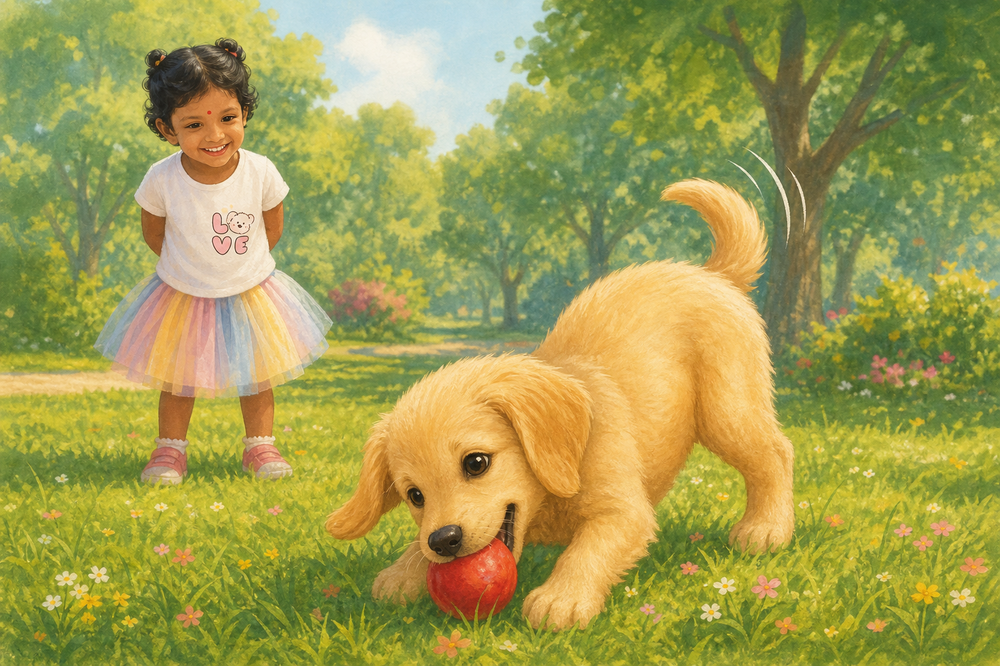

ക്ഷീണിച്ച അന്നമോളും പപ്പിയും ഒടുവിൽ പച്ചപ്പുല്ലിൽ പരസ്പരം ചാരി ഒപ്പമിരുന്നു!

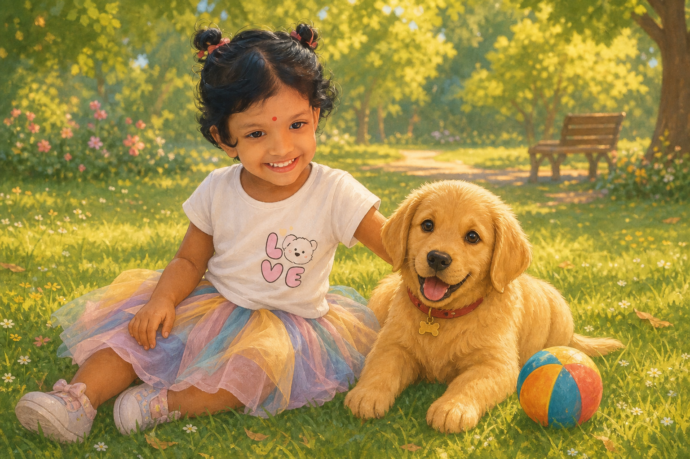

സൂര്യൻ അസ്തമിക്കാറായപ്പോൾ അന്നമോൾക്ക് വീട്ടിലേക്ക് പോകാൻ സമയമായി. സ്നേഹത്തോടെ പപ്പിയെ കെട്ടിപ്പിടിച്ച്, 'നാളെ നമുക്ക് വീണ്ടും കാണാം പപ്പീ...' എന്ന് പറഞ്ഞ് അവൾ വിട പറഞ്ഞു; പപ്പിയാകട്ടെ, സന്തോഷത്തോടെ വാലാട്ടി യാത്രയയക്കുകയും ചെയ്തു!

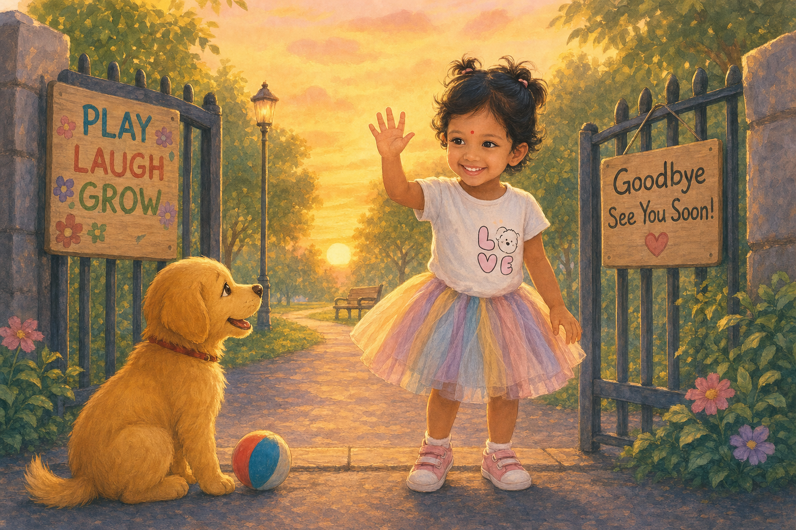
