# Anna and the Funny Zoo Day

ഒരു ദിവസം അമ്മ അന്നമോളോട് പറഞ്ഞു, "മോളേ, നാളെ നമുക്ക് മൃഗശാലയിൽ പോകാം!" അത് കേട്ടതും അന്നമോൾക്ക് സന്തോഷം കൊണ്ട് ഇരിക്കപ്പൊറുതിയില്ലാതായി; നാളത്തെ ദിവസം എന്നാവും എന്നോർത്ത് അവൾ ആകാംക്ഷയോടെ കാത്തിരുന്നു.

അടുത്ത ദിവസം രാവിലെ ഉറക്കമുണർന്നപ്പോൾത്തന്നെ, "അമ്മേ, നമ്മൾ ഇന്ന് മൃഗശാലയിൽ പോവുകയല്ലേ!" എന്ന് പറഞ്ഞ് അന്നമോൾ കിടക്കയിൽ നിന്ന് സന്തോഷത്തോടെ തുള്ളിച്ചാടി.

അങ്ങനെ അമ്മയും അച്ഛനും അന്നമോളും ചേർന്ന് പ്രഭാതഭക്ഷണമെല്ലാം കഴിച്ച് മൃഗശാലയിലേക്ക് പുറപ്പെട്ടു. മൃഗശാലയുടെ കവാടത്തിൽ വലിയ അക്ഷരങ്ങളിൽ 'ZOO' എന്ന് എഴുതിയ ബോർഡ് കണ്ടപ്പോൾ, സന്തോഷം കൊണ്ട് അന്നമോളുടെ കണ്ണുകൾ തിളങ്ങി!

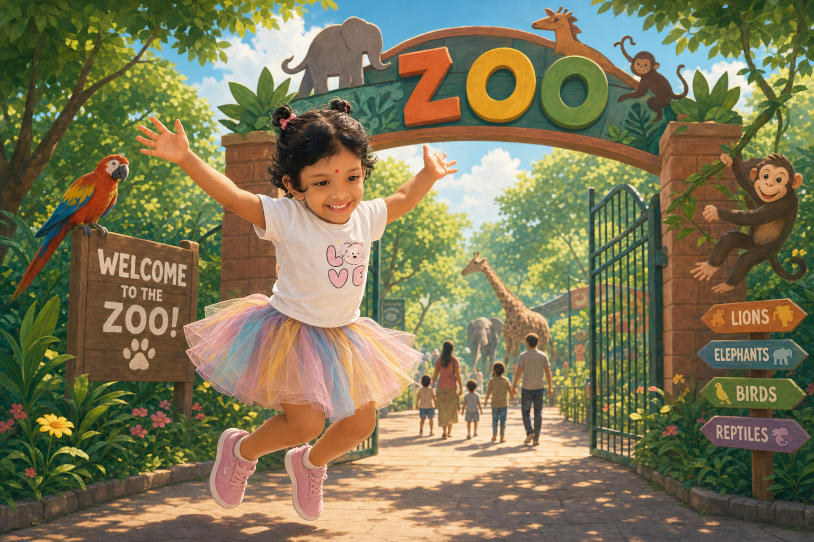

അയ്യോ! ഇതെന്താ ആകാശത്തേക്ക് നീളുന്ന ഒരു തെങ്ങോ?" എന്ന് അന്നമോൾ അത്ഭുതത്തോടെ ചോദിച്ചു — പക്ഷേ അത് ജിറാഫാണെന്ന് മനസ്സിലായപ്പോൾ അവൾ "ഹാ... ഹാ... ഹാ..." എന്ന് ഉറക്കെ ചിരിച്ചു

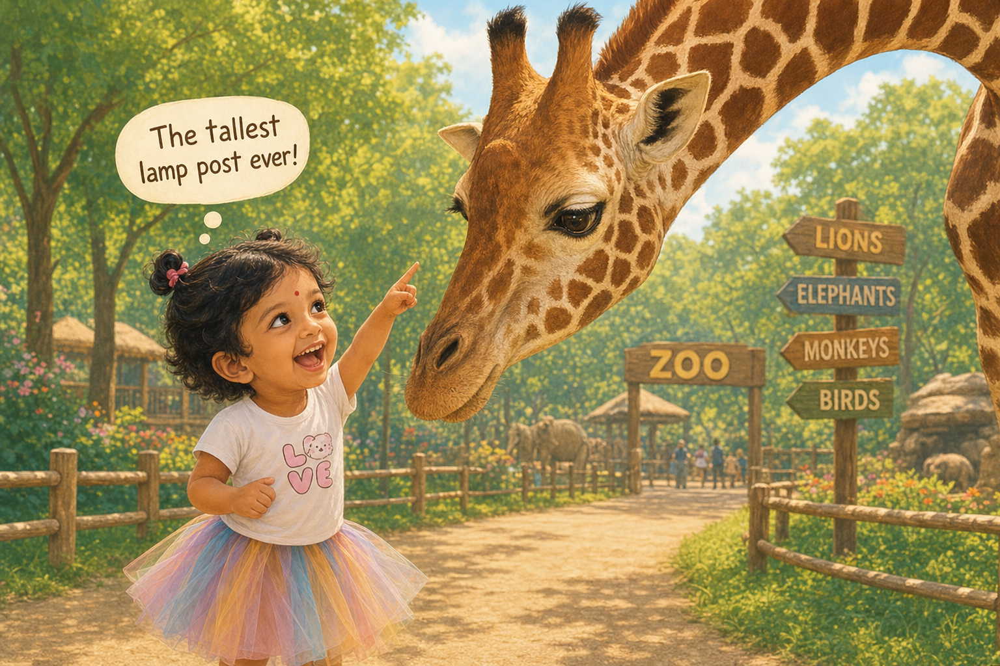

കുരങ്ങന്മാരുടെ കൂട്ടിനടുത്തേക്ക് ചെന്നപ്പോൾ, ഒരു കുരങ്ങൻ അന്നമോളെ നോക്കി നാവ് പുറത്തേക്കിട്ട് കോന്തല കാണിച്ചു. "ഓ... നീ മുഖം വളച്ചാൽ ഞാനും വളയ്ക്കും!" എന്ന് പറഞ്ഞ് അന്നമോളും അതേപോലെ കോന്തല കാണിച്ചു; അത് കണ്ടുനിന്ന അമ്മയ്ക്കും മറ്റുള്ളവർക്കും ചിരി അടക്കാനായില്ല.

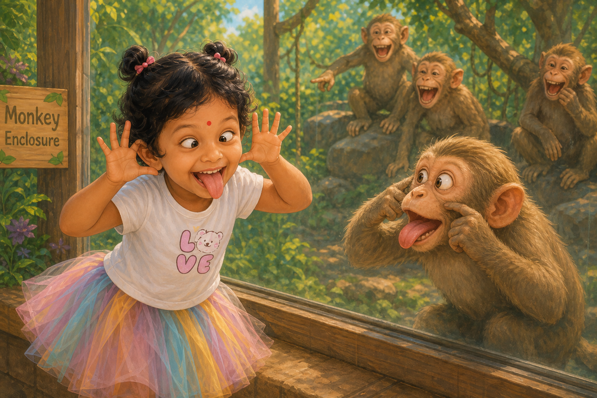

ആനക്കുട്ടി തുമ്പിക്കൈയിൽ വെള്ളമെടുത്ത് ചുറ്റും തെറിപ്പിച്ചു! അന്നമോൾ പെട്ടെന്ന് തന്നെ തന്റെ ചെറിയ കുട തുറന്നുപിടിച്ചെങ്കിലും, കുട തലയ്ക്ക് താഴെയായിപ്പോയി! "അയ്യോ... ഞാൻ കുട പിടിച്ചതാണല്ലോ, പിന്നെങ്ങിനാ നനഞ്ഞത്!" എന്ന് പറഞ്ഞ് അവൾ പൊട്ടിച്ചിരിച്ചു.

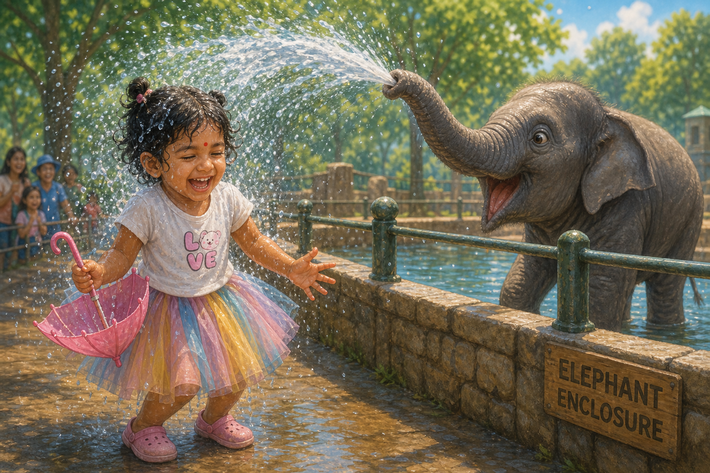

പെൻഗ്വിനുകളുടെ അടുത്തെത്തിയപ്പോൾ അന്നമോൾ കൈകൾ രണ്ടും ശരീരത്തോട് ചേർത്തുവെച്ച് പെൻഗ്വിനുകളെപ്പോലെ ആടി ആടി നടന്നു. അത് കണ്ട ഒരു പെൻഗ്വിൻ തല ചരിച്ചുനോക്കി: "ആഹാ... ഈ കുട്ടി നമ്മടെ സ്കൂളിൽ പഠിക്കുന്നതാണോ?" എന്ന് ചോദിക്കുന്നതുപോലെ ഉണ്ടായിരുന്നു ആ നോട്ടം!

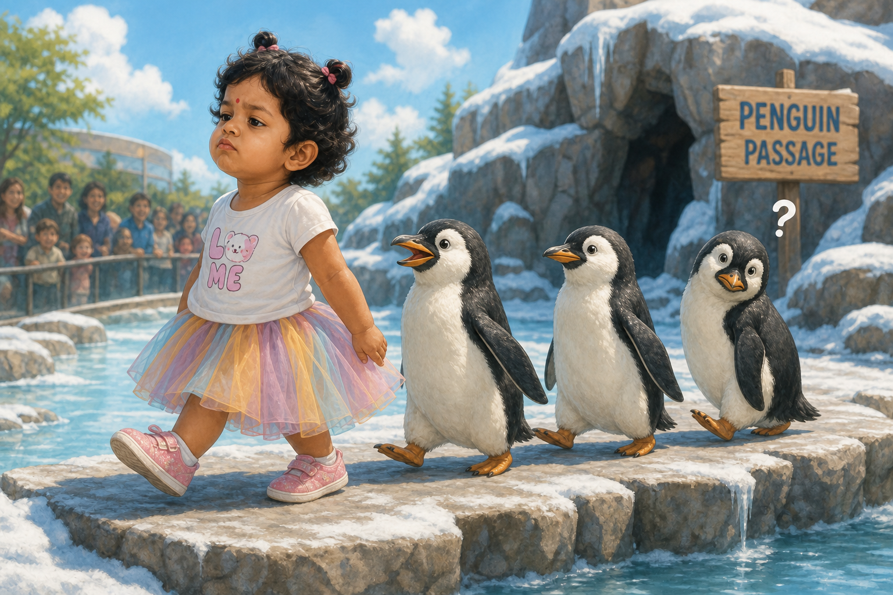

സിംഹത്തിന്റെ കൂട്ടിലെത്തിയപ്പോൾ അന്നമോൾ കൈകൾ രണ്ടും തലയ്ക്ക് മുകളിൽ വെച്ച്, ഉള്ള ശക്തിയൊക്കെ എടുത്ത് "റോർ...!" എന്ന് ഗർജ്ജിച്ചു. ഗ്ലാസിന് പിന്നിലിരുന്ന സിംഹം പോലും ഒരു നിമിഷം ഞെട്ടിപ്പോയി! "അയ്യോ! ഈ കുഞ്ഞുസിംഹത്തിന് ഇത്രയും ശക്തിയോ?" എന്ന് അത് ആലോചിച്ചു കാണും!

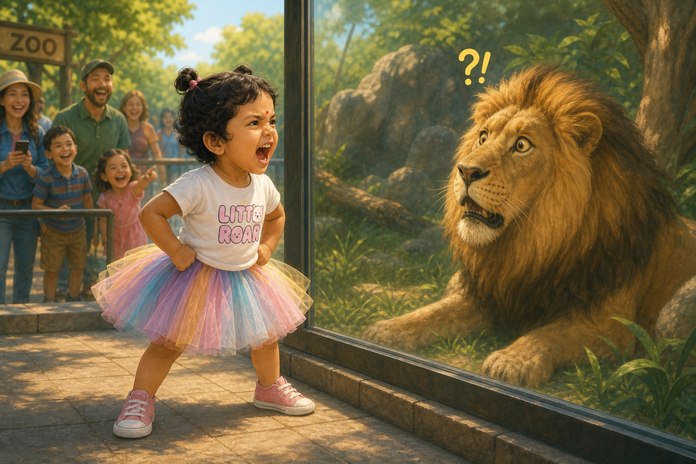

പച്ചത്തത്തയോട് അന്നമോൾ കൊഞ്ചിക്കൊണ്ട് "നമസ്കാരം!" എന്ന് പറഞ്ഞു. പക്ഷേ അത്ഭുതം! ആ തത്തയും തിരിച്ചും അതേ ശബ്ദത്തിൽ "നമസ്കാരം!" എന്ന് പറഞ്ഞു! "അയ്യോ, ഞാൻ പറഞ്ഞത് ഇതെങ്ങനെ പഠിച്ചു!" എന്ന് പറഞ്ഞ് അന്നമോൾ വായ പൊത്തി അത്ഭുതപ്പെട്ടു.

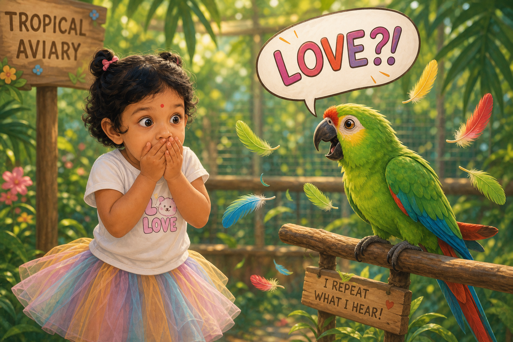

വെള്ളക്കെട്ടിൽ കിടന്ന ഹിപ്പോത്താമസ് പെട്ടെന്ന് തലയുയർത്തി ഒരു വലിയ "പ്ലാഷ്!" ശബ്ദത്തോടെ വെള്ളത്തിലേക്ക് വീണു. "വാവ്! എന്തൊരു വലിയ കുളിയാണിത്!" എന്ന് പറഞ്ഞ് അന്നമോൾ കൈയടിച്ചു; അവൾ തുള്ളിച്ചാടിയപ്പോൾ അവളുടെ പാവാടയും വെള്ളത്തുള്ളികളും ഒരുമിച്ച് വായുവിൽ പറന്നു!

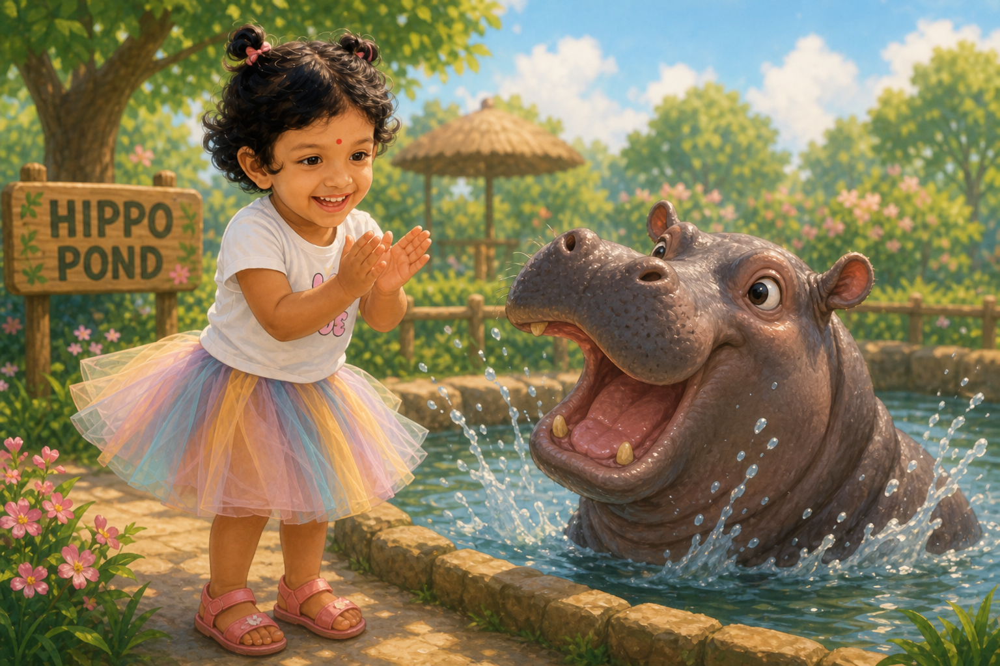

രണ്ട് സീബ്രകൾ ഒരേപോലെ അടുത്തുരുമ്മി നിൽക്കുന്നുണ്ടായിരുന്നു. അന്നമോൾ വിരൽ ചൂണ്ടി എണ്ണിനോക്കി: "ഒന്ന്... രണ്ട്... ഹേയ്, ഇതിൽ ഏതാണ് ഒന്ന്, ഏതാണ് രണ്ട്? രണ്ടും ഒരേ ആൾ തന്നെയല്ലേ!" എന്ന് പറഞ്ഞ് അവൾ ചിരിച്ചു.

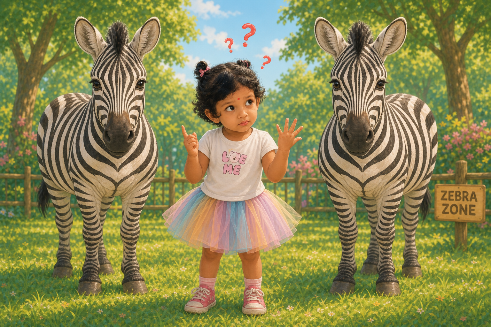

വളരെ പതുക്കെ മാത്രം അനങ്ങുന്ന സ്ലോത്തിന്റെ (Sloth) കൂട്ടിൽ അന്നമോൾ കുറേനേരം കാത്തുനിന്നു. "അയ്യോ, ഒരു ഇല തിന്നാൻ ഇത്രയും സമയമോ!" എന്ന് അവൾ വാച്ചിലേക്ക് നോക്കി പറഞ്ഞു; സ്ലോത്തിന് ആ ഇല വായിലാക്കാൻ ഒരു നൂറ്റാണ്ട് വേണ്ടിവരുമെന്ന് അവൾക്ക് തോന്നി!

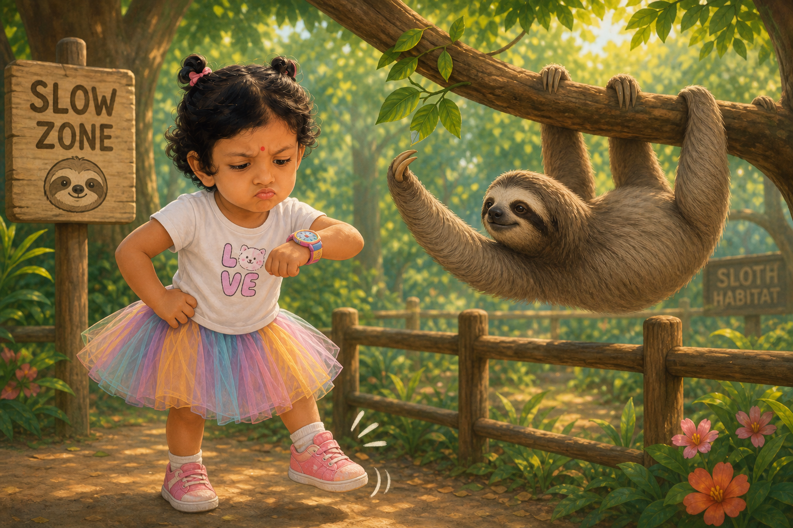

കുഞ്ഞു മൃഗങ്ങളെ തൊട്ടുതലോടാൻ പറ്റുന്നിടത്ത് (Petting Zone) വെച്ച് ഒരു ചെറിയ ആട്ടിൻകുട്ടി അന്നമോളുടെ പാവാടത്തുമ്പിൽ മെല്ലെ കടിച്ചു. "ഹേയ് കുഞ്ഞാടേ, എന്റെ പാവാടയ്ക്ക് നല്ല രുചിയുണ്ടോ?" എന്ന് അവൾ ചിരിച്ചുകൊണ്ട് ചോദിച്ചു — ആടാവട്ടെ, ഒന്നുമറിയാത്ത ഭാവത്തിൽ അത് കടിച്ചുതിന്നാൻ നോക്കുകയായിരുന്നു!

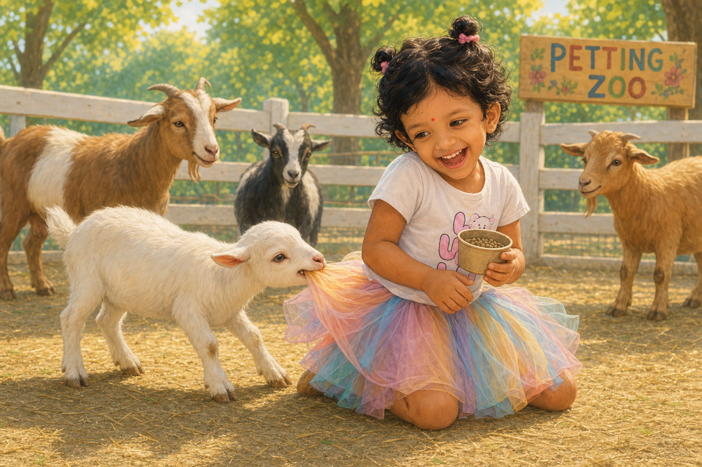

സൂര്യൻ അസ്തമിക്കാറായപ്പോൾ, ക്ഷീണിച്ചെങ്കിലും നിറഞ്ഞ സന്തോഷത്തോടെ അന്നമോൾ മൃഗശാലയുടെ കവാടത്തിൽ നിന്ന് സ്നേഹത്തോടെ വിട പറഞ്ഞു: "നന്ദി കൂട്ടുകാരേ... നമ്മൾ നാളെ വീണ്ടും കാണാം!" ദൂരെ നിന്ന് ജിറാഫും, ആനയും, പെൻഗ്വിനും, കുരങ്ങനുമെല്ലാം വാലാട്ടിയും തലയാട്ടിയും അവളോട് യാത്രപറഞ്ഞു!

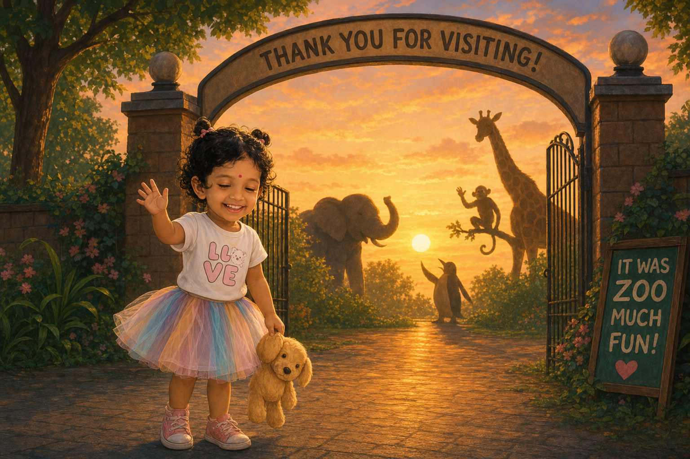
