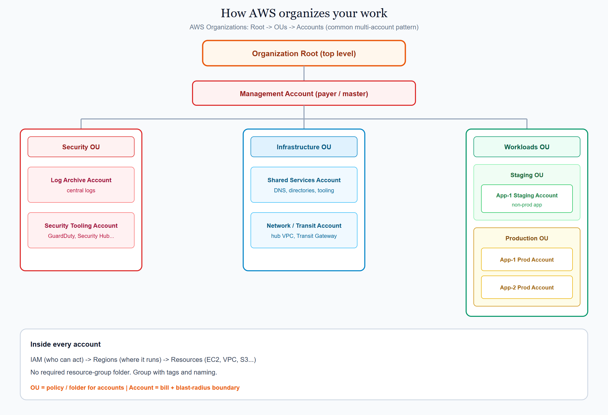
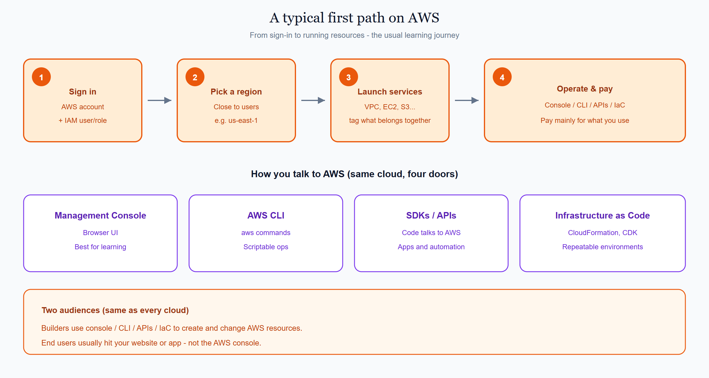
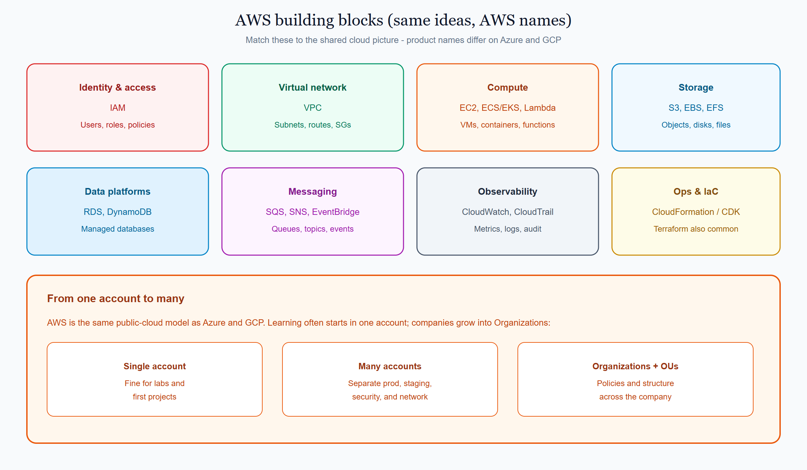

# 1.1 What is AWS?

**AWS** (Amazon Web Services) is Amazon’s public cloud. It offers on-demand compute, storage, networking, databases, and hundreds of managed services across regions worldwide.

This page is the AWS view of the shared concept **[What is the cloud / cloud model](../../docs/1000_what_is_the_cloud.md)**. AWS follows the same model as Azure and GCP: you rent infrastructure and managed services instead of running your own data center. The names and consoles differ.

## On this page

- [How AWS organizes your work](#how-aws-organizes-your-work)
- [A typical first path](#a-typical-first-path)
- [Building blocks you will meet](#building-blocks-you-will-meet)
- [How you work with AWS](#how-you-work-with-aws)
- [Where this sits in the syllabus](#where-this-sits-in-the-syllabus)

## How AWS organizes your work

Companies rarely put everything in one place. **AWS Organizations** lets you nest **accounts** under a root, group them with **Organizational Units (OUs)**, and apply policies from above.

A common multi-account layout looks like this:

```text
Organization Root (top level)
│
├── Management Account (payer / master)
│
├── Security OU
│   ├── Log Archive Account
│   └── Security Tooling Account
│
├── Infrastructure OU
│   ├── Shared Services Account
│   └── Network / Transit Account
│
└── Workloads OU
    ├── Staging OU
    │   └── App-1 Staging Account
    └── Production OU
        ├── App-1 Prod Account
        └── App-2 Prod Account
```

| Scope | Everyday meaning |
|-------|------------------|
| **Organization Root** | Top of the company tree |
| **Management Account** | Payer / master account that owns the organization |
| **OU (Organizational Unit)** | Folder for accounts (security, platform, workloads…) |
| **AWS account** | Who pays for that slice; main blast-radius and IAM boundary |
| **IAM** | Users, roles, and policies inside an account |
| **Region** | Where most resources run (for example `us-east-1`) |
| **Resource** | EC2, VPC, S3, database, and so on |

Beginners often start with **one account**. The tree above is what healthy companies grow into. AWS has **no required resource group folder** — people group related work with **tags** and naming.

<p align="center">
  
</p>

<p align="center"><em>OU = policy folder for accounts. Account = bill + blast-radius boundary. Inside each account: IAM → region → resources.</em></p>

## A typical first path

With AWS you usually:

1. Create an **account** and sign in with an **IAM** user or role (not the root user for daily work).
2. Pick a **region** close to your users.
3. Launch services (VPC, compute, storage, and more) and **tag** what belongs together.
4. Pay mainly for what you use, with options to reserve capacity when usage is steady.

Later you may join that account into the Organizations tree (security / infrastructure / workloads).

<p align="center">
  
</p>

<p align="center"><em>Builders manage AWS through console, CLI, APIs, or IaC. End users hit your app — not the AWS console.</em></p>

## Building blocks you will meet

These map to the shared “pieces of the cloud” picture — AWS product names:

| Idea | AWS name | Everyday meaning |
|------|----------|------------------|
| Identity & access | **IAM** | Who can do what |
| Virtual network | **VPC** | Your private network in the cloud |
| Compute | **EC2**, containers, **Lambda** | VMs, containers, or functions |
| Storage | **S3**, EBS, EFS | Objects, disks, and file systems |
| Data platforms | **RDS**, DynamoDB, and others | Managed databases |
| Messaging | **SQS**, SNS, EventBridge | Queues, topics, and events |
| Observability | **CloudWatch**, CloudTrail | Metrics, logs, and audit trails |
| Ops & IaC | **CloudFormation**, CDK | Automating how you build and run everything |

<p align="center">
  
</p>

<p align="center"><em>Same building blocks as Azure and GCP — AWS names. Start with one account; grow into Organizations when the company needs isolation.</em></p>

You do not need every service on day one. Learn the idea on the shared page, then remember the AWS name here.

## How you work with AWS

| Path | What it is for |
|------|----------------|
| **AWS Management Console** | Browser UI for learning and day-to-day tasks |
| **AWS CLI** | Scriptable commands from your terminal |
| **SDKs / APIs** | Application code talking to AWS |
| **Infrastructure as Code** | CloudFormation, CDK, and similar tools (covered later) |

Builders use console, CLI, and APIs to create and change resources. End users usually hit *your* application, not the AWS console.

## Where this sits in the syllabus

Next in this topic is Azure, then GCP, then a **side-by-side comparison**. After that, the syllabus continues with accounts / subscriptions / projects, regions, identity, networking, and the shared M1–M14 path.

Related AWS pages: [Foundations](./1000_foundations.md) · [AWS tutorials](../README.md) · [Docs index](./index.md)

<br/>
<p>
    <span style="float: left;">
        <a href="../../docs/1000_what_is_the_cloud.md">Previous: Cloud Model</a>
        &nbsp;
        <a href="../../azure/docs/1000_what_is_azure.md">Next: Azure Intro</a>
    </span>
    <span style="float: right;">
        <a href="../../../README.md">Home</a>
        &nbsp;|&nbsp;
        <a href="../../README.md">Cloud</a>
        &nbsp;|&nbsp;
        <a href="../../docs/1000_what_is_the_cloud.md">Topic: What is the cloud</a>
    </span>
</p>
