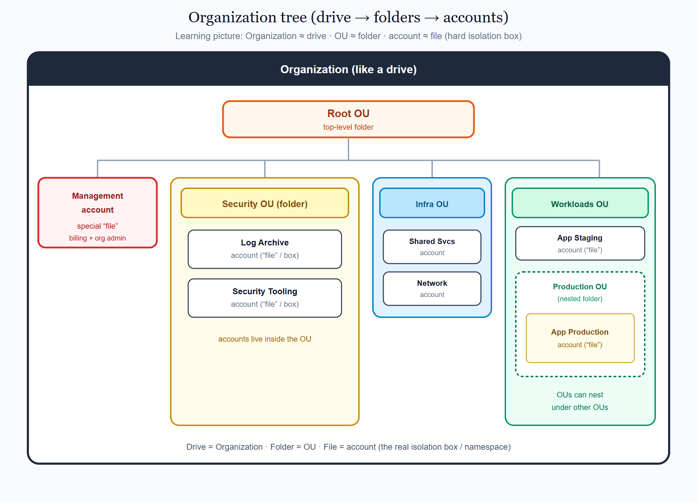
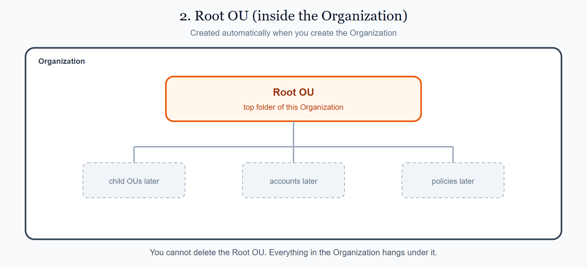
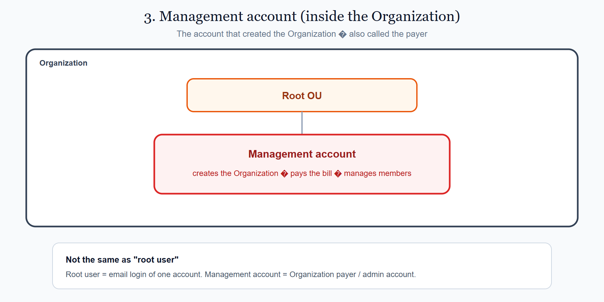
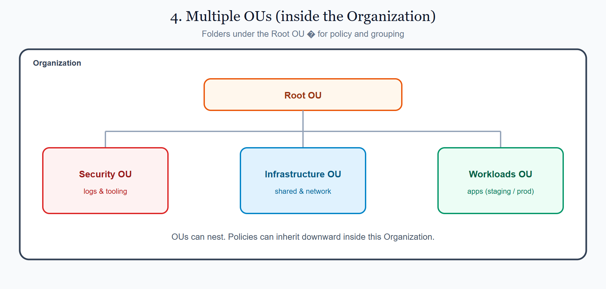
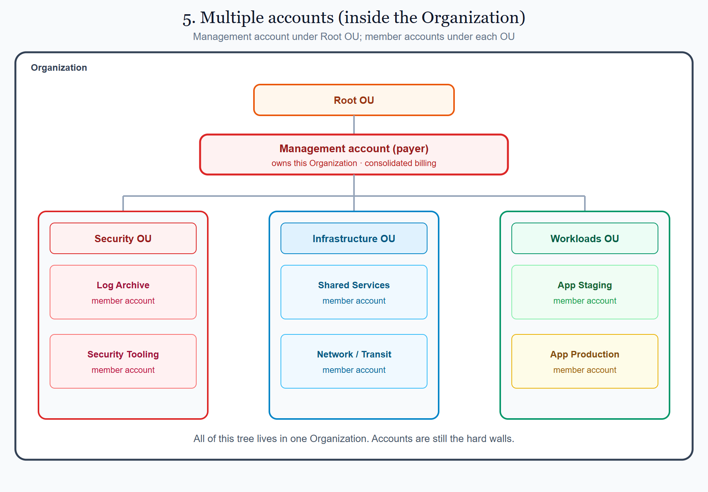
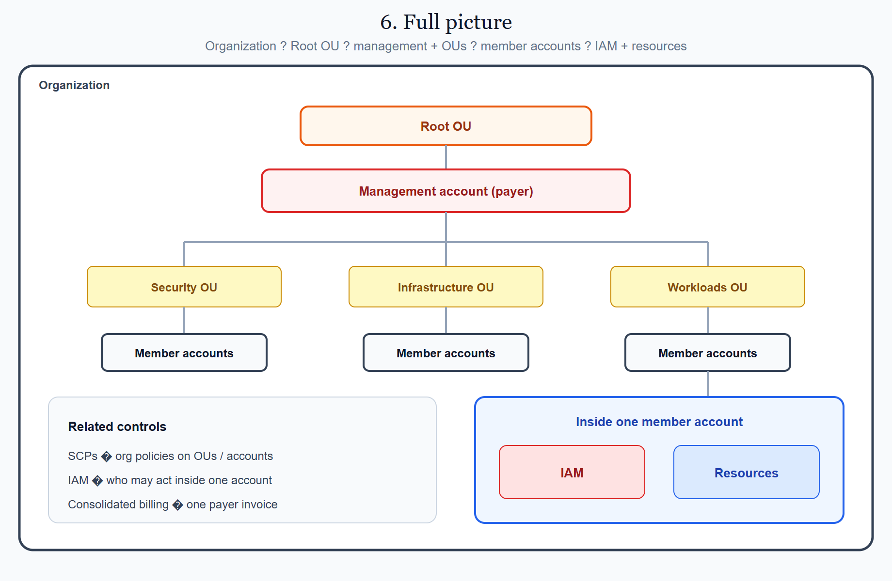
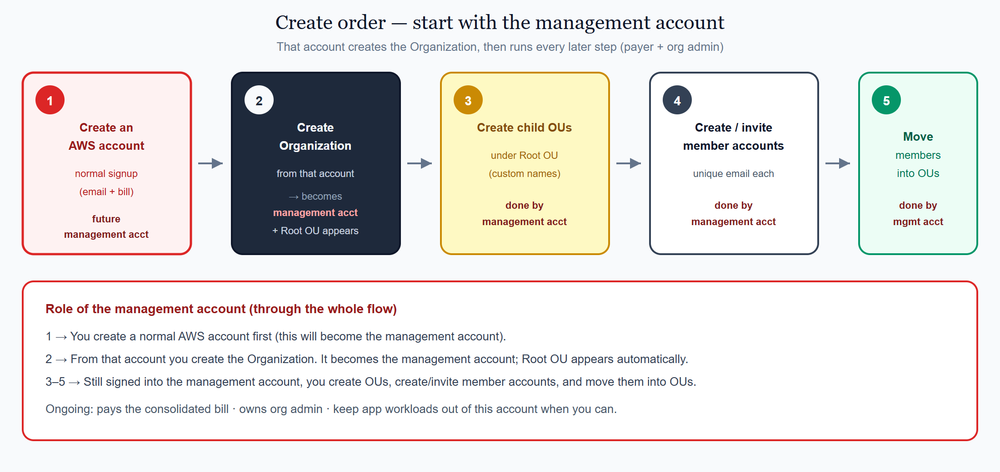

# 2.1 AWS — Accounts & Organizations

This page is the AWS view of the shared concept **[Accounts, subscriptions & projects](../../docs/1010_accounts_subscriptions_projects.md)**.

On AWS, an **account** is one of the core idea: a hard isolation **box** (like a namespace). A company usually has many accounts, of different types, and groups them under **Organizational Units (OUs)**. Think of OUs as **folders** and accounts as **files** inside those folders — a useful picture for learning, even though AWS does not store them as real folders and files. An OU can hold other OUs (nested folders). The top-level OU is the **Root OU**. Under it sits one special account — the **management account** (also called the root account) — that owns billing and org admin. The outer container for this whole tree (imagine a drive that holds all the folders) is the **Organization**.

## On this page

- [A single AWS account (the box)](#a-single-aws-account-the-box)
- [1. Organization (the company container)](#1-organization-the-company-container)
- [2. Root OU](#2-root-ou)
- [3. Management account (root account)](#3-management-account-root-account)
- [4. Multiple OUs](#4-multiple-ous)
- [5. Multiple accounts](#5-multiple-accounts)
- [6. Full picture](#6-full-picture)
- [7. How to create them (console + CLI)](#7-how-to-create-them-console--cli)
  - [Create an Organization (step by step)](#create-an-organization-step-by-step)
  - [Then create OUs and member accounts](#then-create-ous-and-member-accounts)
- [Where this sits in the syllabus](#where-this-sits-in-the-syllabus)

## A single AWS account (the box)

Before Organizations, remember the basic unit: an **AWS account**.

- It has a bill (or a bill line under an Organization).
- It has **IAM** (users, roles, policies) — who may act inside.
- It holds **resources** (VPC, EC2, S3, and so on) in regions.

One account is fine for learning. Companies create an **Organization** so they can use **many** accounts safely under one tree.

## 1. Organization (the company container)

An **AWS Organization** is the company container for many AWS accounts. It is **not** a folder you click into for apps. It is the **outer product** — the whole tree — that holds (as given below):

| Piece | Role in the Organization |
|-------|--------------------------|
| **Root OU** | Top of the tree (created for you) |
| **Management account** | The account that owns the Organization (billing + admin) |
| **Child OUs** | Folders you add later for grouping and policy |
| **Member accounts** | Other accounts that join the tree and do most of the work |

Before you create an Organization, you only have **one AWS account**. After you create it:

- That same account becomes the **management account**.
- AWS creates the **Root OU** and parks the management account under it.
- You can later add member accounts, OUs, and org policies (such as SCPs).
- You get **consolidated billing** — one payer invoice, with usage still visible per account.

<p align="center">
  
</p>

<p align="center"><em>Organization ≈ drive → Root OU → management account + OUs (folders) → accounts (files / hard boxes). OUs can nest.</em></p>

Every diagram below keeps that same **Organization** border so you always see where each piece sits.

## 2. Root OU

When you create an Organization, AWS also creates the **Root** (often called the **Root OU**). It is the top folder **inside** the Organization.

- Every OU and every account in the org sits under the Root OU.
- You cannot delete the Root OU.
- Policies attached high in the tree can inherit downward.

<p align="center">
  
</p>

<p align="center"><em>Inside the Organization: Root OU at the top. Child OUs and accounts hang under it.</em></p>

## 3. Management account (root account)

The **management account** (older name: master account) is the special account that **created** the Organization. It sits under the Root OU **inside** that Organization.

People sometimes say “root account” for this. Be careful:

| Term | Meaning |
|------|---------|
| **Management account** | The Organization payer / admin account |
| **Root user** | The email-based login of *one* account (use rarely) |

What the management account does:

- Pays the **consolidated bill** for member accounts  
- Creates / invites member accounts  
- Creates OUs and attaches org policies (such as SCPs)  
- Should stay almost empty of app workloads (best practice)

<p align="center">
  
</p>

<p align="center"><em>Inside the Organization: management account under Root OU — billing + org administration.</em></p>

## 4. Multiple OUs

An **OU** (Organizational Unit) is a folder under the Root OU, still **inside** the same Organization. It groups accounts and can receive policies.

| Example OU name (custom) | Typical purpose |
|--------------------------|-----------------|
| **Security OU** | Log archive, security tooling |
| **Infrastructure OU** | Shared services, network / transit |
| **Workloads OU** | Application accounts (often split into Staging / Production child OUs) |

AWS does **not** create Security / Infrastructure / Workloads OUs for you. After you create the Organization, you only get the **Root OU**. Any other OU names are **custom** — your company chooses them.

**Who configures OUs under the Root OU?**

- People signed into the **management account** with permission to administer Organizations (for example an admin IAM role there) create, rename, move, and delete OUs.
- They also move **member accounts** into those OUs and attach org policies (such as SCPs).
- Member accounts cannot redesign the org tree by themselves unless the management account has **delegated** that admin work to them.

OUs can nest. For example: `Workloads OU → Production OU → app accounts` — those child OU names are custom too.

<p align="center">
  
</p>

<p align="center"><em>Inside the Organization: OUs are folders for policy and grouping — not the hard isolation wall.</em></p>

### Why OUs matter

You *can* put every member account directly under the Root OU. That works for a tiny lab. It does **not** scale well for a company. OUs become important because they give you a place to **group** and **govern** many accounts at once.

| Reason | What it means in practice |
|--------|---------------------------|
| **Group by job** | Put security accounts together, platform accounts together, app accounts together — easier to find and reason about |
| **Apply policy once** | Attach an SCP (or other org policy) to an OU; every account under that OU inherits the guardrail |
| **Different rules per area** | Production Workloads OU can be stricter than a Sandbox OU without editing each account by hand |
| **Safer change** | Move an account into an OU and it picks up that OU’s policies; move it out and the rules change with it |
| **Clear ownership** | Teams can own an OU (and the accounts under it) without owning the whole Organization |

**Remember:** the account is still the hard wall (bill, IAM, blast radius). The OU does not replace the account. It sits **above** accounts so you can organize them and push shared rules down the tree.

Without OUs, every new account tends to become a one-off: separate naming, separate policy clicks, and easy mistakes when prod and sandbox sit side by side under Root with the same loose rules.

## 5. Multiple accounts

Under the **Root OU** (still inside the **Organization**) you normally find the **management account**, plus **child OUs**. Each child OU holds one or more **member accounts** — the accounts where most work actually runs.

A **member account** is a normal AWS account that belongs to the Organization. It is not the management account. Think of it as one of the **hard boxes** you learned on the shared page.

**How it fits**

1. **Join the Organization** — From the management account, create a new account or invite an existing one.  
2. **Place it under an OU** — Move the member account into the OU that matches its job (Security, Infrastructure, Workloads, …) so the right policies apply.  
3. **Work inside that account** — Build networks, machines, and apps in the member account — not in the management account.  
4. **Pay from the management account** — Usage is still tracked per member account; the company invoice is usually paid once (consolidated billing).

**Do not mix these up**

- **Management account** = runs the Organization and pays. Keep apps out of it when you can.  
- **Member account** = where most real work runs. One job (or one environment) per account is the usual goal.

```text
So: Organization = company container. OUs = folders. Management account = payer / org admin. Member accounts = boxes where work and risk live.
```

<p align="center">
  
</p>

<p align="center"><em>Inside the Organization: Root OU → management account + OUs → member accounts under each OU.</em></p>

## 6. Full picture

Read the AWS tree top to bottom:

1. **Organization** (company container)  
2. **Root OU**  
3. **Management account** (payer)  
4. **OUs** (folders)  
5. **Member accounts** (boxes)  
6. Inside each account: **IAM** + **resources**

<p align="center">
  
</p>

<p align="center"><em>Organization → Root OU → management account + OUs → member accounts → IAM and resources inside each account.</em></p>

```text
Organization
└── Root OU
    ├── Management account (payer)
    ├── Security OU
    │   ├── Log Archive account
    │   └── Security Tooling account
    ├── Infrastructure OU
    │   ├── Shared Services account
    │   └── Network / Transit account
    └── Workloads OU
        ├── App Staging account
        └── App Production account
```

## 7. How to setup them

Start by creating the **AWS account** that will become the **management account**. From there you create the **Organization**, then build OUs and member accounts — always from that same management account.

<p align="center">
  
</p>

<p align="center"><em>Management account first → create Organization (Root OU appears) → that account creates OUs, members, and moves them.</em></p>


Account setup and configuration continue on **[2.4 First login overview](../../docs/1015_first_login_and_setup.md)** → **[2.5 AWS · First login](./1015_first_login_setup.md)**.

<br/>
<p>
    <span style="float: left;">
        <a href="../../docs/1010_accounts_subscriptions_projects.md">Previous: Accounts</a>
        &nbsp;
        <a href="../../azure/docs/1010_subscriptions_management_groups.md">Next: Azure  Subscriptions</a>
    </span>
    <span style="float: right;">
        <a href="../../../README.md">Home</a>
        &nbsp;|&nbsp;
        <a href="../../README.md">Cloud</a>
        &nbsp;|&nbsp;
        <a href="../../docs/1010_accounts_subscriptions_projects.md">Topic: Accounts, subscriptions & projects</a>
    </span>
</p>
