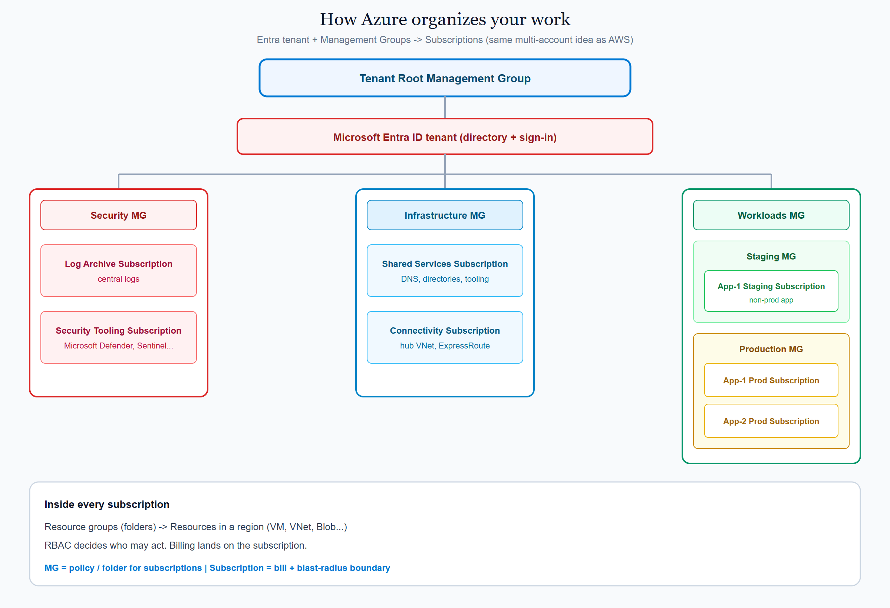
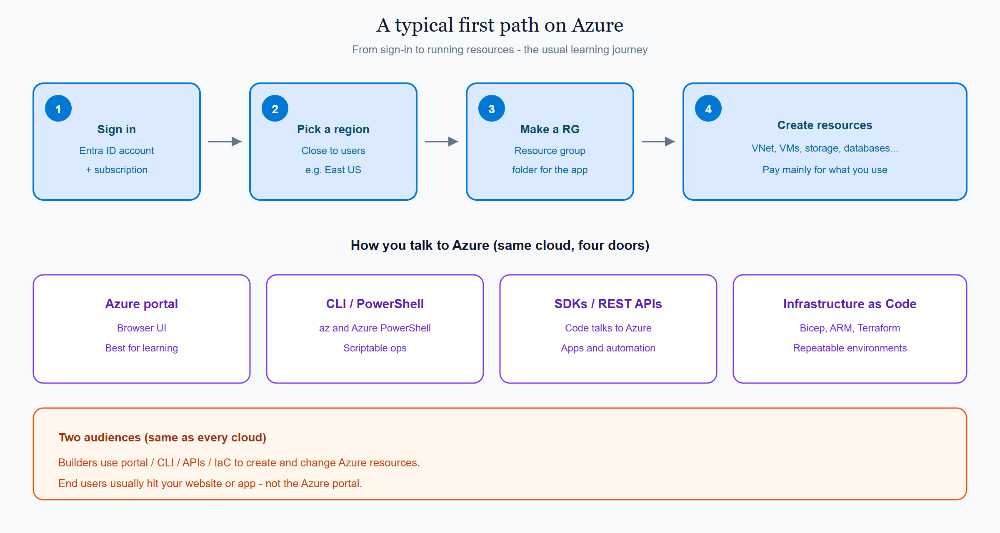
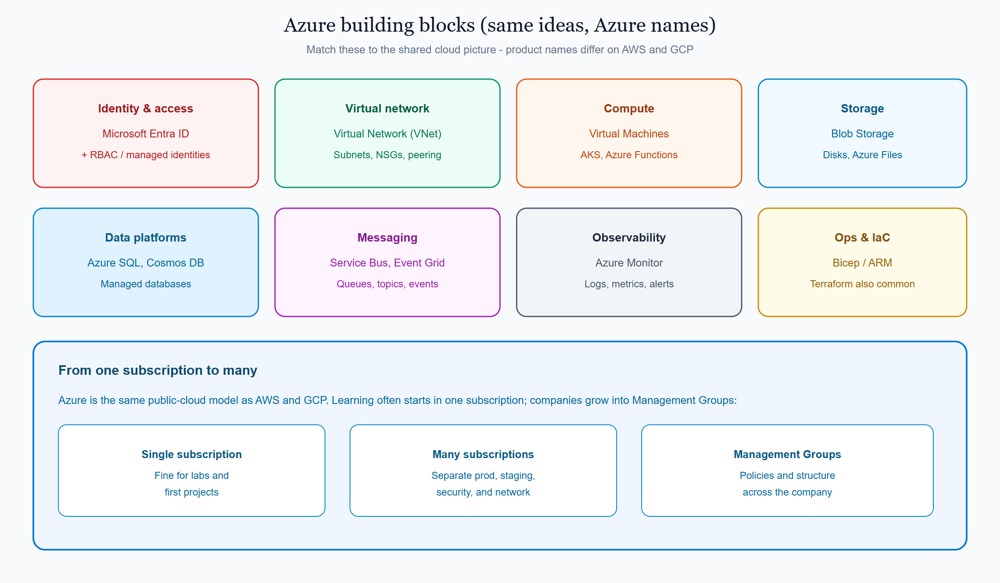

# 1.2 What is Azure?

**Azure** is Microsoft’s public cloud. It offers on-demand compute, storage, networking, databases, and managed services across regions worldwide.

This page is the Azure view of the shared concept **[What is the cloud / cloud model](../../docs/1000_what_is_the_cloud.md)**. Azure follows the same model as AWS and GCP: you rent infrastructure and managed services instead of running your own data center. The names and consoles differ.

## On this page

- [How Azure organizes your work](#how-azure-organizes-your-work)
- [A typical first path](#a-typical-first-path)
- [Building blocks you will meet](#building-blocks-you-will-meet)
- [How you work with Azure](#how-you-work-with-azure)
- [Where this sits in the syllabus](#where-this-sits-in-the-syllabus)

## How Azure organizes your work

Companies rarely put everything in one place. **Management Groups** let you nest **subscriptions** under a tenant root, group them like folders, and apply policies from above.

A common multi-subscription layout looks like this (same idea as AWS Organizations + OUs + accounts):

```text
Tenant Root Management Group
│
├── Microsoft Entra ID tenant (directory + sign-in)
│
├── Security MG
│   ├── Log Archive Subscription
│   └── Security Tooling Subscription
│
├── Infrastructure MG
│   ├── Shared Services Subscription
│   └── Connectivity Subscription
│
└── Workloads MG
    ├── Staging MG
    │   └── App-1 Staging Subscription
    └── Production MG
        ├── App-1 Prod Subscription
        └── App-2 Prod Subscription
```

| Scope | Everyday meaning |
|-------|------------------|
| **Tenant Root Management Group** | Top of the company tree |
| **Microsoft Entra ID tenant** | Organization directory — who can sign in |
| **MG (Management Group)** | Folder for subscriptions (security, platform, workloads…) |
| **Subscription** | Who pays for that slice; main blast-radius and access boundary |
| **Resource group** | Folder that groups related resources for one app or workload |
| **Region** | Where each resource runs (for example East US) |
| **Resource** | VM, VNet, Blob Storage, database, and so on |

Beginners often start with **one subscription**. The tree above is what healthy companies grow into. Inside a subscription you always use **resource groups** to group resources.

<p align="center">
  
</p>

<p align="center"><em>MG = policy folder for subscriptions. Subscription = bill + blast-radius boundary. Inside each subscription: resource groups → resources in a region.</em></p>

## A typical first path

With Azure you usually:

1. Sign in with **Microsoft Entra ID** and choose a **subscription**.
2. Pick a **region** close to your users.
3. Create a **resource group**, then create resources (VNet, compute, storage, and more).
4. Pay mainly for what you use, with reservations or savings plans when usage is steady.

Later you may hang that subscription under the Management Group tree (security / infrastructure / workloads).

<p align="center">
  
</p>

<p align="center"><em>Builders manage Azure through portal, CLI, APIs, or IaC. End users hit your app — not the Azure portal.</em></p>

## Building blocks you will meet

These map to the shared “pieces of the cloud” picture — Azure product names:

| Idea | Azure name | Everyday meaning |
|------|------------|------------------|
| Identity & access | **Microsoft Entra ID**, **RBAC**, managed identities | Who can do what |
| Virtual network | **Virtual Network (VNet)** | Your private network in the cloud |
| Compute | **Virtual Machines**, AKS, **Azure Functions** | VMs, containers, or functions |
| Storage | **Blob Storage**, Disks, Azure Files | Objects, disks, and file shares |
| Data platforms | **Azure SQL**, Cosmos DB, and others | Managed databases |
| Messaging | **Service Bus**, Event Grid, Event Hubs | Queues, topics, and events |
| Observability | **Azure Monitor** | Metrics, logs, and alerts |
| Ops & IaC | **Bicep**, ARM templates, Terraform | Automating how you build and run everything |

<p align="center">
  
</p>

<p align="center"><em>Same building blocks as AWS and GCP — Azure names. Start with one subscription; grow into Management Groups when the company needs isolation.</em></p>

You do not need every service on day one. Learn the idea on the shared page, then remember the Azure name here.

## How you work with Azure

| Path | What it is for |
|------|----------------|
| **Azure portal** | Browser UI for learning and day-to-day operations |
| **Azure CLI / PowerShell** | Scriptable management from your terminal (`az`, Azure PowerShell) |
| **SDKs / REST APIs** | Application code talking to Azure |
| **Infrastructure as Code** | Bicep, ARM templates, Terraform (covered later) |

Builders use portal, CLI, and APIs to create and change resources. End users usually hit *your* application, not the Azure portal.

## Where this sits in the syllabus

Next in this topic is GCP, then a **side-by-side comparison** of all three. After that, the syllabus continues with accounts / subscriptions / projects, regions, identity, networking, and the shared M1–M14 path.

Related Azure pages: [Foundations](./1000_foundations.md) · [Azure tutorials](../README.md) · [Docs index](./index.md)

<br/>
<p>
    <span style="float: left;">
        <a href="../../aws/docs/1000_what_is_aws.md">Previous: AWS Intro</a>
        &nbsp;
        <a href="../../gcp/docs/1000_what_is_gcp.md">Next: GCP Intro</a>
    </span>
    <span style="float: right;">
        <a href="../../../README.md">Home</a>
        &nbsp;|&nbsp;
        <a href="../../README.md">Cloud</a>
        &nbsp;|&nbsp;
        <a href="../../docs/1000_what_is_the_cloud.md">Topic: What is the cloud</a>
    </span>
</p>
