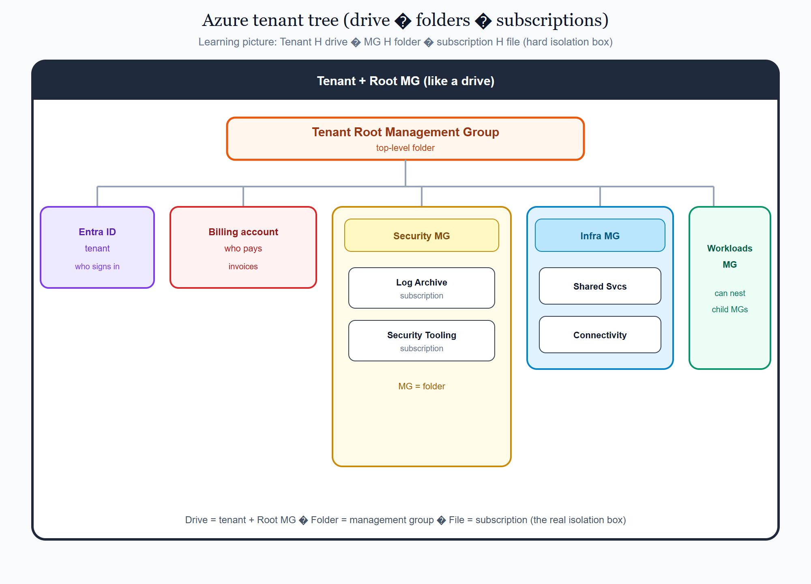
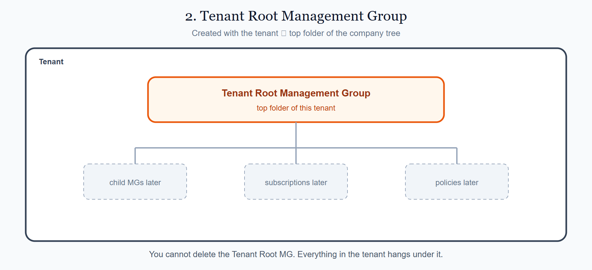
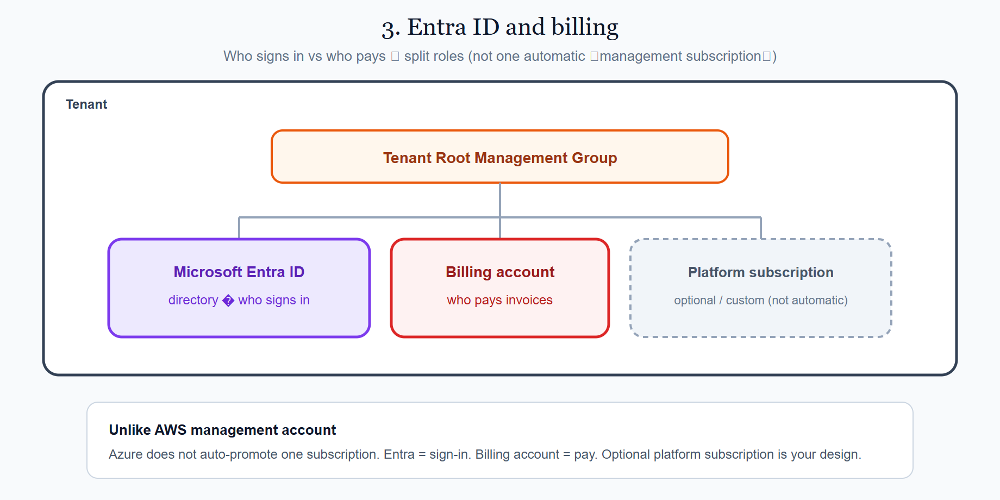
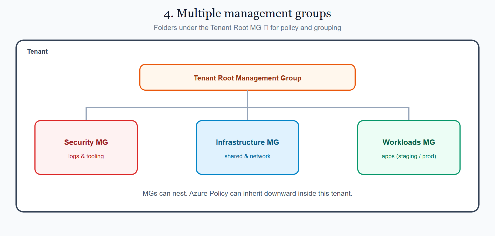
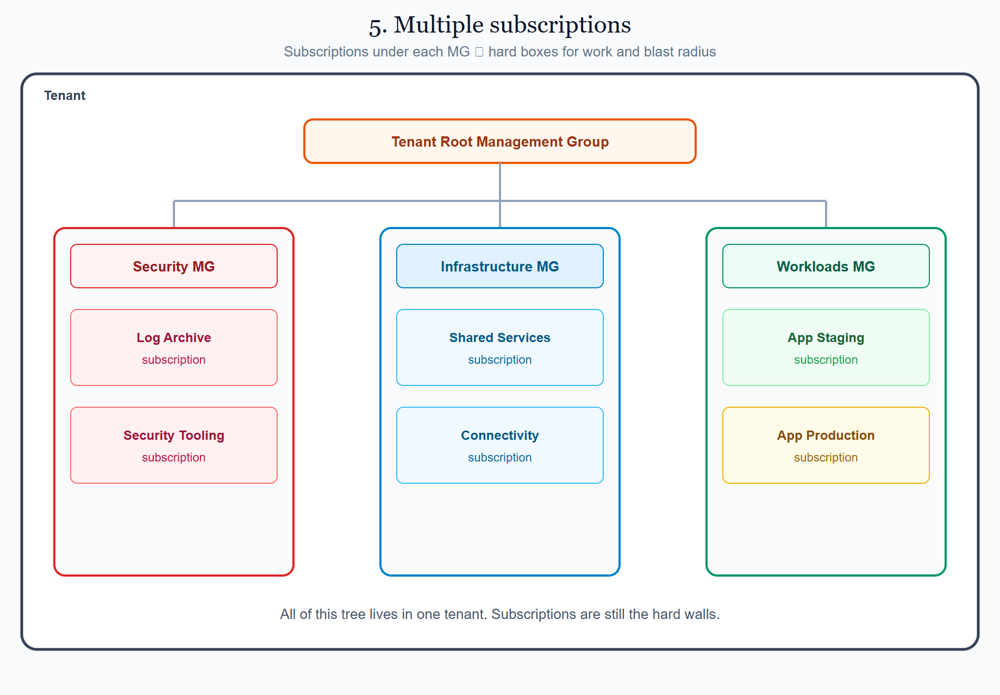
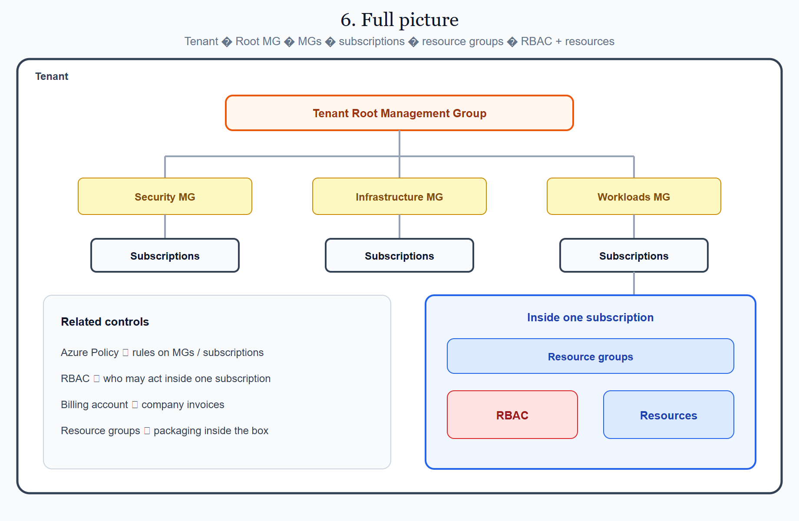
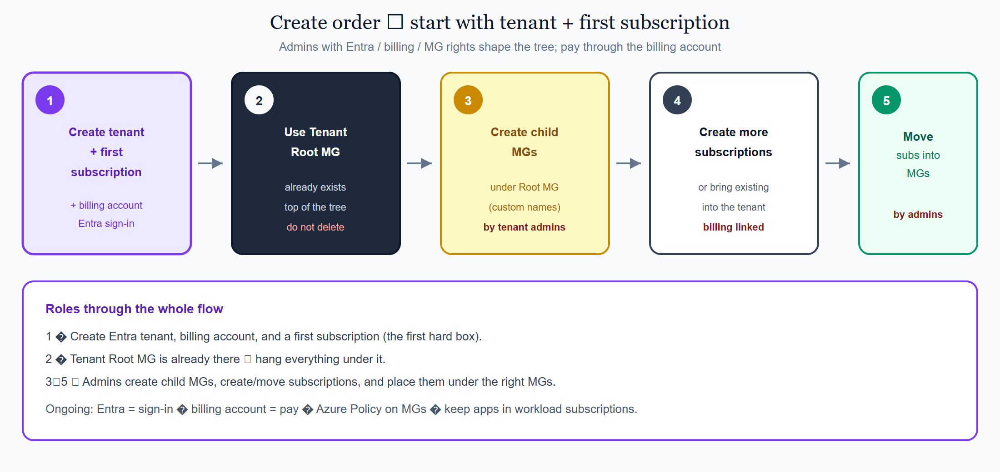

# 2.2 Azure — Subscriptions & management groups

This page is the Azure view of the shared concept **[Accounts, subscriptions & projects](../../docs/1010_accounts_subscriptions_projects.md)**.

On Azure, a **subscription** is a core idea: a hard isolation **box** (like a namespace). A company usually has many subscriptions, of different types, and groups them under **Management Groups (MGs)**. Think of MGs as **folders** and subscriptions as **files** inside those folders — a useful picture for learning, even though Azure does not store them as real folders and files. An MG can hold other MGs (nested folders). The top-level MG is the **Tenant Root Management Group**. Sign-in lives in a **Microsoft Entra ID tenant** (the company directory). Billing usually attaches through a **billing account**. The outer container for this whole tree (imagine a drive that holds all the folders) is the **tenant + management-group tree**.

## On this page

- [A single Azure subscription (the box)](#a-single-azure-subscription-the-box)
- [1. Tenant + Root MG (the company container)](#1-tenant--root-mg-the-company-container)
  - [How Entra ID + Root MG act as one “Organization”](#how-entra-id--root-mg-act-as-one-organization)
- [2. Tenant Root Management Group](#2-tenant-root-management-group)
- [3. Entra ID and billing (who signs in / who pays)](#3-entra-id-and-billing-who-signs-in--who-pays)
  - [What is a billing account?](#what-is-a-billing-account)
- [4. Multiple management groups](#4-multiple-management-groups)
- [5. Multiple subscriptions](#5-multiple-subscriptions)
- [6. Full picture](#6-full-picture)
- [7. How to set them up](#7-how-to-set-them-up)
- [Where this sits in the syllabus](#where-this-sits-in-the-syllabus)

## A single Azure subscription (the box)

Before a big MG tree, remember the basic unit: an **Azure subscription**.

- It has a bill (or a bill line under a billing account).
- It has **RBAC** (who may act) — often via **Microsoft Entra ID** users, groups, and roles.
- It holds **resources**, almost always inside **resource groups**, in regions.

One subscription is fine for learning. Companies grow a **management-group tree** so they can use **many** subscriptions safely under one tenant.

## 1. Tenant + Root MG (the company container)

On Azure, the company container is not a single product named “Organization.” It is the **Microsoft Entra ID tenant** plus the **management-group tree** under the **Tenant Root Management Group**. That outer shell holds:

| Piece | Role in the company tree |
|-------|--------------------------|
| **Microsoft Entra ID tenant** | Company directory — who can sign in |
| **Tenant Root Management Group** | Top of the MG tree (created for you) |
| **Billing account** | Commercial agreement with Microsoft — invoices and payment (not a resource box) |
| **Child management groups** | Folders you add later for grouping and policy |
| **Subscriptions** | Boxes that join the tree and do most of the work |

Before you expand the tree, you often have **one tenant** and **one subscription**. After you use management groups well:

- The **Tenant Root MG** sits at the top of the folder tree.
- You add child MGs and hang subscriptions under them.
- **Azure Policy** (and similar controls) can inherit down the MG tree.
- Usage can still be tracked per subscription while billing rolls up through the billing account.

<p align="center">
  
</p>

<p align="center"><em>Tenant + Root MG ≈ drive → Root MG → Entra / billing + MGs (folders) → subscriptions (files / hard boxes). MGs can nest.</em></p>

Every diagram below keeps that same **tenant** border so you always see where each piece sits.

### How Entra ID + Root MG act as one “Organization” ?

They are **two products**, one **company shell**:

| Piece | Job |
|-------|-----|
| **Entra ID tenant** | **Who** — sign-in and identities |
| **Tenant Root MG** | **Where the tree starts** — subscriptions hang under it |

AWS still has Root OU, OUs, a management account, and member accounts **inside** a named product: **Organization**. Azure has no product with that name. The same outer-container *job* is done by **Entra ID** (people) plus the **Root MG / MG tree** (subscription folders). Billing sits beside them as the **billing account**.


## 2. Tenant Root Management Group

Every Entra tenant gets a **Tenant Root Management Group**. It is the top folder **inside** the company tree.

- Every MG and every subscription in the tenant sits under this Root MG (directly or through child MGs).
- You cannot delete the Tenant Root MG.
- Policies attached high in the tree can inherit downward.

<p align="center">
  
</p>

<p align="center"><em>Inside the tenant: Tenant Root MG at the top. Child MGs and subscriptions hang under it.</em></p>

## 3. Entra ID and billing (who signs in / who pays)

Azure splits two jobs that AWS often mixes into the “management account” story:

| Term | Meaning |
|------|---------|
| **Microsoft Entra ID tenant** | Directory for identities (users, groups, apps) |
| **Billing account** | Commercial agreement with Microsoft — invoices and payment methods |
| **Global Administrator** (Entra) | Powerful directory admin — use carefully |
| **Subscription Owner** | Can manage one subscription’s resources and access |

### What is a billing account?

A **billing account** is **not** an Azure “account” in the AWS sense. It is **not** a hard isolation box, **not** a folder for resources, and **not** your sign-in directory.

Think of it as your **contract / invoice folder with Microsoft**:

- It tracks **what you owe** and **how you pay** (credit card, invoice, Enterprise Agreement, Microsoft Customer Agreement, and similar).
- One or more **subscriptions** send their usage costs up to that billing account (often through billing profiles / invoice sections — details later).
- People manage it with **billing roles** (who may see invoices, change payment methods, create subscriptions under that agreement).

So when Azure says “account” here, it means a **billing object**, not “the place where VMs live.”

| Piece | Is it a box for resources? | Main job | Everyday analogy |
|-------|----------------------------|----------|------------------|
| **Billing account** | No | Contract, invoices, payment | The company’s Microsoft bill / agreement |
| **Microsoft Entra ID tenant** | No | Who can sign in (users, groups, apps) | Company employee directory |
| **Management group** | No | Folder for grouping + policy above subscriptions | Folder in a filing cabinet |
| **Subscription** | **Yes** | Hard wall for cost line, RBAC, quotas, blast radius | The locked room where work runs |

**How they connect (simple chain)**

1. You sign in with an identity from the **Entra tenant**.  
2. You create or open a **subscription** (the box) that trusts that tenant.  
3. Usage in that subscription is charged against a **billing account** (the agreement that pays Microsoft).  
4. You hang that subscription under a **management group** so company policy can apply — the MG does not pay the bill and does not hold the VMs itself.

**Common mix-ups**

- “Billing account” ≠ “subscription.” The subscription is where resources and day-to-day access live; the billing account is where the invoice lands.  
- “Billing account” ≠ “Entra tenant.” Entra answers *who may sign in*; billing answers *who pays Microsoft*.  
- “Billing account” ≠ “management group.” An MG organizes and governs subscriptions; it is not the payment contract.  
- You can have several subscriptions under one billing account. A lab subscription and a production subscription can share the same bill while staying separate boxes.

Unlike AWS, Azure does **not** automatically promote one subscription into a special “management subscription” when you create the tree. Admins sign in with Entra identities; payment follows the **billing account**. Many companies still keep a dedicated **platform / management subscription** for shared tools — that name is **custom**, not an Azure default.

What company admins typically do from Entra + billing + elevated roles:

- Create / move **subscriptions** under the MG tree  
- Create **management groups** and attach **Azure Policy**  
- Decide who may sign in (Entra) and who may change a subscription (RBAC)  
- Keep day-to-day apps out of any shared “platform” subscription when they can  

<p align="center">
  
</p>

<p align="center"><em>Entra ID = who signs in. Billing account = who pays (contract/invoice). Root MG = top of the folder tree. Subscription = the hard box.</em></p>

## 4. Multiple management groups

A **management group** is a folder under the Tenant Root MG. It groups subscriptions and can receive policies.

| Example MG name (custom) | Typical purpose |
|--------------------------|-----------------|
| **Security MG** | Log archive, security tooling |
| **Infrastructure MG** | Shared services, connectivity / hub network |
| **Workloads MG** | Application subscriptions (often split into Staging / Production child MGs) |

Azure does **not** create Security / Infrastructure / Workloads MGs for you. After first setup, you mainly get the **Tenant Root MG**. Any other MG names are **custom** — your company chooses them.

**Who configures MGs under the Root MG?**

- People with permission to manage management groups in the tenant (often Entra / RBAC admins) create, rename, move, and delete MGs.
- They also move **subscriptions** into those MGs and assign **Azure Policy** (and related controls).
- A normal subscription user cannot redesign the whole company tree unless an admin has **delegated** that work.

MGs can nest. For example: `Workloads MG → Production MG → app subscriptions` — those child MG names are custom too.

<p align="center">
  
</p>

<p align="center"><em>Inside the tenant: MGs are folders for policy and grouping — not the hard isolation wall.</em></p>

### Why management groups matter

You *can* put every subscription directly under the Tenant Root MG. That works for a tiny lab. It does **not** scale well for a company. MGs become important because they give you a place to **group** and **govern** many subscriptions at once.

| Reason | What it means in practice |
|--------|---------------------------|
| **Group by job** | Put security subscriptions together, platform together, apps together — easier to find and reason about |
| **Apply policy once** | Assign Azure Policy at an MG; subscriptions under that MG inherit the guardrail |
| **Different rules per area** | Production Workloads MG can be stricter than a Sandbox MG without editing each subscription by hand |
| **Safer change** | Move a subscription into an MG and it picks up that MG’s policies; move it out and the rules change with it |
| **Clear ownership** | Teams can own an MG (and the subscriptions under it) without owning the whole tenant |

**Remember:** the subscription is still the hard wall (bill line, RBAC, blast radius). The MG does not replace the subscription. It sits **above** subscriptions so you can organize them and push shared rules down the tree.

Without MGs, every new subscription tends to become a one-off: separate naming, separate policy clicks, and easy mistakes when prod and sandbox sit side by side under Root with the same loose rules.

## 5. Multiple subscriptions

Under the **Tenant Root MG** you normally find **child MGs**. Each child MG holds one or more **subscriptions** — the boxes where most work actually runs.

A **subscription** is a normal Azure billing/access boundary that belongs to the tenant. Think of it as one of the **hard boxes** you learned on the shared page.

**How it fits**

1. **Create or move a subscription** under the tenant’s MG tree.  
2. **Place it under an MG** — Move the subscription into the MG that matches its job (Security, Infrastructure, Workloads, …) so the right policies apply.  
3. **Work inside that subscription** — Create **resource groups**, then resources — not everything dumped at the tenant root.  
4. **Pay through the billing account** — Usage is still tracked per subscription; the company invoice is usually paid once at the billing account.

**Do not mix these up**

- **Entra tenant + Root MG** = company tree and sign-in boundary.  
- **Billing account** = who pays.  
- **Subscription** = where most real work and blast radius live. One job (or one environment) per subscription is the usual goal.  
- **Resource group** = packaging *inside* a subscription (next detail level — not the hard wall).

```text
So: Tenant + Root MG = company container. MGs = folders. Billing account = payer. Subscriptions = boxes where work and risk live.
```

<p align="center">
  
</p>

<p align="center"><em>Inside the tenant: Root MG → MGs → subscriptions under each MG.</em></p>

## 6. Full picture

Read the Azure tree top to bottom:

1. **Tenant + Root MG** (company container)  
2. **Tenant Root Management Group**  
3. **Entra ID** (sign-in) + **billing account** (payer)  
4. **Management groups** (folders)  
5. **Subscriptions** (boxes)  
6. Inside each subscription: **resource groups** → **RBAC** + **resources**

<p align="center">
  
</p>

<p align="center"><em>Tenant → Root MG → MGs → subscriptions → resource groups → RBAC and resources inside each subscription.</em></p>

```text
Tenant (Entra ID) + billing account
└── Tenant Root Management Group
    ├── Security MG
    │   ├── Log Archive subscription
    │   └── Security Tooling subscription
    ├── Infrastructure MG
    │   ├── Shared Services subscription
    │   └── Connectivity subscription
    └── Workloads MG
        ├── Staging MG
        │   └── App Staging subscription
        └── Production MG
            └── App Production subscription
```

## 7. How to set them up

Start with a **Microsoft Entra ID tenant** and a first **subscription** (and a **billing account** that pays for it). Then shape the **Tenant Root MG** tree: create child MGs, create or move more subscriptions, and place them under the right MGs. Admins with the right Entra / MG / billing roles do this work.

<p align="center">
  
</p>

<p align="center"><em>Tenant + first subscription first → use Root MG → create child MGs → add subscriptions → move them under MGs.</em></p>

Subscription and management-group setup continue on **[2.4 First login overview](../../docs/1015_first_login_and_setup.md)** → **[2.6 Azure · First login](./1015_first_login_setup.md)**.

## Where this sits in the syllabus

Next: GCP organizations & folders — same idea, different names. Then first login & setup for all three, then regions.

<br/>
<p>
    <span style="float: left;">
        <a href="../../aws/docs/1010_accounts_organizations.md">Previous: AWS Accounts</a>
        &nbsp;
        <a href="../../gcp/docs/1010_orgs_folders.md">Next: GCP Organizations</a>
    </span>
    <span style="float: right;">
        <a href="../../../README.md">Home</a>
        &nbsp;|&nbsp;
        <a href="../../README.md">Cloud</a>
        &nbsp;|&nbsp;
        <a href="../../docs/1010_accounts_subscriptions_projects.md">Topic: Accounts, subscriptions & projects</a>
    </span>
</p>
