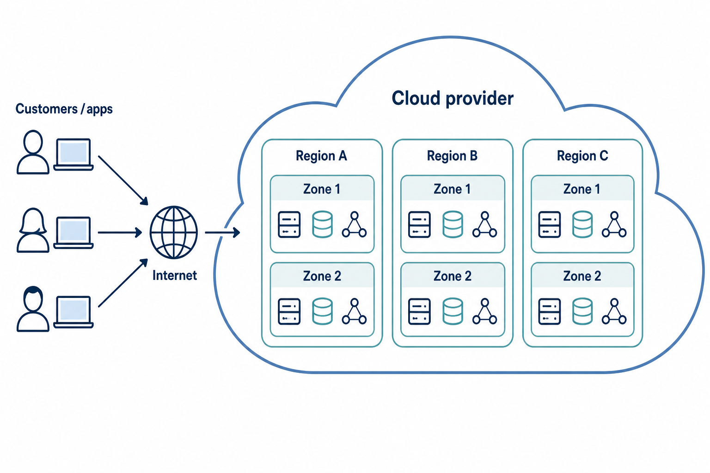
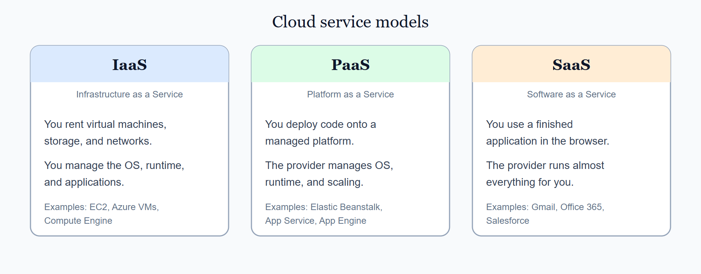
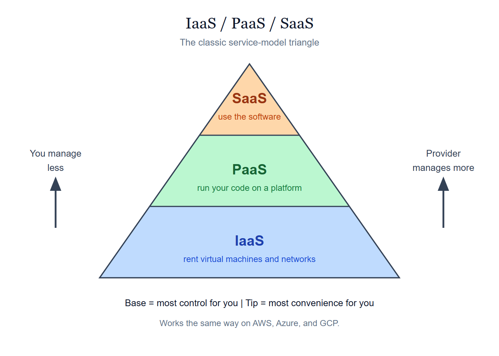
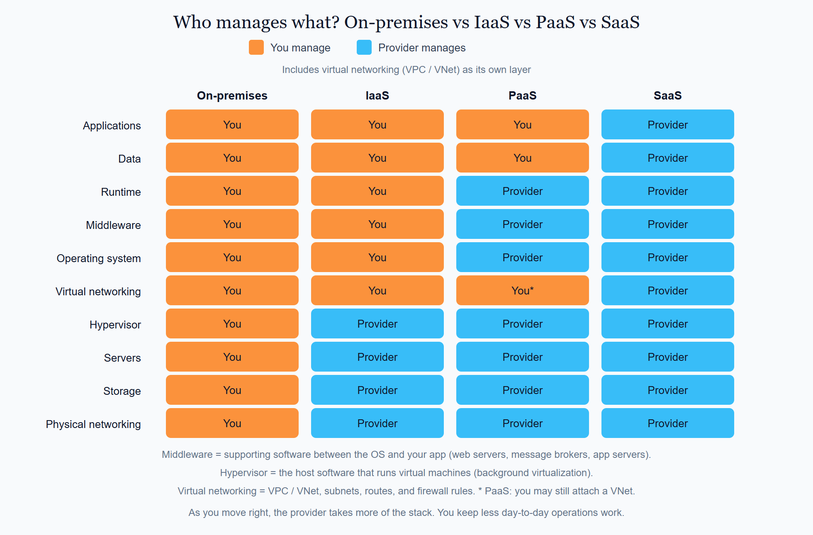
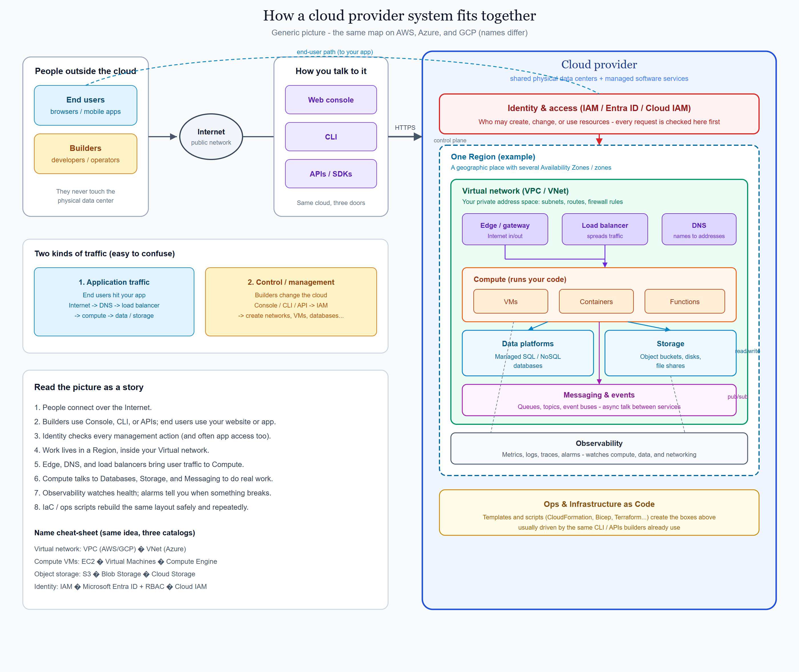

# 1. What is the cloud / cloud model

Cloud computing means you use compute, storage, networking, and managed services over the internet instead of buying and running your own data center. You rent capacity from a provider, pay for what you use, and can grow or shrink as demand changes.

The same ideas appear on every major public cloud. The product names differ; the model does not.

## On this page

- [What the cloud model means](#what-the-cloud-model-means)
- [Cloud service models](#cloud-service-models)
- [How the pieces fit together](#how-the-pieces-fit-together)
- [How the three clouds fit](#how-the-three-clouds-fit)
- [Provider pages for this topic](#provider-pages-for-this-topic)

## What the cloud model means

  

<em>A generic cloud provider: customers and apps reach the provider over the internet. Inside, work runs in multiple <strong>regions</strong>, each with isolated <strong>zones</strong>, offering compute, storage, and networking.</em>

In the classic model:

- The **provider** owns and runs the physical buildings, power, cooling, and hardware.
- You **choose services** (virtual machines, databases, networks, and more) and configure them.
- You **access** them through a console, APIs, and command-line tools.
- You **pay** for usage (and often for reserved capacity when that fits your needs).

Shared responsibility still applies: the provider secures the cloud; you secure what you put in it. That idea is covered later in this syllabus.

## Cloud service models

Cloud services are usually grouped into three **service models**. They answer a simple question: *how much of the stack do you want to manage yourself?*

  

| Model | Full name | What you get | You manage | Provider manages | One-line difference |
|-------|-----------|--------------|------------|------------------|---------------------|
| **IaaS** | Infrastructure as a Service | Virtual machines and cloud storage (like volumes); also lets you create and manage your own virtual networks (not the provider’s physical network) | Operating system, runtime, middleware, applications, data, and virtual networking (VPC / VNet) | Data center, physical hardware, physical networking, and hypervisor | Closest to “a server you rent” |
| **PaaS** | Platform as a Service | A managed environment (“ready platform”) where you simply deploy your code, without having to set up or manage virtual machines, the operating system, or runtimes. Unlike IaaS, where you rent a VM and must configure it yourself, PaaS handles the platform setup for you. | Application code, configuration, and data | Operating system, runtime, middleware, platform scaling, and infrastructure | You deliver your app; the provider manages everything underneath, so you don’t deal with servers or OS setup.
| **SaaS** | Software as a Service | A finished application (usually in a browser) | Users, access, settings, and your business data | The application and the full stack under it | You use software; you do not build or host it |

**Remember the ladder:** IaaS → PaaS → SaaS means *you manage less each step*. Control goes down; convenience goes up.

  

### Who manages each layer?

The standard teaching picture compares **on-premises**, **IaaS**, **PaaS**, and **SaaS** layer by layer. Orange means you manage it. Blue means the provider manages it.

**Virtual networking** (VPC on AWS/GCP, VNet on Azure — subnets, routes, firewall rules) is shown as its own layer, separate from the provider’s physical network cables and switches.

  

**How to read it**

- **On-premises:** you buy and run the full stack in your own data center.
  - Own servers in a company data center
  - Rack-mounted storage and network switches you own
  - Self-hosted email, databases, or apps on your hardware
- **IaaS:** you rent the lower layers (for example EC2, Azure Virtual Machines, Compute Engine). You still install and patch the OS, run your software, and design **virtual networking** (VPC / VNet).
  - AWS: Amazon EC2, Amazon EBS, Amazon VPC
  - Azure: Virtual Machines, Managed Disks, Virtual Network (VNet)
  - GCP: Compute Engine, Persistent Disk, Virtual Private Cloud
- **PaaS:** you deploy code onto a managed platform (for example Elastic Beanstalk, App Service, App Engine). You do not manage the OS or runtime; you may still attach the app to a virtual network.
  - AWS: Elastic Beanstalk, AWS Lambda, Amazon RDS
  - Azure: App Service, Azure Functions, Azure SQL Database
  - GCP: App Engine, Cloud Functions, Cloud SQL
- **SaaS:** you log into a finished product (for example email, Office 365, Salesforce). You do not host the application or design its network.
  - Productivity: Microsoft 365, Google Workspace
  - CRM / business: Salesforce, HubSpot
  - Collaboration: Slack, Zoom, Dropbox

Most real cloud work mixes these. A company might use **SaaS** for email, **PaaS** for an API, and **IaaS** for a special system that needs full OS control.

## How the pieces fit together

Across AWS, Azure, and GCP you rent the same kinds of building blocks. The large picture below shows how people reach the cloud, and how those pieces sit and talk inside a provider.

  

<em>End users and builders reach the provider over the internet (console, CLI, APIs). Inside: identity gates access; a region holds your virtual network, compute, data, storage, messaging, and observability; IaC rebuilds the layout.</em>

## How the three clouds fit

| Provider | Full name | Simple way to think about it |
|----------|-----------|------------------------------|
| **AWS** | Amazon Web Services | The largest public cloud; deep service catalog |
| **Azure** | Microsoft Azure | Strong fit for Microsoft estates and hybrid work |
| **GCP** | Google Cloud Platform | Strong data, analytics, and Kubernetes story |

You do not need to memorize every product on day one. Learn the **shared concept**, then map it to the name on each cloud.

## Provider pages for this topic

1.1 AWS — [What is AWS?](../aws/docs/1000_what_is_aws.md)  
1.2 Azure — [What is Azure?](../azure/docs/1000_what_is_azure.md)  
1.3 GCP — [What is Google Cloud?](../gcp/docs/1000_what_is_gcp.md)

 

    
        <a href="../README.md">Previous: Cloud</a>
        &nbsp;
        <a href="../aws/docs/1000_what_is_aws.md">Next: 1.1 AWS · Intro</a>
    
    
        <a href="../../README.md">Home</a>
        &nbsp;|&nbsp;
        <a href="../README.md">Cloud</a>
        &nbsp;|&nbsp;
        <a href="./1000_what_is_the_cloud.md">Topic: What is the cloud / cloud model</a>
    

