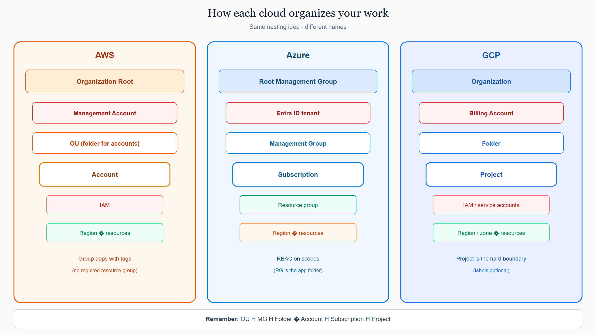
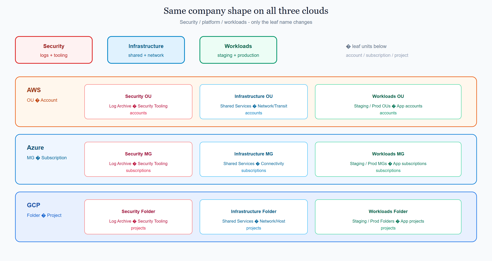
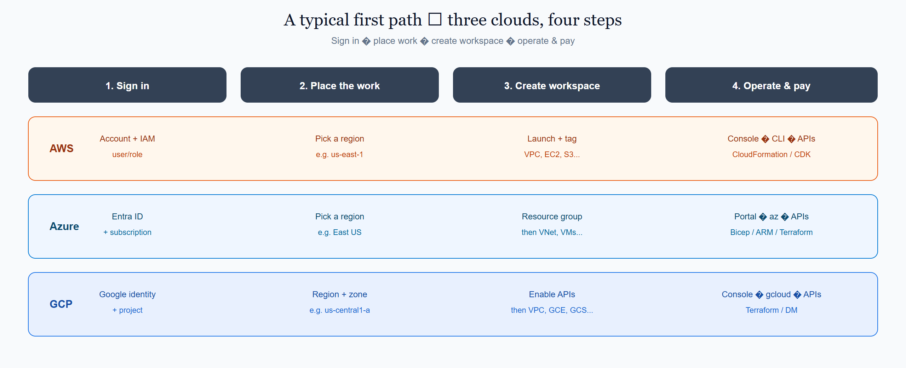
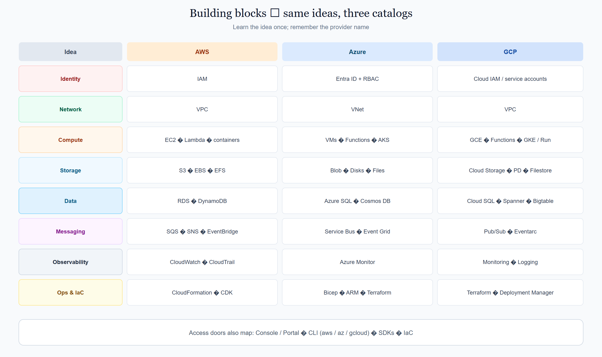

# 1.4 AWS · Azure · GCP at a glance

This page compares the three “what is” intros side by side: **[AWS](../aws/docs/1000_what_is_aws.md)**, **[Azure](../azure/docs/1000_what_is_azure.md)**, and **[GCP](../gcp/docs/1000_what_is_gcp.md)**.

The cloud model is the same. The nesting names differ. Use this page when you jump between providers.

## On this page

- [How each cloud organizes your work](#how-each-cloud-organizes-your-work)
- [Multi-account / multi-subscription pattern](#multi-account--multi-subscription-pattern)
- [A typical first path](#a-typical-first-path)
- [Building blocks (name map)](#building-blocks-name-map)
- [How you work with each cloud](#how-you-work-with-each-cloud)
- [Where this sits in the syllabus](#where-this-sits-in-the-syllabus)

## How each cloud organizes your work

  

<em>Remember: OU ≈ Management Group ≈ Folder · Account ≈ Subscription ≈ Project</em>

| Idea | AWS | Azure | GCP |
|------|-----|-------|-----|
| Company container | Organization (+ Root) | Tenant Root Management Group (+ Entra ID tenant) | Organization |
| Payer / billing owner | Management Account | Billing on each **subscription** (Billing Account in Microsoft ecosystem) | **Billing Account** linked to projects |
| Folder for isolation groups | **OU** (Organizational Unit) | **Management Group** | **Folder** |
| Main blast-radius + bill slice | **Account** | **Subscription** | **Project** |
| Group related resources | Tags + naming (no required folder) | **Resource group** (required habit) | Labels + naming (project is the hard boundary) |
| Who may act | **IAM** (in the account) | **Entra ID** + **RBAC** | **Cloud IAM** / service accounts |
| Where resources run | **Region** (and AZs) | **Region** (and AZs) | **Region** and **zone** |

**Short memory aid**

| | AWS | Azure | GCP |
|--|-----|-------|-----|
| Folder layer | OU | MG | Folder |
| Isolation unit | Account | Subscription | Project |
| App packaging folder | tags | Resource group | (optional labels) |

## Multi-account / multi-subscription pattern

Same company shape on all three clouds:

  

<em>Security / platform / workloads — only the leaf name changes (account, subscription, or project).</em>

| Role in the tree | AWS | Azure | GCP |
|------------------|-----|-------|-----|
| Security / logs | Security OU → Log Archive + Security Tooling **accounts** | Security MG → Log Archive + Security Tooling **subscriptions** | Security Folder → Log Archive + Security Tooling **projects** |
| Shared platform | Infrastructure OU → Shared Services + Network/Transit **accounts** | Infrastructure MG → Shared Services + Connectivity **subscriptions** | Infrastructure Folder → Shared Services + Network/Host **projects** |
| Apps | Workloads OU → Staging / Production OUs → app **accounts** | Workloads MG → Staging / Production MGs → app **subscriptions** | Workloads Folder → Staging / Production Folders → app **projects** |

Beginners usually start with **one** account / subscription / project. The tree above is what healthy companies grow into.

## A typical first path

  

<em>Sign in → place work → create workspace → operate and pay.</em>

| Step | AWS | Azure | GCP |
|------|-----|-------|-----|
| 1. Sign in | Account + **IAM** user/role | **Entra ID** + **subscription** | Google identity + **project** |
| 2. Place the work | Pick a **region** | Pick a **region** | Pick a **region** / **zone** |
| 3. Create the workspace | Launch services; **tag** related items | Create a **resource group**, then resources | **Enable APIs**, then launch services |
| 4. Operate & pay | Console / CLI / APIs / IaC; pay for use | Portal / CLI / APIs / IaC; pay for use | Console / gcloud / APIs / IaC; pay for use |

## Building blocks (name map)

  

<em>Learn the idea once; remember the provider name.</em>

| Idea | AWS | Azure | GCP |
|------|-----|-------|-----|
| Identity & access | IAM | Entra ID + RBAC / managed identities | Cloud IAM + service accounts |
| Virtual network | VPC | Virtual Network (VNet) | VPC |
| Compute | EC2, containers, Lambda | Virtual Machines, AKS, Azure Functions | Compute Engine, GKE, Cloud Functions / Cloud Run |
| Storage | S3, EBS, EFS | Blob Storage, Disks, Azure Files | Cloud Storage, Persistent Disk, Filestore |
| Data platforms | RDS, DynamoDB, … | Azure SQL, Cosmos DB, … | Cloud SQL, Spanner, Bigtable, … |
| Messaging | SQS, SNS, EventBridge | Service Bus, Event Grid, Event Hubs | Pub/Sub, Eventarc |
| Observability | CloudWatch, CloudTrail | Azure Monitor | Cloud Monitoring, Cloud Logging |
| Ops & IaC | CloudFormation, CDK | Bicep, ARM, Terraform | Terraform, Deployment Manager |

## How you work with each cloud

| Path | AWS | Azure | GCP |
|------|-----|-------|-----|
| Browser UI | Management Console | Azure portal | Google Cloud console |
| CLI | AWS CLI | Azure CLI / PowerShell (`az`) | gcloud |
| Code | SDKs / APIs | SDKs / REST APIs | Client libraries / APIs |
| IaC | CloudFormation, CDK | Bicep, ARM, Terraform | Terraform, Deployment Manager |

Builders use those doors. End users hit *your* application — not the cloud console.

## Where this sits in the syllabus

You have finished the three provider intros for topic **1**. Next is topic **2**: how accounts, subscriptions, and projects work in more depth.

Provider intros: [1.1 AWS](../aws/docs/1000_what_is_aws.md) · [1.2 Azure](../azure/docs/1000_what_is_azure.md) · [1.3 GCP](../gcp/docs/1000_what_is_gcp.md)  
Shared concept: [What is the cloud / cloud model](./1000_what_is_the_cloud.md)

 

    
        <a href="../gcp/docs/1000_what_is_gcp.md">Previous: GCP Intro</a>
        &nbsp;
        <a href="./1010_accounts_subscriptions_projects.md">Next: Accounts</a>
    
    
        <a href="../../README.md">Home</a>
        &nbsp;|&nbsp;
        <a href="../README.md">Cloud</a>
        &nbsp;|&nbsp;
        <a href="./1000_what_is_the_cloud.md">Topic: What is the cloud</a>
    

