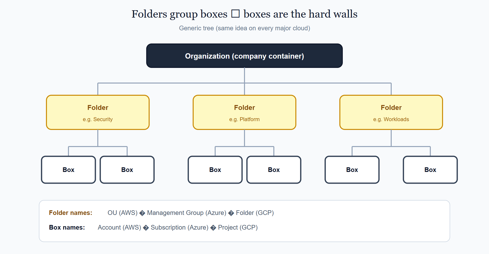
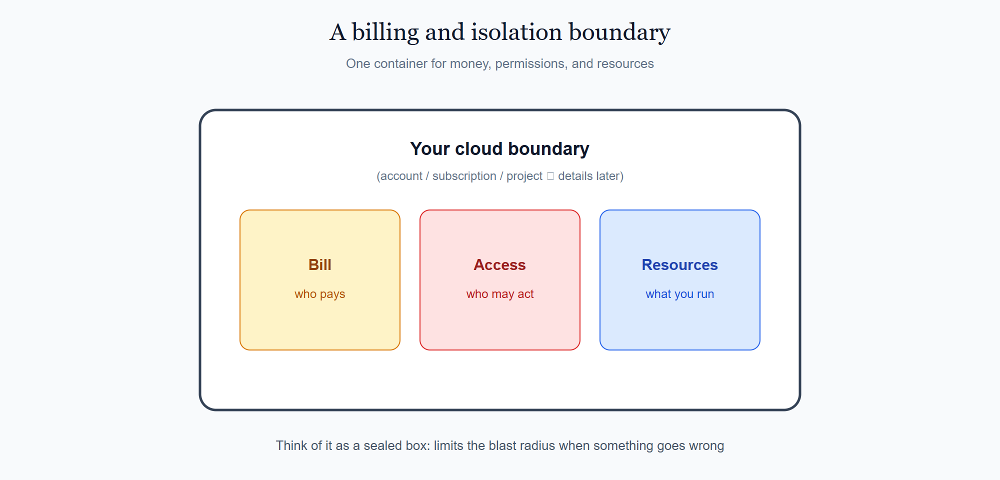
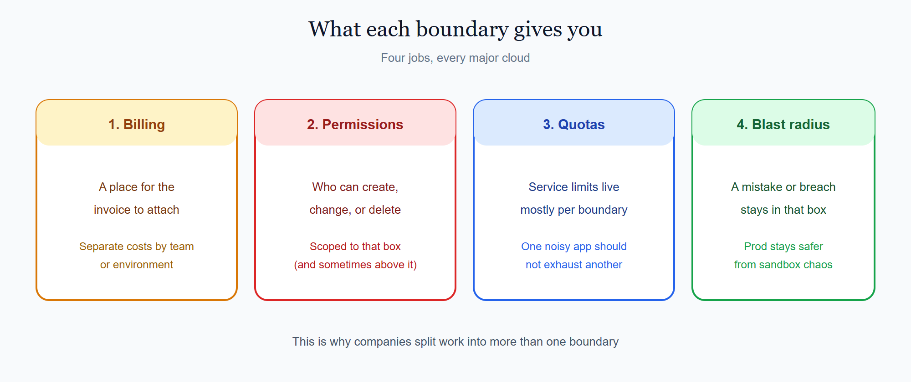
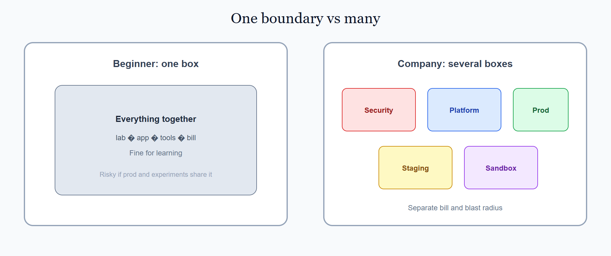
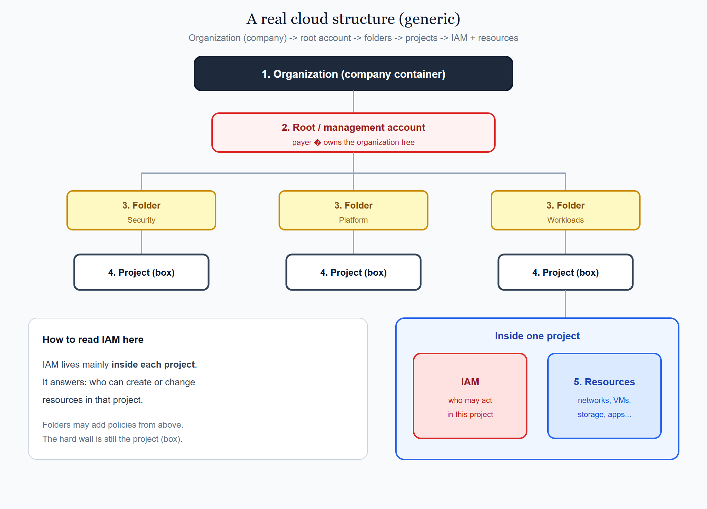

# 2. Accounts, subscriptions & projects

Every cloud resource lives inside a **boundary**. A boundary is a separate box for your team or company. What is inside one box cannot be seen or changed from another box unless you allow it on purpose.

People reach that box by signing in with an **identity** (a user or role). On AWS this is often called an IAM user or role inside an **account**. Azure uses **Microsoft Entra ID** with access to a **subscription**. GCP uses a Google identity with access to a **project**.

Work inside the box is **monitored** for several everyday purposes:

- **Billing** — how much you spent, and on what
- **Security** — who did what, and whether access looks wrong
- **Operations** — whether services are healthy
- **Audit / compliance** — a history you can review later

The box itself — the real isolation boundary — has different product names:

| Cloud | Name of the box |
|-------|-----------------|
| **AWS** | **Account** |
| **Azure** | **Subscription** |
| **GCP** | **Project** |

The **Organization** is the **company container** for the whole tree. It is not an app folder. It is the outer product that holds folders and boxes together (AWS Organization, Azure tenant + management-group tree, GCP Organization).

Under the Organization sits a **folder** layer. A company usually has several folders, and each folder can hold many boxes. The folder is only for grouping and policy. It is **not** the isolation boundary — the box still is.

On each cloud the folder has a different name: **OU** (Organizational Unit) on AWS, **Management Group** on Azure, and **Folder** on GCP. The hard wall remains the account, subscription, or project — that is, the **boxes**.

  

<em>Organization (company container) → folders → boxes. Boxes are the hard walls (account / subscription / project).</em>

Inside the box you put the things you run — networks, machines, storage, and apps. The box also holds the rules for who may change those things. The bill for that work is tied to the same box (or to a billing link attached to it).

If everything shared one box, one mistake could touch everything, and one invoice would mix every team together. Separate boxes keep cost, access, and damage in clearer limits.

## On this page

- [Look inside one box](#look-inside-one-box)
- [Why the box matters (four jobs)](#why-the-box-matters-four-jobs)
- [Start with one box, grow to many](#start-with-one-box-grow-to-many)
- [A real cloud structure](#a-real-cloud-structure)
- [Quick name map](#quick-name-map)
- [What to learn next](#what-to-learn-next)
- [Provider pages for this topic](#provider-pages-for-this-topic)

## Look inside one box

You already know the box is the hard wall. Here is what lives **inside** it in practice:

  

<em>Bill + access rules + resources — all in the same box.</em>

You almost never place a resource “in the cloud” with no box. You always choose a box first, then create the resource inside it.

## Why the box matters (four jobs)

Monitoring (billing, security, operations, audit) is one part of the story. The box also gives you four lasting jobs:

  

| Job | Everyday meaning |
|-----|------------------|
| **Billing** | Where costs attach (team, app, or environment) |
| **Permissions** | Who may act inside this box |
| **Quotas / limits** | How much of each service this box may use |
| **Blast radius** | How far a mistake, outage, or breach can spread |

If a student lab and a production app share one box, they also share risk and often share the same invoice noise. That is the practical reason to add more boxes later.

## Start with one box, grow to many

**While learning:** use **one** box. Keep the bill small. Focus on creating resources and reading the console.

**In a company:** use **several** boxes — for example one for security tooling, one for shared platform, one for staging, and one for production.

  

<em>One box is fine for labs. Companies use several boxes so bills and blast radii stay separate.</em>

A simple rule:

- Same **trust** and same **lifecycle** → can share a box.
- Different **environment** (prod vs sandbox) or different **security role** → usually a new box.

Then hang those boxes under the folders you met earlier (security / platform / workloads).

## A real cloud structure

Put the pieces in the order companies usually use them:

1. **Organization** at the top (company container for the whole tree)  
2. **Root / management account** inside that Organization (payer; owns the tree)  
3. **Folders** under the root (group related work)  
4. **Projects** (the boxes / hard walls) under each folder  
5. **Inside each project:** **IAM** (who may act) and **resources** (what you run)

IAM belongs with the project. It does not replace the project. Folders may add policy from above, but day-to-day “who can change this VM?” is decided inside the project.

  

<em>Organization → root account → folders → projects → IAM + resources inside each project.</em>

Name reminder (same tree, different words): Organization ≈ company container. Project ≈ account (AWS) ≈ subscription (Azure). Folder ≈ OU ≈ Management Group. You also saw provider-shaped versions on the intros and the [comparison page](./1005_aws_azure_gcp_at_a_glance.md).

## Quick name map

Keep this short map nearby when you open a provider page:

| Generic idea | AWS | Azure | GCP |
|--------------|-----|-------|-----|
| The box | Account | Subscription | Project |
| The folder | OU | Management Group | Folder |
| Company container | Organization | Entra tenant + Root MG | Organization |
| Extra packaging inside a box | tags / naming | Resource group | labels / naming |

You do not need every console click yet. Learn the map, then follow the provider tutorial for your cloud.

## What to learn next

This page stayed generic on purpose. The provider pages add the product details:

- How to create the box in that cloud’s console  
- How folders and policies work there  
- Azure resource groups as a day-to-day habit  
- First login & setup for AWS, Azure, and GCP ([2.4](./1015_first_login_and_setup.md))  
- How this connects to regions and identity (later M1 topics)

## Provider pages for this topic

2.1 AWS — [Accounts & Organizations](../aws/docs/1010_accounts_organizations.md)  
2.2 Azure — [Subscriptions & management groups](../azure/docs/1010_subscriptions_management_groups.md)  
2.3 GCP — [Organizations & folders](../gcp/docs/1010_orgs_folders.md)  
2.4 Setup — [First login & setup (overview)](./1015_first_login_and_setup.md)  
2.5 AWS — [First login & setup](../aws/docs/1015_first_login_setup.md)  
2.6 Azure — [First login & setup](../azure/docs/1015_first_login_setup.md)  
2.7 GCP — [First login & setup](../gcp/docs/1015_first_login_setup.md)

### Related pages

- AWS — [Accounts, Regions, and Availability Zones](../aws/docs/1100_accounts_regions_az.md)
- Azure — [Subscriptions, resource groups, and regions](../azure/docs/1100_subscriptions_regions.md)
- GCP — [Projects](../gcp/docs/1020_projects.md) · [Projects, regions, and zones](../gcp/docs/1100_projects_regions_zones.md)
- Compare — [AWS · Azure · GCP at a glance](./1005_aws_azure_gcp_at_a_glance.md)

 

    
        <a href="./1005_aws_azure_gcp_at_a_glance.md">Previous: Compare clouds</a>
        &nbsp;
        <a href="../aws/docs/1010_accounts_organizations.md">Next: AWS Accounts</a>
    
    
        <a href="../../README.md">Home</a>
        &nbsp;|&nbsp;
        <a href="../README.md">Cloud</a>
        &nbsp;|&nbsp;
        <a href="./1010_accounts_subscriptions_projects.md">Topic: Accounts, subscriptions & projects</a>
    

