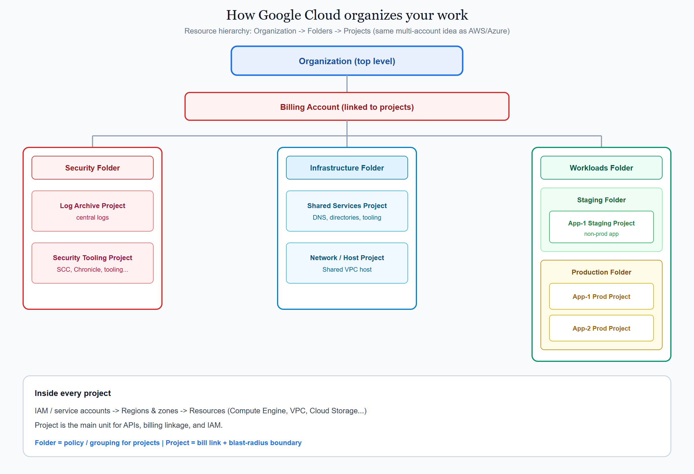
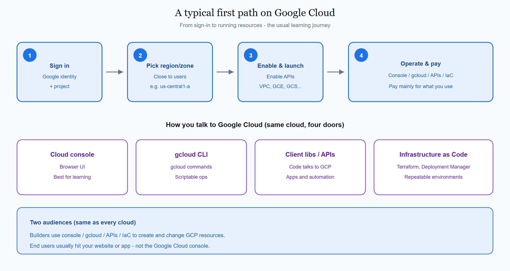
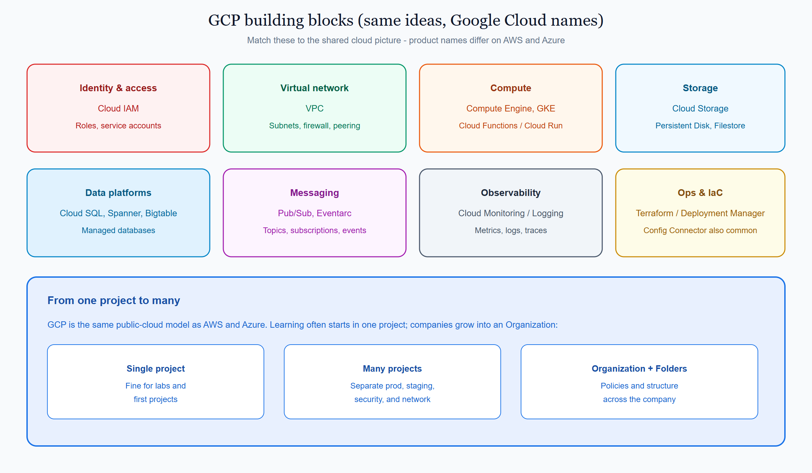

# 1.3 What is Google Cloud?

**GCP** (Google Cloud Platform) is Google’s public cloud. It offers on-demand compute, storage, networking, databases, and managed services across regions worldwide.

This page is the GCP view of the shared concept **[What is the cloud / cloud model](../../docs/1000_what_is_the_cloud.md)**. GCP follows the same model as AWS and Azure: you rent infrastructure and managed services instead of running your own data center. The names and consoles differ.

## On this page

- [How Google Cloud organizes your work](#how-google-cloud-organizes-your-work)
- [A typical first path](#a-typical-first-path)
- [Building blocks you will meet](#building-blocks-you-will-meet)
- [How you work with GCP](#how-you-work-with-gcp)
- [Where this sits in the syllabus](#where-this-sits-in-the-syllabus)

## How Google Cloud organizes your work

Companies rarely put everything in one place. The **resource hierarchy** lets you nest **projects** under an **organization**, group them with **folders**, and apply policies from above.

A common multi-project layout looks like this (same idea as AWS Organizations + OUs + accounts):

```text
Organization (top level)
│
├── Billing Account (linked to projects)
│
├── Security Folder
│   ├── Log Archive Project
│   └── Security Tooling Project
│
├── Infrastructure Folder
│   ├── Shared Services Project
│   └── Network / Host Project
│
└── Workloads Folder
    ├── Staging Folder
    │   └── App-1 Staging Project
    └── Production Folder
        ├── App-1 Prod Project
        └── App-2 Prod Project
```

| Scope | Everyday meaning |
|-------|------------------|
| **Organization** | Top of the company tree |
| **Billing Account** | Who pays; linked to one or more projects |
| **Folder** | Folder for projects (security, platform, workloads…) |
| **Project** | Main unit for APIs, IAM, and billing linkage; blast-radius boundary |
| **IAM / service accounts** | Who may act in the project (or higher in the tree) |
| **Region / zone** | Where most resources run (for example `us-central1-a`) |
| **Resource** | Compute Engine VM, VPC, Cloud Storage bucket, database, and so on |

Beginners often start with **one project**. The tree above is what healthy companies grow into. Folders are optional; projects are required for almost all GCP work.

<p align="center">
  
</p>

<p align="center"><em>Folder = policy / grouping for projects. Project = bill link + blast-radius boundary. Inside each project: IAM → region/zone → resources.</em></p>

## A typical first path

With GCP you usually:

1. Sign in with a **Google identity** and create or select a **project**.
2. Pick a **region** and **zone** close to your users.
3. **Enable APIs**, then launch services (VPC, Compute Engine, Cloud Storage, and more).
4. Pay mainly for what you use, with committed use discounts when demand is steady.

Later you may place that project under an Organization with folders (security / infrastructure / workloads).

<p align="center">
  
</p>

<p align="center"><em>Builders manage GCP through console, gcloud, APIs, or IaC. End users hit your app — not the Google Cloud console.</em></p>

## Building blocks you will meet

These map to the shared “pieces of the cloud” picture — Google Cloud product names:

| Idea | GCP name | Everyday meaning |
|------|----------|------------------|
| Identity & access | **Cloud IAM**, service accounts | Who can do what |
| Virtual network | **VPC** | Your private network in the cloud |
| Compute | **Compute Engine**, GKE, **Cloud Functions** / Cloud Run | VMs, containers, or functions |
| Storage | **Cloud Storage**, Persistent Disk, Filestore | Objects, disks, and file shares |
| Data platforms | **Cloud SQL**, Spanner, Bigtable, and others | Managed databases |
| Messaging | **Pub/Sub**, Eventarc | Topics, subscriptions, and events |
| Observability | **Cloud Monitoring**, Cloud Logging | Metrics, logs, and traces |
| Ops & IaC | **Terraform**, Deployment Manager | Automating how you build and run everything |

<p align="center">
  
</p>

<p align="center"><em>Same building blocks as AWS and Azure — GCP names. Start with one project; grow into an Organization with folders when the company needs isolation.</em></p>

You do not need every service on day one. Learn the idea on the shared page, then remember the GCP name here.

## How you work with GCP

| Path | What it is for |
|------|----------------|
| **Google Cloud console** | Browser UI for learning and day-to-day operations |
| **gcloud CLI** | Scriptable commands from your terminal |
| **Client libraries / APIs** | Application code talking to GCP |
| **Infrastructure as Code** | Terraform, Deployment Manager, and similar tools (covered later) |

Builders use console, gcloud, and APIs to create and change resources. End users usually hit *your* application, not the Google Cloud console.

## Where this sits in the syllabus

Next is a **side-by-side comparison** of AWS, Azure, and GCP from these three intros. After that, topic **2** covers accounts, subscriptions, and projects in more depth.

Related GCP pages: [Foundations](./1000_foundations.md) · [GCP tutorials](../README.md) · [Docs index](./index.md)

<br/>
<p>
    <span style="float: left;">
        <a href="../../azure/docs/1000_what_is_azure.md">Previous: Azure Intro</a>
        &nbsp;
        <a href="../../docs/1005_aws_azure_gcp_at_a_glance.md">Next: 1.4 Compare · At a glance</a>
    </span>
    <span style="float: right;">
        <a href="../../../README.md">Home</a>
        &nbsp;|&nbsp;
        <a href="../../README.md">Cloud</a>
        &nbsp;|&nbsp;
        <a href="../../docs/1000_what_is_the_cloud.md">Topic: What is the cloud</a>
    </span>
</p>
