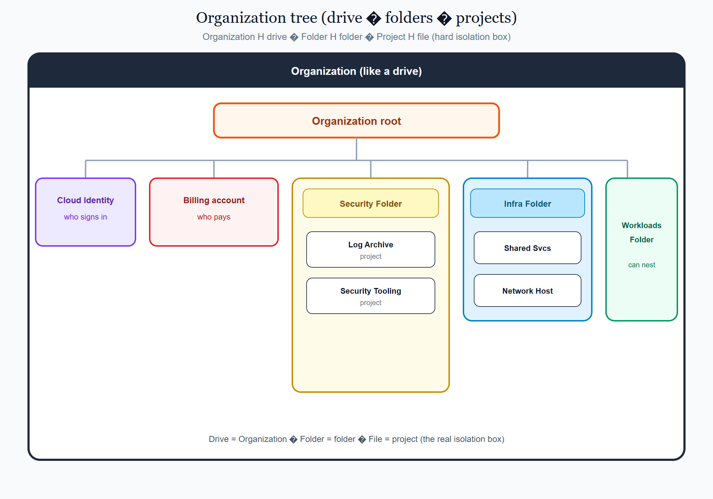
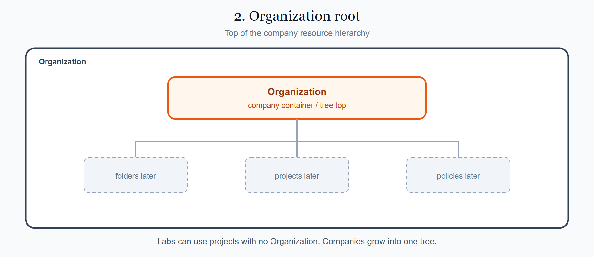
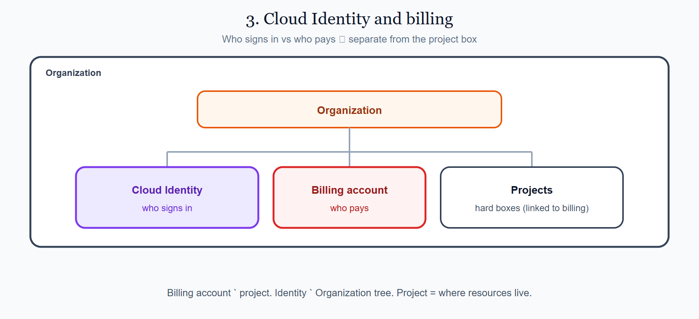
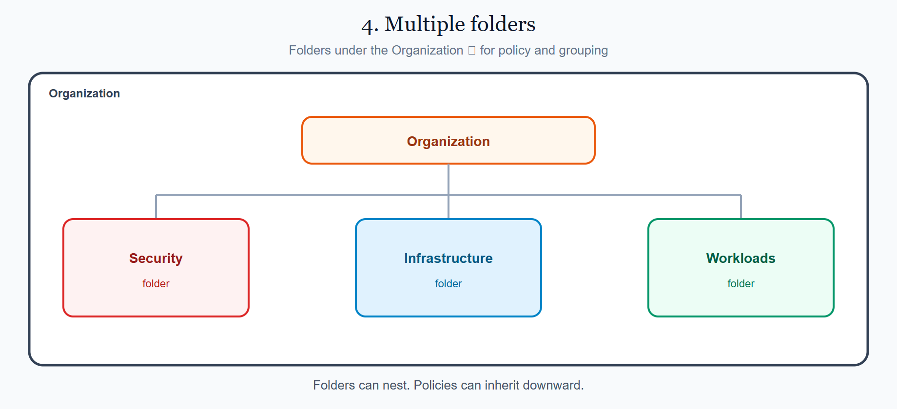
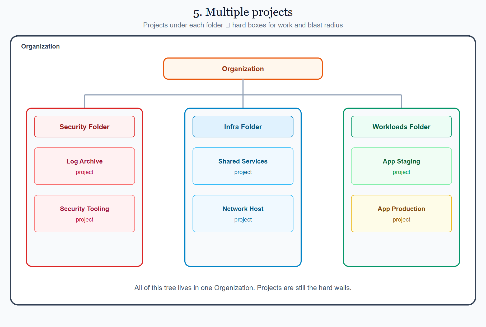
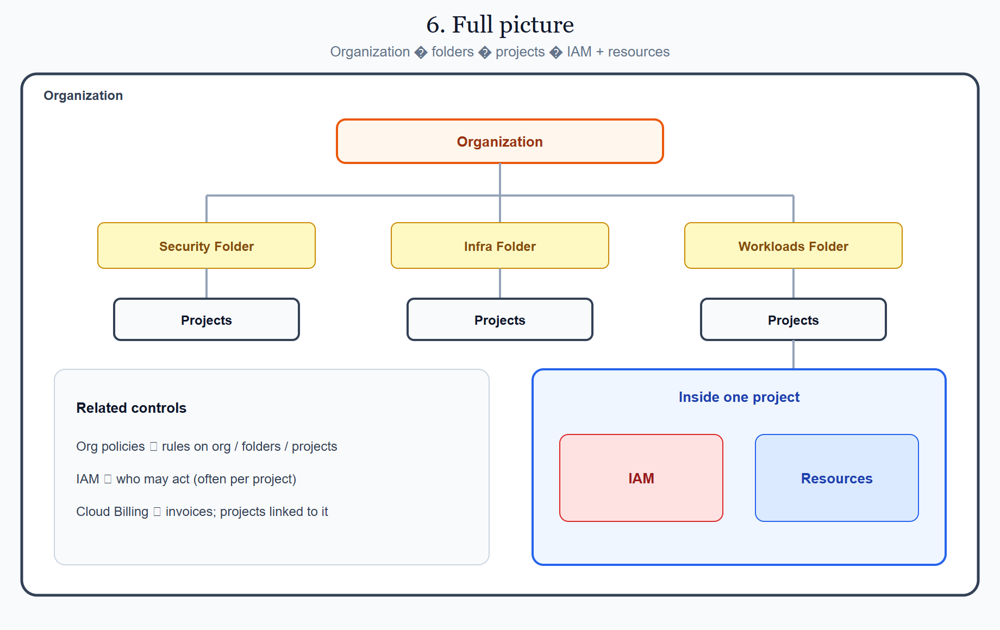
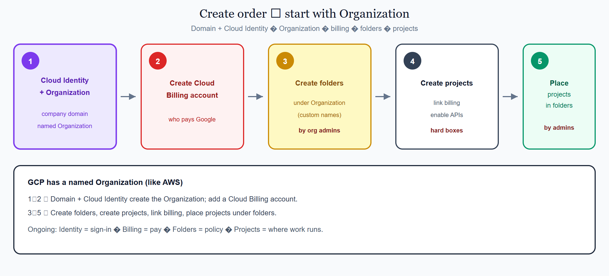

# 2.3 GCP — Organizations & folders

This page is the GCP view of the shared concept **[Accounts, subscriptions & projects](../../docs/1010_accounts_subscriptions_projects.md)**.

On GCP, a **project** is a core idea: a hard isolation **box** (like a namespace). A company usually has many projects, of different types, and groups them under **folders**. Think of GCP **folders** like filing folders and **projects** like files inside them — a useful picture for learning, even though GCP does not store them as real disk folders and files. A folder can hold other folders (nested). The outer container for this whole tree (imagine a drive) is a named product: the **Organization**. Sign-in for the company often comes from **Cloud Identity** (or Google Workspace). Payment usually attaches through a **Cloud Billing account**.

## On this page

- [A single GCP project (the box)](#a-single-gcp-project-the-box)
- [1. Organization (the company container)](#1-organization-the-company-container)
- [2. Organization root](#2-organization-root)
- [3. Cloud Identity and billing (who signs in / who pays)](#3-cloud-identity-and-billing-who-signs-in--who-pays)
  - [What is a Cloud Billing account?](#what-is-a-cloud-billing-account)
- [4. Multiple folders](#4-multiple-folders)
- [5. Multiple projects](#5-multiple-projects)
- [6. Full picture](#6-full-picture)
- [7. How to set them up](#7-how-to-set-them-up)
- [Where this sits in the syllabus](#where-this-sits-in-the-syllabus)

## A single GCP project (the box)

Before a big org tree, remember the basic unit: a **GCP project**.

- It has a bill link (to a Cloud Billing account).
- It has **IAM** (who may act) — users, groups, service accounts, roles.
- It holds **resources** (VMs, VPC, Cloud Storage, and so on) in regions and zones.
- Almost every API you enable is **per project**.

One project is fine for learning. Companies create an **Organization** so they can use **many** projects safely under one tree.

## 1. Organization (the company container)

Unlike Azure, GCP **does** have a product named **Organization** — same idea as AWS Organizations: the company outer container for the resource hierarchy.

That outer shell holds:

| Piece | Role in the Organization |
|-------|--------------------------|
| **Organization** | Company container — top of the resource hierarchy |
| **Cloud Identity / Workspace** | Company directory — who can sign in (tied to the org domain) |
| **Cloud Billing account** | Who pays — linked to one or more projects (not a resource box) |
| **Folders** | Folders you add for grouping and policy |
| **Projects** | Boxes that do most of the work |

Before you have an Organization, you can still use **standalone projects** (common for labs). After you create an Organization:

- Projects and folders hang under that Organization.
- **Organization policies** (and IAM) can apply from the top downward.
- Usage is still tracked per project while billing rolls up through Cloud Billing accounts.

<p align="center">
  
</p>

<p align="center"><em>Organization ≈ drive → folders → projects (files / hard boxes). Cloud Identity = who. Billing account = who pays.</em></p>

Every diagram below keeps that same **Organization** border so you always see where each piece sits.

```text
AWS:    Organization → Root OU / OUs → accounts
Azure:  Entra + Root MG → MGs → subscriptions   (no product named Organization)
GCP:    Organization → folders → projects       (named Organization, like AWS)
```

## 2. Organization root

The **Organization** node is the top of the GCP resource hierarchy. Folders and projects sit under it.

- Every folder and project in the company tree hangs under the Organization (directly or through folders).
- You apply org-wide IAM and **organization policies** from here (or from folders below).
- Projects can also exist **without** an Organization (no-org / free-tier style labs) — companies grow into an Organization when they need one tree and stronger policy.

<p align="center">
  
</p>

<p align="center"><em>Inside the Organization: top of the tree. Folders and projects hang under it.</em></p>

## 3. Cloud Identity and billing (who signs in / who pays)

GCP also splits “who signs in” and “who pays” — closer to Azure’s split than to AWS’s management-account story:

| Term | Meaning |
|------|---------|
| **Cloud Identity / Google Workspace** | Directory for users and groups (company domain) |
| **Cloud Billing account** | Who pays / receives invoices |
| **Organization Admin** | Can manage the org resource hierarchy |
| **Project Owner / Editor** | Can manage one project’s resources and access |

An Organization is usually created for a **domain** (for example `example.com`) with Cloud Identity or Workspace. Billing is a **separate** object you **link** to projects.

### What is a Cloud Billing account?

A **Cloud Billing account** is **not** a project and **not** a folder. It is the **payment / invoice** object with Google.

| Piece | Is it a box for resources? | Main job |
|-------|----------------------------|----------|
| **Cloud Billing account** | No | Contract, invoices, payment |
| **Cloud Identity** | No | Who can sign in |
| **Folder** | No | Grouping + policy above projects |
| **Project** | **Yes** | Hard wall for APIs, IAM, quotas, blast radius |

**Simple chain**

1. Sign in with an identity from **Cloud Identity** (or Workspace).  
2. Work in a **project** (the box).  
3. That project is **linked** to a **Cloud Billing account** (who pays).  
4. Hang the project under a **folder** (or directly under the Organization) for policy.

**Common mix-ups**

- Billing account ≠ project.  
- Billing account ≠ Organization.  
- Folder ≠ project.  
- Many projects can share one billing account.

<p align="center">
  
</p>

<p align="center"><em>Cloud Identity = who signs in. Billing account = who pays. Organization = company tree. Project = the hard box.</em></p>

## 4. Multiple folders

A **folder** under the Organization groups projects (and other folders) and can receive IAM and organization policies.

| Example folder name (custom) | Typical purpose |
|------------------------------|-----------------|
| **Security** | Log archive, security tooling |
| **Infrastructure** | Shared services, host / network project |
| **Workloads** | Application projects (often Staging / Production child folders) |

GCP does **not** create Security / Infrastructure / Workloads folders for you. After you get an Organization, you add folder names that fit your company.

**Who configures folders?**

- People with Organization / Folder Admin (or similar) create, move, and delete folders.
- They move **projects** into those folders and set policies that inherit downward.
- A normal project user cannot redesign the whole company tree unless an admin has delegated that work.

Folders can nest. For example: `Workloads → Production → app projects`.

<p align="center">
  
</p>

<p align="center"><em>Inside the Organization: folders for policy and grouping — not the hard isolation wall.</em></p>

### Why folders matter

You *can* put every project directly under the Organization. That works for a tiny lab. It does **not** scale well for a company.

| Reason | What it means in practice |
|--------|---------------------------|
| **Group by job** | Security projects together, platform together, apps together |
| **Apply policy once** | Set IAM or org policy on a folder; projects under it inherit |
| **Different rules per area** | Production can be stricter than Sandbox without editing each project |
| **Safer change** | Move a project into a folder and it picks up that folder’s rules |
| **Clear ownership** | Teams can own a folder without owning the whole Organization |

**Remember:** the project is still the hard wall. The folder sits **above** projects so you can organize them and push shared rules down the tree.

## 5. Multiple projects

Under the **Organization** you normally find **folders**, and under those folders **projects** — where most work runs.

A **project** is a normal GCP box that belongs to the Organization (or stands alone in a lab). Think of it as one of the **hard boxes** from the shared page.

**How it fits**

1. **Create a project** under the Organization (or move an existing one in).  
2. **Place it under a folder** that matches its job.  
3. **Work inside that project** — enable APIs, set IAM, create resources.  
4. **Link a Cloud Billing account** — usage is tracked per project; payment is through billing.

**Do not mix these up**

- **Organization** = company container.  
- **Cloud Billing account** = who pays.  
- **Folder** = grouping + policy.  
- **Project** = where work and risk live. One job (or one environment) per project is the usual goal.

```text
So: Organization = company container. Folders = folders. Billing account = payer. Projects = boxes where work and risk live.
```

<p align="center">
  
</p>

<p align="center"><em>Inside the Organization: folders → projects under each folder.</em></p>

## 6. Full picture

Read the GCP tree top to bottom:

1. **Organization** (company container)  
2. **Cloud Identity** (sign-in) + **Cloud Billing account** (payer)  
3. **Folders**  
4. **Projects** (boxes)  
5. Inside each project: **IAM** + **resources** (in regions / zones)

<p align="center">
  
</p>

<p align="center"><em>Organization → folders → projects → IAM and resources inside each project.</em></p>

```text
Organization (+ Cloud Identity) + Cloud Billing account
├── Security Folder
│   ├── Log Archive project
│   └── Security Tooling project
├── Infrastructure Folder
│   ├── Shared Services project
│   └── Network / Host project
└── Workloads Folder
    ├── Staging Folder
    │   └── App Staging project
    └── Production Folder
        └── App Production project
```

## 7. How to set them up

Start with a **domain** + **Cloud Identity** (or Workspace), create the **Organization**, add a **Cloud Billing account**, then create **folders** and **projects**, link billing, and place projects under the right folders. Organization admins do this work.

<p align="center">
  
</p>

<p align="center"><em>Identity + Organization first → billing → folders → projects → place under folders.</em></p>

Organization, folder, and project setup details continue on **[2.4 First login overview](../../docs/1015_first_login_and_setup.md)** → **[2.7 GCP · First login](./1015_first_login_setup.md)**.

## Where this sits in the syllabus

You finished the three provider views for topic 2. Next: first login & setup for all three clouds, then **regions and availability zones**.

<br/>
<p>
    <span style="float: left;">
        <a href="../../azure/docs/1010_subscriptions_management_groups.md">Previous: Azure Subscriptions</a>
        &nbsp;
        <a href="../../docs/1015_first_login_and_setup.md">Next: Registration</a>
    </span>
    <span style="float: right;">
        <a href="../../../README.md">Home</a>
        &nbsp;|&nbsp;
        <a href="../../README.md">Cloud</a>
        &nbsp;|&nbsp;
        <a href="../../docs/1010_accounts_subscriptions_projects.md">Topic: Accounts, subscriptions & projects</a>
    </span>
</p>
