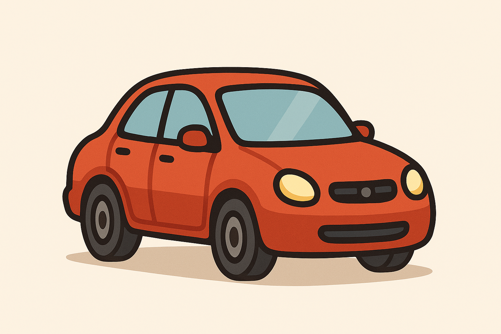

# Design Patterns

In the engineering profession, practitioners routinely encounter diverse challenges that require effective solutions. Regardless of the discipline—be it mechanical, civil, automotive, software, or electronics—engineers are expected to address and resolve the problems presented to them.

`Design patterns` are all about crafting smart solutions to these problems. Devotees of `design patterns` believes that, most of these problems can be categorized — and each of that category has a well-predefined, reusable solution. That solution is the `design pattern` of that problem.

When multiple skilled engineers independently work to solve the same problem, a unique `design patterns` often emerge across their approaches. This does not imply that a problem has only one optimal solution—many problems can yield multiple equally effective solutions. However, these solutions can often be categorized, with each category exhibiting a unique and consistent solution pattern.

## An example

Let’s say a group of engineers is given the below problem to solve:
```
Design a machine that enables efficient travel across the Earth's surface
```

Different engineers may solve the same problem with diverse solutions, as plotted below:

<p align="center">
    
    
    
</p>

Even though each solution is different, they share some common features.
## What are the similarities ?
* All have an engine
* All include a brake, accelerator, and clutch
* All have four wheels
* All can be drive and carry passengers
* etc and etc

This consistency in design, across the solutions, represents the `design pattern`

> [!NOTE]
> Also, the similarity in solution is actually originated from the problem being addressed!

### Categories of Design Patterns
Let us look one step closer to get a big picture!

Imagine you're comparing a bus, car, and truck. At first glance, they’re all differnt vehicles. They all are different! But if you look closer, you’ll notice uniform patterns them. **Also, this uniformity can be observed in different contexts,** like:
- 🏗️ How each vehicle is built — **this relates to `Creational patterns`**
- 🧩 What components are used (engine, wheels, steering, etc) and how they’re organized — **this reflects `Structural patterns`**
- 🎮 How the vehicle is driven (automatic, semi-automatic, manual, etc) — **this corresponds to `Behavioral patterns`**

> [!NOTE]
> Many people get confused here. They often think that there are lots of design patterns, and each one fits neatly into one of the three categories. But that’s not quite right.
> 
> The right way to understand design patterns is to see them from three different angles: creational, structural, and behavioral. When you're looking for a `design pattern` in a solution, first ask yourself: Which angle am I viewing it from? This technique will help you to identify the underlying `design pattern.`
>
> Why? Sometimes, a creational pattern might use structural or behavioral techniques (and in vice versa). That’s why it’s easy to get confused about which category a pattern belongs to.

<p align="right">
    <a href="docs/index.md">Next</a>
</p>