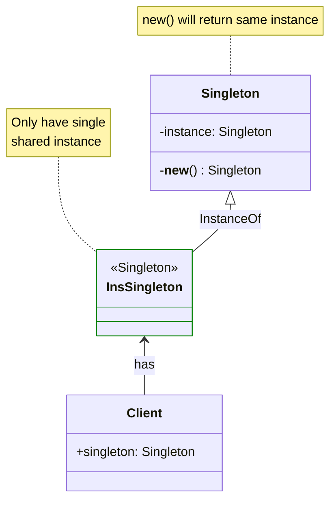
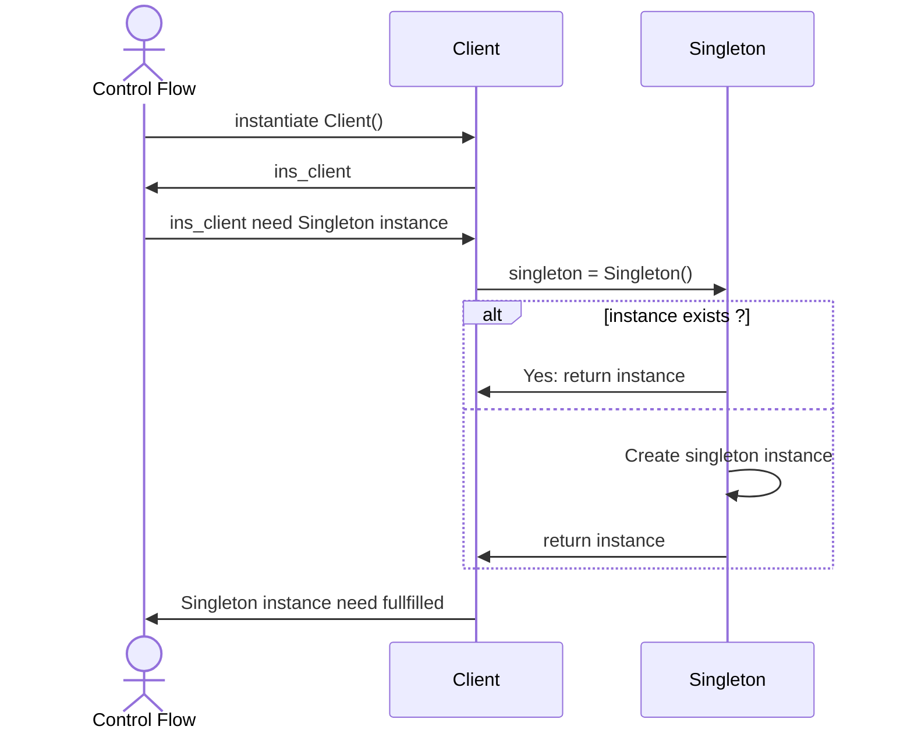

# Singleton Design Pattern

## On this page

- [What is the Singleton pattern?](#what-is-the-singleton-pattern)
- [Car analogy](#car-analogy)
- [When should you use it?](#when-should-you-use-it)
- [Code example](#code-example)
- [Key idea](#key-idea)

## What is the Singleton pattern?

Singleton makes sure a class has only one shared instance. Every part of the car that talks to the ECU uses the same object.

**Category:** Creational POV

## Car analogy

In a car, the engine control unit (ECU) is the main computer that manages the engine—fuel, ignition, and sensor data. Only one ECU exists, shared across the entire system.

## When should you use it?

Use it when exactly one shared resource must exist, such as configuration, logging, or a hardware controller.

## Class and Sequence diagrams

The class and sequence diagrams below show one simple way to model Singleton. They are here to teach the idea, not to fit every real project. In practice, your classes, clients, and flows may look different—draw diagrams that match your own design.




<br/><br/><br/>



## Code example

```python
"""
Singleton pattern demo: one ECU for the whole car.

Run:
    python singleton_demo.py

Only one engine control unit (ECU) exists—shared across the system.
"""

from __future__ import annotations


class ECU:
    """Single shared engine control unit for the vehicle."""

    _instance: ECU | None = None

    def __new__(cls) -> ECU:
        if cls._instance is None:
            cls._instance = super().__new__(cls)
            cls._instance._initialized = False
        return cls._instance

    def __init__(self) -> None:
        if self._initialized:
            return
        self.firmware_version = "v2.1"
        self.engine_map = "eco"
        self._initialized = True

    def calibrate_sensors(self) -> str:
        return f"ECU {self.firmware_version} calibrating sensors ({self.engine_map} map)"

    def set_drive_mode(self, mode: str) -> None:
        self.engine_map = mode


class Dashboard:
    def __init__(self) -> None:
        self._ecu = ECU()

    def show_status(self) -> None:
        print(f"Dashboard reads ECU: {self._ecu.calibrate_sensors()}")


class EngineBay:
    def __init__(self) -> None:
        self._ecu = ECU()

    def sync_timing(self) -> None:
        print(f"Engine bay synced with ECU: {self._ecu.firmware_version}")


def main() -> None:
    print("=== Singleton: shared ECU ===\n")

    dashboard = Dashboard()
    engine_bay = EngineBay()

    dashboard.show_status()
    engine_bay.sync_timing()

    ecu_a = ECU()
    ecu_b = ECU()
    ecu_a.set_drive_mode("sport")

    print()
    print(f"Same ECU instance? {ecu_a is ecu_b}")
    print(f"Dashboard sees updated mode: {dashboard._ecu.calibrate_sensors()}")


if __name__ == "__main__":
    main()
```

**Output:**
```
=== Singleton: shared ECU ===

Dashboard reads ECU: ECU v2.1 calibrating sensors (eco map)
Engine bay synced with ECU: v2.1

Same ECU instance? True
Dashboard sees updated mode: ECU v2.1 calibrating sensors (sport map)
```

Source: [`singleton_demo.py`](../code/1000_singleton/singleton_demo.py)

## Key idea

- The pattern solves a recurring design problem in a reusable way.
- In this example, the car analogy makes the roles of each class easy to remember.
- Run the demo yourself: `python singleton_demo.py` inside `code/1000_singleton/`.

<br/>
<p>
    <span style="float: left;">
        <a href="index.md">Previous: Index</a>
        &nbsp;
        <a href="1100_prototype.md">Next: Prototype</a>
    </span>
    <span style="float: right;">
        <a href="../../README.md">Home</a>
        &nbsp;|&nbsp;
        <a href="index.md">Back to Design Patterns Index</a>
    </span>
</p>
