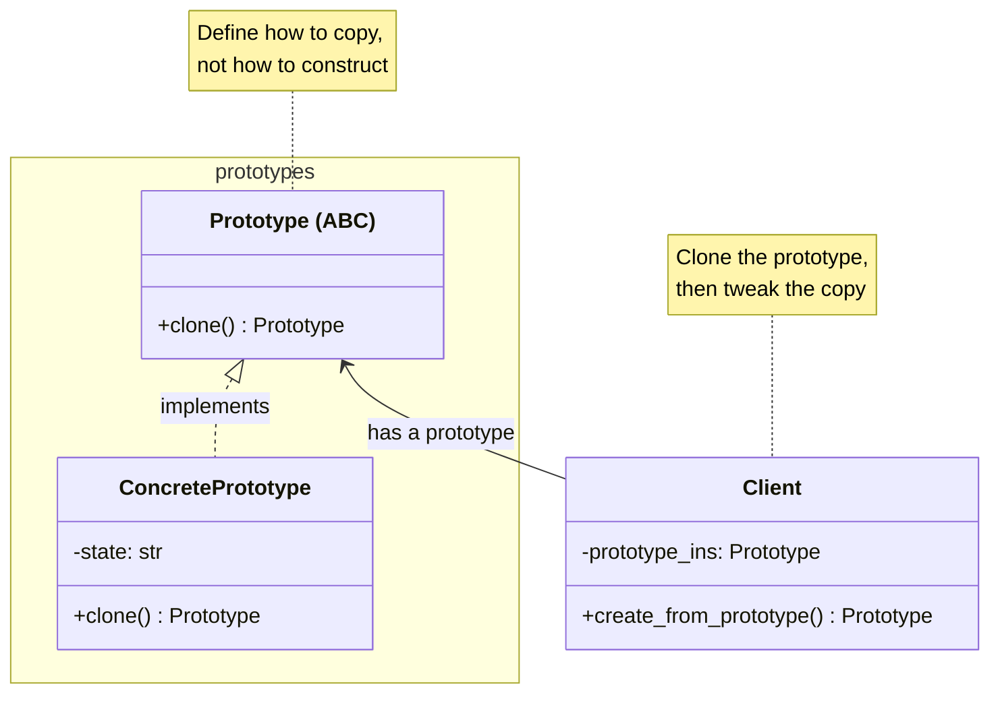
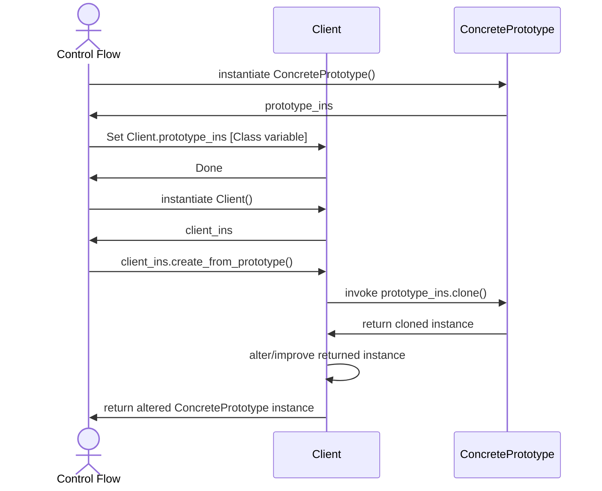

# Prototype Design Pattern

## On this page

- [What is the Prototype pattern?](#what-is-the-prototype-pattern)
- [Car analogy](#car-analogy)
- [When should you use it?](#when-should-you-use-it)
- [Code example](#code-example)
- [Key idea](#key-idea)

## What is the Prototype pattern?

Prototype copies an existing object instead of building from scratch. Start from a base design, clone it, then tweak the copy.

**Category:** Creational POV

## Car analogy

Clone and update an existing car design to make a new car design.

## When should you use it?

Use it when creating a new object is costly and small changes to an existing template are enough.

## UML based Class and sequence diagram



<br/><br/><br/>



## Code example

```python
"""
Prototype pattern demo: clone an existing car design.

Run:
    python prototype_demo.py

Clone and update an existing car design to make a new car design.
"""

from __future__ import annotations

import copy
from dataclasses import dataclass, field


@dataclass
class CarDesign:
    model_name: str
    body_style: str
    paint_color: str
    features: list[str] = field(default_factory=list)

    def clone(self) -> CarDesign:
        """Return a deep copy so changes do not affect the original."""
        return copy.deepcopy(self)

    def describe(self) -> str:
        extras = ", ".join(self.features) if self.features else "none"
        return f"{self.model_name} ({self.body_style}, {self.paint_color}, extras: {extras})"


class DesignStudio:
    def __init__(self, base_design: CarDesign) -> None:
        self._prototype = base_design

    def create_variant(self, model_name: str, paint_color: str, *features: str) -> CarDesign:
        variant = self._prototype.clone()
        variant.model_name = model_name
        variant.paint_color = paint_color
        variant.features.extend(features)
        return variant


def main() -> None:
    print("=== Prototype: clone car design ===\n")

    hatchback_blueprint = CarDesign(
        model_name="CityGo Hatch",
        body_style="hatchback",
        paint_color="silver",
        features=["ABS", "airbags"],
    )
    print(f"Original design: {hatchback_blueprint.describe()}")

    studio = DesignStudio(hatchback_blueprint)
    sport_variant = studio.create_variant("CityGo Sport", "red", "sport suspension", "alloy wheels")
    family_variant = studio.create_variant("CityGo Family", "white", "roof rack")

    print(f"Sport variant:   {sport_variant.describe()}")
    print(f"Family variant:  {family_variant.describe()}")
    print()
    print(f"Original unchanged: {hatchback_blueprint.describe()}")
    print(f"Variants share body style: {sport_variant.body_style == family_variant.body_style}")


if __name__ == "__main__":
    main()
```

**Output:**
```
=== Prototype: clone car design ===

Original design: CityGo Hatch (hatchback, silver, extras: ABS, airbags)
Sport variant:   CityGo Sport (hatchback, red, extras: ABS, airbags, sport suspension, alloy wheels)
Family variant:  CityGo Family (hatchback, white, extras: ABS, airbags, roof rack)

Original unchanged: CityGo Hatch (hatchback, silver, extras: ABS, airbags)
Variants share body style: True
```

Source: [`prototype_demo.py`](../code/1100_prototype/prototype_demo.py)

## Key idea

- The pattern solves a recurring design problem in a reusable way.
- In this example, the car analogy makes the roles of each class easy to remember.
- Run the demo yourself: `python prototype_demo.py` inside `code/1100_prototype/`.

<br/>
<p>
    <span style="float: left;">
        <a href="1000_singleton.md">Previous: Singleton</a>
        &nbsp;
        <a href="1200_factory_method.md">Next: Factory Method</a>
    </span>
    <span style="float: right;">
        <a href="../../README.md">Home</a>
        &nbsp;|&nbsp;
        <a href="index.md">Back to Design Patterns Index</a>
    </span>
</p>
