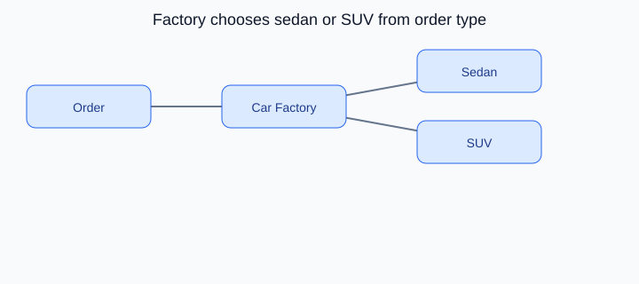

# Factory Method Design Pattern

<p align="center">
    
</p>

<p align="center"><strong>Fig:</strong> Factory chooses sedan or SUV from order type</p>

## What is the Factory Method pattern?

Factory Method lets subclasses decide which object to create. The factory receives an order and builds the right car model.

**Category:** Creational POV

## Car analogy

A car factory decides which model to produce based on order type.

## When should you use it?

Use it when object creation depends on input type but the creation steps should stay in one place.

## Code example

```python
"""
Factory Method pattern demo: car factory picks the model to build.

Run:
    python factory_method_demo.py

A car factory decides which model to produce based on order type.
"""

from __future__ import annotations

from abc import ABC, abstractmethod


class Car(ABC):
    def __init__(self, model: str, seats: int) -> None:
        self.model = model
        self.seats = seats

    @abstractmethod
    def drive(self) -> str:
        pass


class Sedan(Car):
    def drive(self) -> str:
        return f"{self.model} sedan glides smoothly on the highway"


class SUV(Car):
    def drive(self) -> str:
        return f"{self.model} SUV climbs the rough trail with ease"


class CarFactory(ABC):
    @abstractmethod
    def create_car(self, model: str) -> Car:
        pass

    def fulfill_order(self, model: str) -> Car:
        car = self.create_car(model)
        print(f"Factory built: {car.model} ({car.seats} seats)")
        return car


class SedanFactory(CarFactory):
    def create_car(self, model: str) -> Car:
        return Sedan(model, seats=5)


class SUVFactory(CarFactory):
    def create_car(self, model: str) -> Car:
        return SUV(model, seats=7)


def main() -> None:
    print("=== Factory Method: model-specific factory ===\n")

    orders = [
        (SedanFactory(), "Aurora"),
        (SUVFactory(), "TrailBlazer"),
        (SedanFactory(), "Aurora LX"),
    ]

    for factory, model in orders:
        car = factory.fulfill_order(model)
        print(f"  -> {car.drive()}")
        print()


if __name__ == "__main__":
    main()
```

**Output:**
```
=== Factory Method: model-specific factory ===

Factory built: Aurora (5 seats)
  -> Aurora sedan glides smoothly on the highway

Factory built: TrailBlazer (7 seats)
  -> TrailBlazer SUV climbs the rough trail with ease

Factory built: Aurora LX (5 seats)
  -> Aurora LX sedan glides smoothly on the highway
```

Source: [`factory_method_demo.py`](../code/1200_factory_method/factory_method_demo.py)

## Key idea

- The pattern solves a recurring design problem in a reusable way.
- In this example, the car analogy makes the roles of each class easy to remember.
- Run the demo yourself: `python factory_method_demo.py` inside `code/1200_factory_method/`.

<p align="right">
    <a href="1100_prototype.md">Previous: Prototype</a>
    <a href="1300_abstract_factory.md">Next: Abstract Factory</a>
</p>
