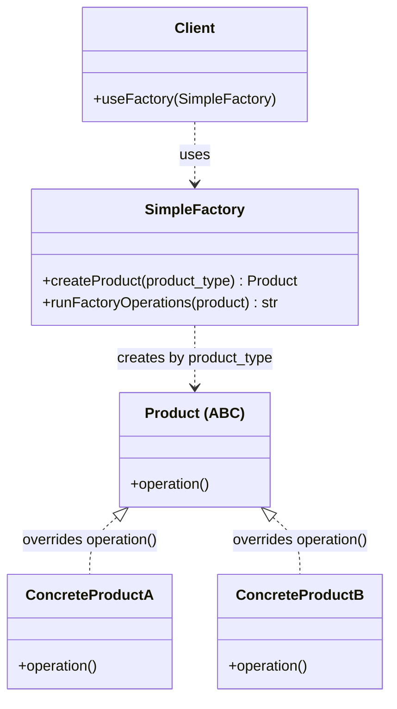
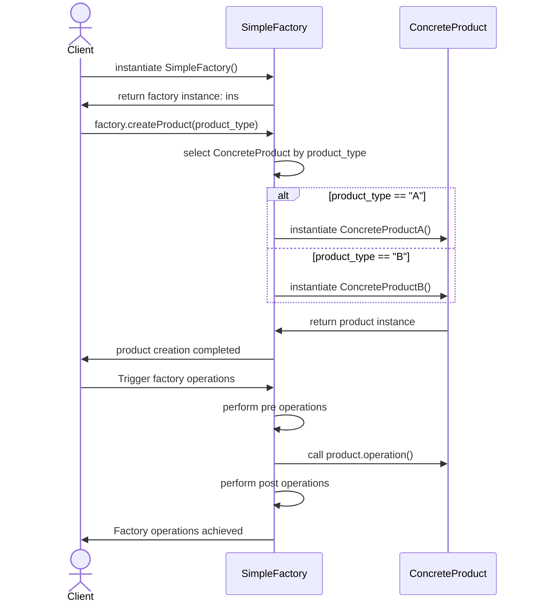

# Parameterized / Simple Factory

## On this page

- [What is it?](#what-is-a-simple-factory)
- [Car analogy](#car-analogy)
- [When should you use it?](#when-should-you-use-it)
- [Class diagram — Client, factory, and products](#class-diagram)
- [Sequence diagram — create, then operate](#sequence-diagram)
- [Python example (car factory)](#code-example)
- [Key takeaways](#key-idea)

## What is a Simple Factory?

A **Simple Factory** (also called a **Parameterized Factory**) centralizes object creation in one place—usually a standalone function or a single class method. Callers pass a parameter such as `"sedan"` or `"suv"`, and the factory picks the concrete class and returns an instance.

This is not the full GoF Factory Method pattern, but it is a common first step when creation logic should not be scattered across the codebase.

**Category:** Creational POV

## Car analogy

The order desk receives `"sedan"` or `"suv"` on the form and routes the build to the right production line from one checklist—no separate factory company per model.

## When should you use it?

Use it when:

- Creation depends on a small, known set of input types.
- You want one class method to own the `if/elif` (or mapping) that picks the product class.
- Subclassing a factory per product type would be overkill for now.

The flow has two phases: **create** the product with `createProduct(product_type)`, then **run factory operations** (pre steps, `product.operation()`, post steps).

## Class Diagram




## Sequence Diagram



## Code example

```python
"""
Simple (Parameterized) Factory demo: createProduct + factory operations.

Run:
    python simple_factory_demo.py

Matches the sequence: instantiate factory, createProduct(product_type),
then run pre/operation/post steps on the product.
"""

from __future__ import annotations

from abc import ABC, abstractmethod


class Product(ABC):
    def __init__(self, model: str, seats: int) -> None:
        self.model = model
        self.seats = seats

    @abstractmethod
    def operation(self) -> str:
        pass


class Sedan(Product):
    def operation(self) -> str:
        return f"{self.model} sedan glides smoothly on the highway"


class SUV(Product):
    def operation(self) -> str:
        return f"{self.model} SUV climbs the rough trail with ease"


class SimpleFactory:
    def create_product(self, product_type: str, model: str) -> Product:
        if product_type == "sedan":
            return Sedan(model, seats=5)
        if product_type == "suv":
            return SUV(model, seats=7)
        raise ValueError(f"Unknown product type: {product_type}")

    def run_factory_operations(self, product: Product) -> str:
        print("  perform pre operations")
        result = product.operation()
        print("  perform post operations")
        return result


def main() -> None:
    print("=== Simple Factory: parameter picks the product ===\n")

    factory = SimpleFactory()
    orders = [
        ("sedan", "Aurora"),
        ("suv", "TrailBlazer"),
        ("sedan", "Aurora LX"),
    ]

    for product_type, model in orders:
        print(f"Order: {product_type} / {model}")
        product = factory.create_product(product_type, model)
        print(f"  product creation completed -> {product.__class__.__name__} ({product.seats} seats)")

        print("  trigger factory operations")
        outcome = factory.run_factory_operations(product)
        print(f"  factory operations achieved -> {outcome}\n")


if __name__ == "__main__":
    main()
```

**Output:**
```
=== Simple Factory: parameter picks the product ===

Order: sedan / Aurora
  product creation completed -> Sedan (5 seats)
  trigger factory operations
  perform pre operations
  perform post operations
  factory operations achieved -> Aurora sedan glides smoothly on the highway

Order: suv / TrailBlazer
  product creation completed -> SUV (7 seats)
  trigger factory operations
  perform pre operations
  perform post operations
  factory operations achieved -> TrailBlazer SUV climbs the rough trail with ease

Order: sedan / Aurora LX
  product creation completed -> Sedan (5 seats)
  trigger factory operations
  perform pre operations
  perform post operations
  factory operations achieved -> Aurora LX sedan glides smoothly on the highway
```

Source: [`simple_factory_demo.py`](../code/1210_simple_factory/simple_factory_demo.py)

## Key idea

- **Create phase:** `SimpleFactory.create_product(product_type)` picks `Sedan` or `SUV` from the type parameter (diagram labels these ConcreteProductA / ConcreteProductB).
- **Operations phase:** `run_factory_operations()` runs pre steps, calls `product.operation()`, then post steps—same order as the sequence diagram.
- One factory class owns both creation and the follow-up workflow around the product.

<br/>
<p>
    <span style="float: left;">
        <a href="1200_factory_method.md">Previous: Factory Method</a>
        &nbsp;
        <a href="1220_factory_method_gof.md">Next: Classic GoF Factory Method</a>
    </span>
    <span style="float: right;">
        <a href="../../README.md">Home</a>
        &nbsp;|&nbsp;
        <a href="index.md">Back to Design Patterns Index</a>
    </span>
</p>
