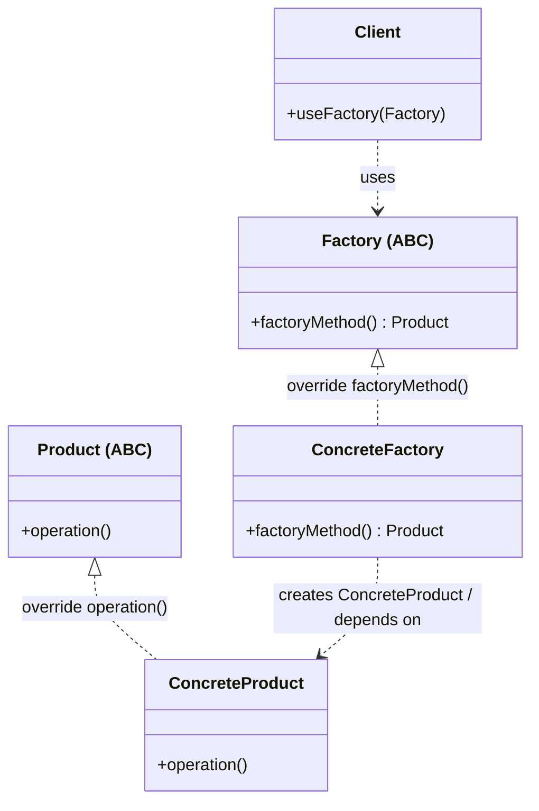
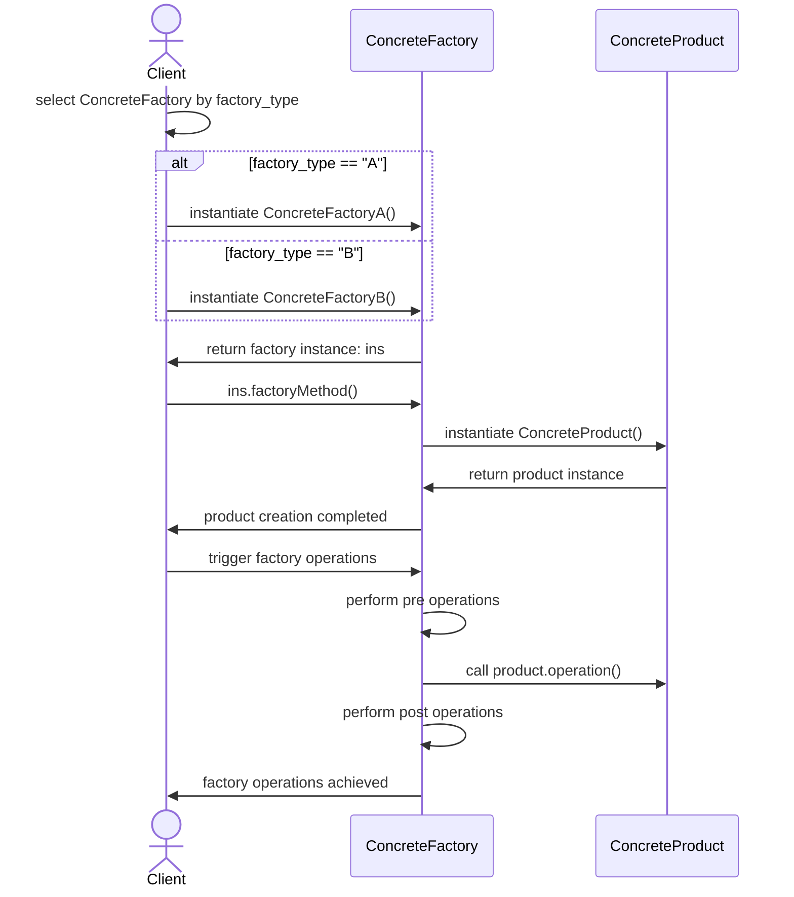

# Classic GoF Factory Method

## On this page

- [What is the GoF Factory Method?](#what-is-the-gof-factory-method)
- [Car analogy](#car-analogy)
- [When should you use it?](#when-should-you-use-it)
- [Code example](#code-example)
- [Key idea](#key-idea)

## What is the GoF Factory Method?

**GoF** stands for **Gang of Four**—a nickname for the four authors of *Design Patterns: Elements of Reusable Object-Oriented Software* (1994):

- **Erich Gamma**
- **Richard Helm**
- **Ralph Johnson**
- **James “Jim” Vlissides**

They were called the “Gang of Four” because four people co-wrote one influential book that named and documented 23 classic patterns—including Factory Method. In tutorials and teams, **GoF** is shorthand for “the pattern as defined in that book,” as opposed to informal factory-style variations (like Simple Factory).

Read the reference article: [articulo.pdf](../static/1220_factory_method_gof/articulo.pdf)


In the **Classic GoF Factory Method** pattern, a **Creator** class declares `factoryMethod()` to build a **Product**. Each **ConcreteCreator** subclass overrides `factoryMethod()` and decides which concrete product to return. Steps that use that product—such as `anOperation()`, which calls `factoryMethod()` internally—stay in the base Creator class so the workflow is shared.

The **Client** works with the Creator through its abstract interface. It never needs to know the exact concrete product class that was instantiated.

**Category:** Creational POV

## Car analogy

Sedan and SUV divisions are separate factory objects. Each division knows how to build its own models, but both follow the same order-fulfillment process.

## When should you use it?

Use it when:

- Different product families need different factory implementations.
- Creation logic should be extensible via subclassing instead of growing one big `if/elif` block.
- The creator should stay open for new factory types without changing existing client code.

## Class Diagram




## Sequence Diagram





## Code example

```python
"""
Factory Method pattern demo: car factory picks the model to build.

Run:
    python factory_method_demo.py

A car factory decides which model to produce based on order type.
"""

from __future__ import annotations

from abc import ABC, abstractmethod


class Car(ABC):
    def __init__(self, model: str, seats: int) -> None:
        self.model = model
        self.seats = seats

    @abstractmethod
    def drive(self) -> str:
        pass


class Sedan(Car):
    def drive(self) -> str:
        return f"{self.model} sedan glides smoothly on the highway"


class SUV(Car):
    def drive(self) -> str:
        return f"{self.model} SUV climbs the rough trail with ease"


class CarFactory(ABC):
    @abstractmethod
    def create_car(self, model: str) -> Car:
        pass

    def fulfill_order(self, model: str) -> Car:
        car = self.create_car(model)
        print(f"Factory built: {car.model} ({car.seats} seats)")
        return car


class SedanFactory(CarFactory):
    def create_car(self, model: str) -> Car:
        return Sedan(model, seats=5)


class SUVFactory(CarFactory):
    def create_car(self, model: str) -> Car:
        return SUV(model, seats=7)


def main() -> None:
    print("=== Factory Method: model-specific factory ===\n")

    orders = [
        (SedanFactory(), "Aurora"),
        (SUVFactory(), "TrailBlazer"),
        (SedanFactory(), "Aurora LX"),
    ]

    for factory, model in orders:
        car = factory.fulfill_order(model)
        print(f"  -> {car.drive()}")
        print()


if __name__ == "__main__":
    main()
```

**Output:**
```
=== Factory Method: model-specific factory ===

Factory built: Aurora (5 seats)
  -> Aurora sedan glides smoothly on the highway

Factory built: TrailBlazer (7 seats)
  -> TrailBlazer SUV climbs the rough trail with ease

Factory built: Aurora LX (5 seats)
  -> Aurora LX sedan glides smoothly on the highway
```

Source: [`factory_method_demo.py`](../code/1220_factory_method_gof/factory_method_demo.py)

## Key idea

- The pattern solves a recurring design problem in a reusable way.
- In this example, the car analogy makes the roles of each class easy to remember.
- Run the demo yourself: `python factory_method_demo.py` inside `code/1220_factory_method_gof/`.

<br/>
<p>
    <span style="float: left;">
        <a href="1210_simple_factory.md">Previous: Simple Factory</a>
        &nbsp;
        <a href="1300_abstract_factory.md">Next: Abstract Factory</a>
    </span>
    <span style="float: right;">
        <a href="../../README.md">Home</a>
        &nbsp;|&nbsp;
        <a href="index.md">Back to Design Patterns Index</a>
    </span>
</p>
