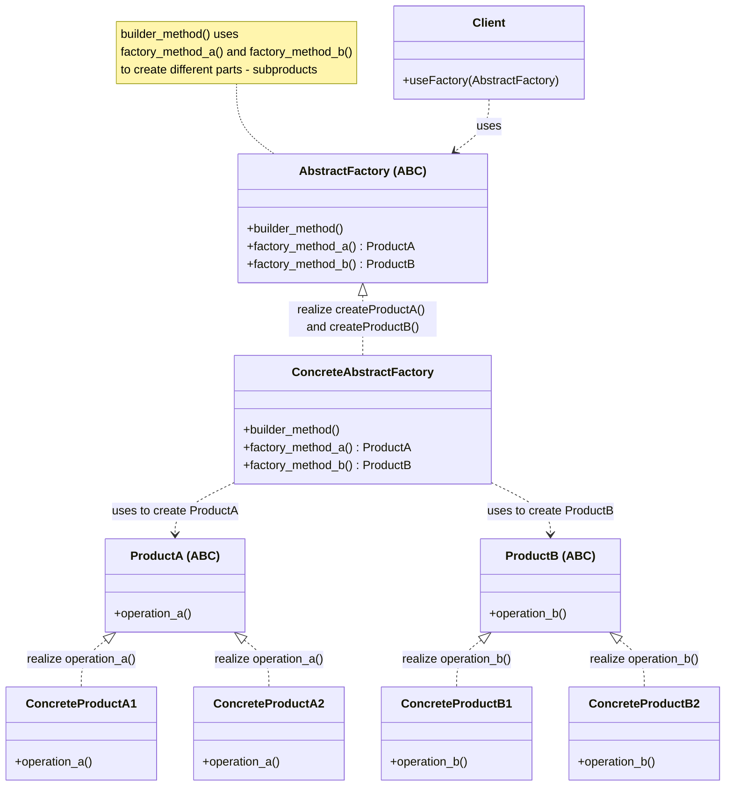
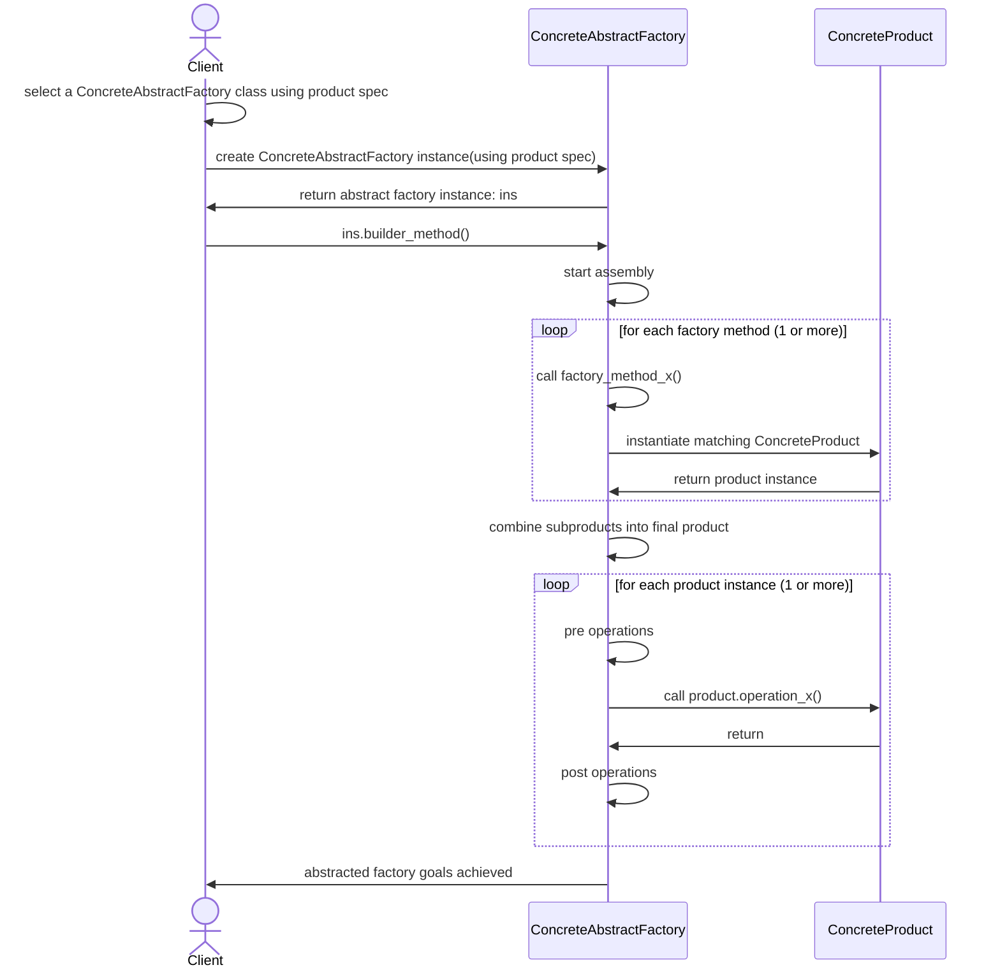

# Abstract Factory Design Pattern

## On this page

- [What is it?](#what-is-the-abstract-factory-pattern)
- [Car analogy](#car-analogy)
- [When should you use it?](#when-should-you-use-it)
- [Class diagram — how the parts connect](#class-diagram)
- [Sequence diagram — step-by-step flow](#sequence-diagram)
- [Python example (car factory)](#code-example)
- [Key takeaways](#key-idea)

## What is the Abstract Factory pattern?

Abstract Factory sits **one level above** several concrete factories. Each factory assembles a **matched set of related parts**. For example, the sedan line gives you a sedan engine and sedan body together; the SUV line gives you SUV parts—never a mix of both.

**Category:** Creational POV

## Car analogy

A manufacturer picks the sedan or SUV factory line from a bulk order; each factory then builds matching parts for that line.

## When should you use it?

Use it when you must create groups of related objects that must work together.

## Class Diagram



<br/>

The **Client** depends only on `AbstractFactory`. The **ConcreteAbstractFactory** does the real work. It implements factory methods such as `factory_method_a()` and `factory_method_b()` that return the product parts. For example:

1. `factory_method_a()` returns `ConcreteProductA1` or `ConcreteProductA2` for `ProductA`, and
2. `factory_method_b()` returns `ConcreteProductB1` or `ConcreteProductB2` for `ProductB`.

Then `builder_method()` combines those parts into one complete, meaningful product. The factory chooses matching pieces so the final result is always a compatible set.

<br/>

## Sequence Diagram



## Code example

```python
"""
Abstract Factory pattern demo: manufacturer picks the right factory.

Run:
    python abstract_factory_demo.py

Each abstract factory creates a matched family of engine and body parts.
"""

from __future__ import annotations

from abc import ABC, abstractmethod


# --- Products ---


class Engine(ABC):
    @abstractmethod
    def spec(self) -> str:
        pass


class Body(ABC):
    @abstractmethod
    def spec(self) -> str:
        pass


class SedanEngine(Engine):
    def spec(self) -> str:
        return "1.5L turbo sedan engine"


class SedanBody(Body):
    def spec(self) -> str:
        return "low-profile sedan body"


class SUVEngine(Engine):
    def spec(self) -> str:
        return "2.0L VVT SUV engine"


class SUVBody(Body):
    def spec(self) -> str:
        return "high-clearance SUV body"


# --- Abstract Factory layer ---


class VehicleFactory(ABC):
    @abstractmethod
    def create_engine(self) -> Engine:
        pass

    @abstractmethod
    def create_body(self) -> Body:
        pass

    def assemble_car(self, model: str) -> str:
        return f"{model}: {self.create_body().spec()} + {self.create_engine().spec()}"


class SedanFactory(VehicleFactory):
    def create_engine(self) -> Engine:
        return SedanEngine()

    def create_body(self) -> Body:
        return SedanBody()


class SUVFactory(VehicleFactory):
    def create_engine(self) -> Engine:
        return SUVEngine()

    def create_body(self) -> Body:
        return SUVBody()


# --- Client ---


class Manufacturer:
    _factories = {"city fleet": SedanFactory, "adventure fleet": SUVFactory}

    def select_factory(self, order_type: str) -> VehicleFactory:
        factory_cls = self._factories.get(order_type)
        if factory_cls is None:
            raise ValueError(f"Unknown order type: {order_type}")
        return factory_cls()

    def fulfill_order(self, order_type: str, model: str) -> str:
        factory = self.select_factory(order_type)
        print(f"Factory selected -> {factory.__class__.__name__}")
        return factory.assemble_car(model)


def main() -> None:
    print("=== Abstract Factory: matched part families ===\n")

    manufacturer = Manufacturer()
    for order_type, model in [("city fleet", "Metro Sedan"), ("adventure fleet", "Peak SUV")]:
        print(f"Order '{order_type}'")
        print(f"  {manufacturer.fulfill_order(order_type, model)}\n")


if __name__ == "__main__":
    main()
```

**Output:**
```
=== Abstract Factory: matched part families ===

Order 'city fleet'
Factory selected -> SedanFactory
  Metro Sedan: low-profile sedan body + 1.5L turbo sedan engine

Order 'adventure fleet'
Factory selected -> SUVFactory
  Peak SUV: high-clearance SUV body + 2.0L VVT SUV engine
```

Source: [`abstract_factory_demo.py`](../code/1300_abstract_factory/abstract_factory_demo.py)

## Key idea

- **Abstract Factory** (`VehicleFactory`) ensures *related products* from the same family are created together (`create_engine` + `create_body`).
- **Client** (`Manufacturer`) picks the right factory line, then uses it to build matched parts.
- Run the demo yourself: `python abstract_factory_demo.py` inside `code/1300_abstract_factory/`.

<br/>
<p>
    <span style="float: left;">
        <a href="1220_factory_method_gof.md">Previous: Factory Method</a>
        &nbsp;
        <a href="1400_builder.md">Next: Builder</a>
    </span>
    <span style="float: right;">
        <a href="../../README.md">Home</a>
        &nbsp;|&nbsp;
        <a href="index.md">Back to Design Patterns Index</a>
    </span>
</p>
