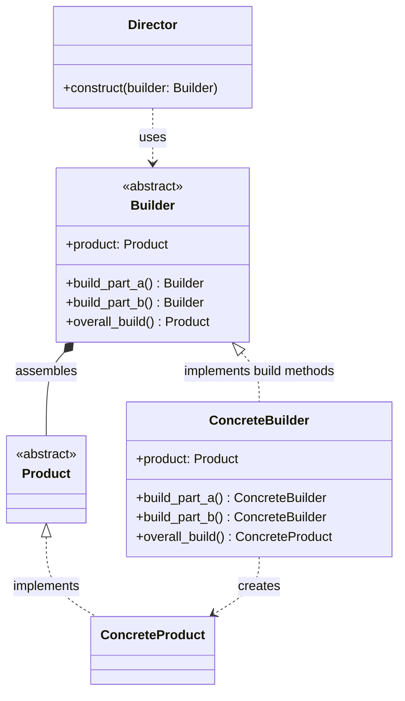
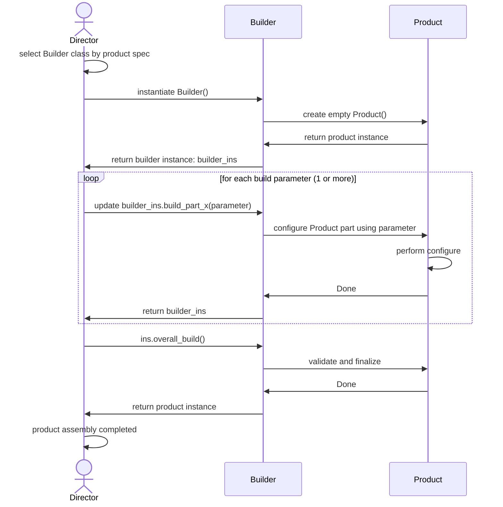

# Builder Design Pattern

## On this page

- [What is the Builder pattern?](#what-is-the-builder-pattern)
- [When should you use it?](#when-should-you-use-it)
- [Class diagram — how the parts connect](#class-diagram)
- [Sequence diagram — step-by-step flow](#sequence-diagram)
- [Python example (car assembly)](#code-example)
- [Key takeaways](#key-idea)

## What is the Builder pattern?

Builder helps you create a big object **one step at a time**, instead of putting everything into one constructor.

Think of a car assembly line: you add the chassis, then the engine, then the wiring, then the paint. The **same steps** can produce different cars—a city car or a sport car—by choosing different parts along the way.

**Category:** Creational POV

## When should you use it?

Use it when an object has many optional parts and you want readable assembly steps.

## Class Diagram



<br/>

The **Director** knows the assembly recipe. It calls build steps on a **ConcreteBuilder** in a fixed order. The builder holds the **Product** under construction and returns the finished result from `overall_build()`.

<br/>

## Sequence Diagram



## Code example

```python
"""
Builder pattern demo: assemble a car step by step.

Run:
    python builder_demo.py

Build a car step-by-step: chassis, engine, wiring, and paint.
"""

from __future__ import annotations


class Car:
    def __init__(self) -> None:
        self.chassis: str | None = None
        self.engine: str | None = None
        self.wiring: str | None = None
        self.paint: str | None = None

    def summary(self) -> str:
        parts = [self.chassis, self.engine, self.wiring, self.paint]
        return " | ".join(part for part in parts if part)


class CarBuilder:
    def __init__(self) -> None:
        self._car = Car()

    def fit_chassis(self, chassis_type: str) -> CarBuilder:
        self._car.chassis = f"chassis: {chassis_type}"
        return self

    def fit_engine(self, engine_type: str) -> CarBuilder:
        self._car.engine = f"engine: {engine_type}"
        return self

    def do_electric_work(self, wiring_package: str) -> CarBuilder:
        self._car.wiring = f"wiring: {wiring_package}"
        return self

    def apply_paint(self, color: str) -> CarBuilder:
        self._car.paint = f"paint: {color}"
        return self

    def build(self) -> Car:
        if not all([self._car.chassis, self._car.engine, self._car.wiring, self._car.paint]):
            raise ValueError("Car is incomplete—finish all build steps first")
        return self._car


class AssemblyLine:
    def build_city_car(self) -> Car:
        return (
            CarBuilder()
            .fit_chassis("compact frame")
            .fit_engine("1.2L efficient")
            .do_electric_work("basic dashboard")
            .apply_paint("pearl white")
            .build()
        )

    def build_sport_car(self) -> Car:
        return (
            CarBuilder()
            .fit_chassis("stiff sport frame")
            .fit_engine("2.5L turbo")
            .do_electric_work("digital cockpit")
            .apply_paint("racing red")
            .build()
        )


def main() -> None:
    print("=== Builder: step-by-step assembly ===\n")

    line = AssemblyLine()

    city_car = line.build_city_car()
    print(f"City car ready: {city_car.summary()}")

    print()
    sport_car = line.build_sport_car()
    print(f"Sport car ready: {sport_car.summary()}")


if __name__ == "__main__":
    main()
```

**Output:**
```
=== Builder: step-by-step assembly ===

City car ready: chassis: compact frame | engine: 1.2L efficient | wiring: basic dashboard | paint: pearl white

Sport car ready: chassis: stiff sport frame | engine: 2.5L turbo | wiring: digital cockpit | paint: racing red
```

Source: [`builder_demo.py`](../code/1400_builder/builder_demo.py)

## Key idea

- The pattern solves a recurring design problem in a reusable way.
- In this example, the car analogy makes the roles of each class easy to remember.
- Run the demo yourself: `python builder_demo.py` inside `code/1400_builder/`.

<br/>
<p>
    <span style="float: left;">
        <a href="1300_abstract_factory.md">Previous: Abstract Factory</a>
        &nbsp;
        <a href="1500_adapter.md">Next: Adapter</a>
    </span>
    <span style="float: right;">
        <a href="../../README.md">Home</a>
        &nbsp;|&nbsp;
        <a href="index.md">Back to Design Patterns Index</a>
    </span>
</p>
