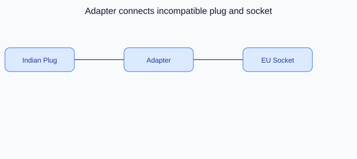

# Adapter Design Pattern

## On this page

- [What is the Adapter pattern?](#what-is-the-adapter-pattern)
- [Car analogy](#car-analogy)
- [When should you use it?](#when-should-you-use-it)
- [Code example](#code-example)
- [Key idea](#key-idea)

<p align="center">
    
</p>

<p align="center"><strong>Fig:</strong> Adapter connects incompatible plug and socket</p>

## What is the Adapter pattern?

Adapter makes two incompatible interfaces work together. A travel adapter lets an Indian charger plug into a European socket.

**Category:** Structural POV

## Car analogy

Like an adapter between an Indian plug and a European socket.

## When should you use it?

Use it when existing code cannot be changed but must work with a different interface.

## Code example

```python
"""
Adapter pattern demo: plug adapter for an EV charger.

Run:
    python adapter_demo.py

Indian and European plugs differ; an adapter lets one charger work everywhere.
"""

from abc import ABC, abstractmethod


class EuropeanSocket(ABC):
    @abstractmethod
    def supply_230v(self) -> str:
        pass


class EuropeanWallSocket(EuropeanSocket):
    def supply_230v(self) -> str:
        return "230V AC from European socket"


class IndianPlug:
    def connect_240v(self) -> str:
        return "240V AC from Indian plug"


class IndianToEuropeanAdapter(EuropeanSocket):
    """Adapts an Indian plug to fit a European socket interface."""

    def __init__(self, plug: IndianPlug) -> None:
        self._plug = plug

    def supply_230v(self) -> str:
        raw = self._plug.connect_240v()
        return f"Adapted {raw} -> 230V for car charger"


class CarCharger:
    def __init__(self, socket: EuropeanSocket) -> None:
        self._socket = socket

    def start_charging(self) -> None:
        power = self._socket.supply_230v()
        print(f"Car charger connected: {power}")
        print("Charging started...")


def main() -> None:
    print("=== Adapter: EV charger plug ===\n")

    native_socket = EuropeanWallSocket()
    CarCharger(native_socket).start_charging()

    print()
    indian_plug = IndianPlug()
    adapter = IndianToEuropeanAdapter(indian_plug)
    CarCharger(adapter).start_charging()


if __name__ == "__main__":
    main()
```

**Output:**
```
=== Adapter: EV charger plug ===

Car charger connected: 230V AC from European socket
Charging started...

Car charger connected: Adapted 240V AC from Indian plug -> 230V for car charger
Charging started...
```

Source: [`adapter_demo.py`](../code/1500_adapter/adapter_demo.py)

## Key idea

- The pattern solves a recurring design problem in a reusable way.
- In this example, the car analogy makes the roles of each class easy to remember.
- Run the demo yourself: `python adapter_demo.py` inside `code/1500_adapter/`.

<p align="right">
    <a href="1400_builder.md">Previous: Builder</a>
    <a href="1600_composite.md">Next: Composite</a>
</p>

<p align="right">
    <a href="index.md">Back to Design Patterns Index</a>
</p>
