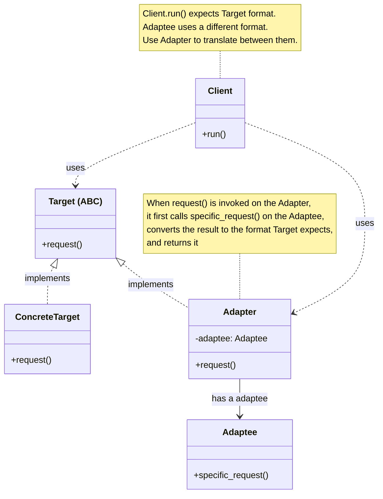
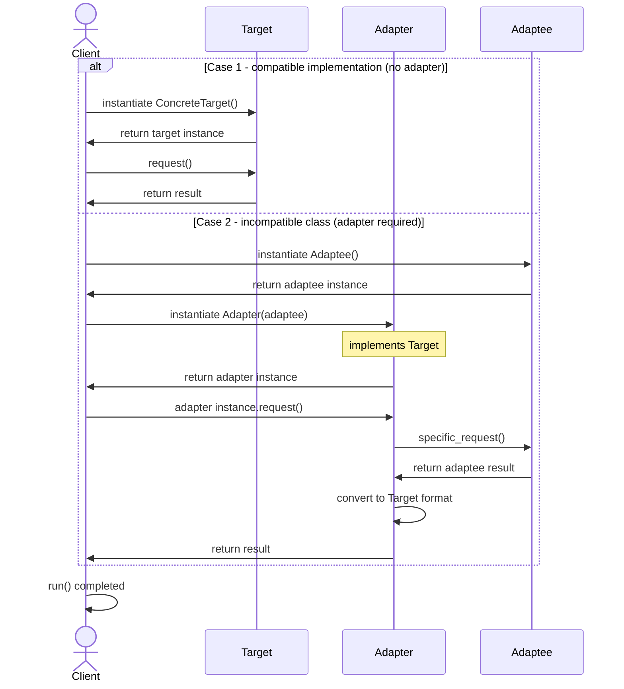

# Adapter Design Pattern

## On this page

- [What is it?](#what-is-the-adapter-pattern)
- [When should you use it?](#when-should-you-use-it)
- [Class diagram — Client, Target, Adaptee, Adapter](#class-diagram)
- [Sequence diagram — with and without an adapter](#sequence-diagram)
- [Python example (speed sensor)](#code-example)
- [Key takeaways — GoF roles in code](#key-idea)

## What is the Adapter pattern?

Adapter makes two incompatible interfaces work together, so existing code can stay unchanged.

Think of a car dashboard that always reads speed in **km/h**. A new car has a metric sensor that fits directly. An older car has a legacy sensor that reports **mph**. An adapter sits in between and translates — the dashboard never needs to know which sensor is plugged in.

**Category:** Structural POV

## When should you use it?

Use it when:

- You have a **Client** that expects one interface (**Target**).
- An existing class (**Adaptee**) speaks a different interface and cannot be rewritten.
- You want a middle layer (**Adapter**) to translate between them.

## Class Diagram



<br/>

The **Client** depends only on **Target**. **ConcreteTarget** already matches that interface. **Adapter** also implements **Target**, but it wraps **Adaptee** and translates `specific_request()` into `request()`.

<br/>

## Sequence Diagram



## Code example

```python
"""
Adapter pattern demo — GoF Object Adapter (vehicle context).

Run:
    python adapter_demo.py

ClientCarDashboard expects TargetSpeedSensor (km/h).
AdapteeImperialSpeedSensor reports mph.
AdapterImperialToMetric wraps it so the dashboard needs no changes.
"""

from abc import ABC, abstractmethod

MPH_TO_KMH = 1.60934


class TargetSpeedSensor(ABC):
    """Target — interface ClientCarDashboard expects."""

    @abstractmethod
    def read_speed_kmh(self) -> float:
        pass


class ConcreteTargetMetricSpeedSensor(TargetSpeedSensor):
    """ConcreteTarget — already reports km/h."""

    def read_speed_kmh(self) -> float:
        return 100.0


class AdapteeImperialSpeedSensor:
    """Adaptee — existing sensor that reports mph instead."""

    def read_speed_mph(self) -> float:
        return 60.0


class AdapterImperialToMetric(TargetSpeedSensor):
    """Adapter — wraps AdapteeImperialSpeedSensor and exposes km/h."""

    def __init__(self, sensor: AdapteeImperialSpeedSensor) -> None:
        self._sensor = sensor

    def read_speed_kmh(self) -> float:
        mph = self._sensor.read_speed_mph()
        return mph * MPH_TO_KMH


class ClientCarDashboard:
    """Client — works only with TargetSpeedSensor."""

    def __init__(self, sensor: TargetSpeedSensor) -> None:
        self._sensor = sensor

    def show_speed(self) -> None:
        kmh = self._sensor.read_speed_kmh()
        print(f"Dashboard shows: {kmh:.0f} km/h")


def main() -> None:
    print("=== Adapter pattern demo ===\n")

    print("Case 1 - compatible sensor (no adapter)")
    print("  ClientCarDashboard uses ConcreteTargetMetricSpeedSensor directly")
    ClientCarDashboard(ConcreteTargetMetricSpeedSensor()).show_speed()

    print("\nCase 2 - incompatible sensor (adapter in the middle)")
    print("  ClientCarDashboard still calls read_speed_kmh() only")
    legacy_sensor = AdapteeImperialSpeedSensor()
    print(f"  AdapteeImperialSpeedSensor returns: {legacy_sensor.read_speed_mph():.0f} mph")

    adapted_sensor = AdapterImperialToMetric(legacy_sensor)
    print(
        "  AdapterImperialToMetric translates mph -> km/h "
        f"({legacy_sensor.read_speed_mph():.0f} mph -> {adapted_sensor.read_speed_kmh():.0f} km/h)"
    )
    ClientCarDashboard(adapted_sensor).show_speed()


if __name__ == "__main__":
    main()
```

**Output:**
```
=== Adapter pattern demo ===

Case 1 - compatible sensor (no adapter)
  ClientCarDashboard uses ConcreteTargetMetricSpeedSensor directly
Dashboard shows: 100 km/h

Case 2 - incompatible sensor (adapter in the middle)
  ClientCarDashboard still calls read_speed_kmh() only
  AdapteeImperialSpeedSensor returns: 60 mph
  AdapterImperialToMetric translates mph -> km/h (60 mph -> 97 km/h)
Dashboard shows: 97 km/h
```

Source: [`adapter_demo.py`](../code/1500_adapter/adapter_demo.py)

## Key takeaways

| GoF role | Class in this example |
|---|---|
| **Target** | `TargetSpeedSensor` — dashboard expects `read_speed_kmh()` |
| **ConcreteTarget** | `ConcreteTargetMetricSpeedSensor` — already reports km/h |
| **Adaptee** | `AdapteeImperialSpeedSensor` — legacy sensor with `read_speed_mph()` |
| **Adapter** | `AdapterImperialToMetric` — converts mph to km/h (Object Adapter) |
| **Client** | `ClientCarDashboard` — uses `TargetSpeedSensor` only |

Run the demo yourself: `python adapter_demo.py` inside `code/1500_adapter/`.

<br/>
<p>
    <span style="float: left;">
        <a href="1400_builder.md">Previous: Builder</a>
        &nbsp;
        <a href="1510_python_decorator.md">Next: Python @decorator vs Patterns</a>
    </span>
    <span style="float: right;">
        <a href="../../README.md">Home</a>
        &nbsp;|&nbsp;
        <a href="index.md">Back to Design Patterns Index</a>
    </span>
</p>
