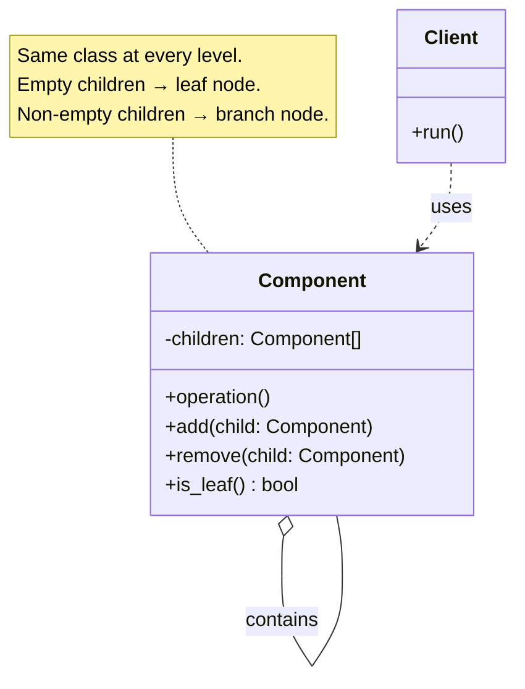
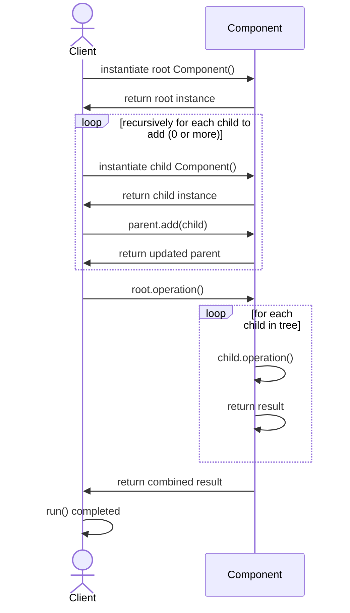

# Composite Design Pattern

## On this page

- [What is the Composite pattern?](#what-is-the-composite-pattern)
- [When should you use it?](#when-should-you-use-it)
- [Class diagram — Component tree (no separate Leaf)](#class-diagram)
- [Sequence diagram — build and traverse the tree](#sequence-diagram)
- [Python example (comment thread)](#code-example)
- [Key takeaways](#key-idea)
- [GoF Composite — folder and file](#gof-composite--folder-and-file)

## What is the Composite pattern?

Composite is for **tree-like structures** where the **same structure repeats** at every level.

Think of a folder on your computer: it can hold files **or** other folders. Those subfolders can hold more files and folders again — the same idea keeps nesting inside itself.

Other everyday examples:

- **Directory structure** — folder → subfolder → file
- **Comments** — a comment can have replies, and each reply can have more replies

The key idea: whether something is a **single item** (one reply) or a **group** (a comment with replies), you can treat it the same way — for example, "show the whole thread" or "count all replies."

**Category:** Structural POV

## When should you use it?

Use it when you have tree structures — comments, folders, menus — and want one common operation across single items and groups.

This page uses a **unified model** — one `Comment` class where empty `_replies` means leaf and non-empty means branch. For the **classic GoF split** (separate Leaf and Composite classes), see [GoF Composite — folder and file](1610_composite_gof.md).

## Class Diagram



<br/>

**Client** works with **Component** only. Every node uses the same class. A node with **empty `children`** behaves as a **leaf**; a node with **children** behaves as a **branch**. No separate Leaf class is required — the tree shape comes from nesting alone.

<br/>

## Sequence Diagram



<br/>

The Python example below uses one `Comment` class the same way: empty `_replies` means leaf, non-empty means branch.

## Code example

```python
"""
Composite pattern demo: comment thread with nested replies.

Run:
    python composite_demo.py

One Comment class acts as both leaf (no replies) and branch (has replies).
Display and reply counts roll up the tree the same way at every level.
"""

from __future__ import annotations


class Comment:
    """One node type — a leaf when it has no replies, a branch when it does."""

    def __init__(self, author: str, text: str) -> None:
        self._author = author
        self._text = text
        self._replies: list[Comment] = []

    def add_reply(self, reply: Comment) -> None:
        self._replies.append(reply)

    def author(self) -> str:
        return self._author

    def text(self) -> str:
        return self._text

    def is_leaf(self) -> bool:
        return not self._replies

    def total_replies(self) -> int:
        return sum(1 + reply.total_replies() for reply in self._replies)

    def display(self, indent: int = 0) -> None:
        prefix = "  " * indent
        if self.is_leaf():
            print(f"{prefix}- {self._author}: {self._text}")
            return

        reply_count = self.total_replies()
        suffix = f" [{reply_count} replies]" if reply_count else ""
        print(f"{prefix}+ {self._author}: {self._text}{suffix}")
        for reply in self._replies:
            reply.display(indent + 1)


def main() -> None:
    print("=== Composite: comment thread ===\n")

    # Thread shape — every node is Comment:
    # Alice (post)
    # ├── Bob → Carol, Dave
    # ├── Eve
    # └── Frank → Grace, Heidi

    post = Comment("Alice", "Can someone explain the Composite pattern?")

    # Create top-level replies — all use the same Comment class
    bob = Comment("Bob", "It treats single items and groups the same way.")
    eve = Comment("Eve", "We use it for nested menus at work.")       # will stay a leaf
    frank = Comment("Frank", "Here is a code example...")            # will become a branch

    # Attach replies to the post
    post.add_reply(bob)
    post.add_reply(eve)
    post.add_reply(frank)

    # Bob becomes a branch — add replies under Bob
    bob.add_reply(Comment("Carol", "Nice summary!"))
    bob.add_reply(Comment("Dave", "Think folder inside folder."))

    # Eve stays a leaf — no sub-replies added

    # Frank becomes a branch — add replies under Frank
    frank.add_reply(Comment("Grace", "That helped, thanks."))
    frank.add_reply(Comment("Heidi", "Saving this thread."))

    post.display(0)
    print(f"\nTotal replies in thread: {post.total_replies()}")


if __name__ == "__main__":
    main()
```

**Output:**
```
=== Composite: comment thread ===

+ Alice: Can someone explain the Composite pattern? [7 replies]
  + Bob: It treats single items and groups the same way. [2 replies]
    - Carol: Nice summary!
    - Dave: Think folder inside folder.
  - Eve: We use it for nested menus at work.
  + Frank: Here is a code example... [2 replies]
    - Grace: That helped, thanks.
    - Heidi: Saving this thread.

Total replies in thread: 7
```

Source: [`composite_demo.py`](../code/1600_composite/composite_demo.py)

## Key takeaways

| GoF role | How it appears in this example |
|---|---|
| **Component** | `Comment` — one class for every node in the tree |
| **Leaf** (role, not a class) | `Comment` with empty `_replies` (e.g. Eve, Carol) |
| **Composite** (role, not a class) | `Comment` with items in `_replies` (e.g. Alice, Bob) |

- The same `Comment` class is the post, a reply, a reply-to-a-reply — leaf or branch depends only on whether it has children.
- `display()` and `total_replies()` work on any node without checking the node type.
- Run the demo yourself: `python composite_demo.py` inside `code/1600_composite/`.

## GoF Composite — folder and file

When leaves and containers are **different kinds of things** — like **files** that must not hold children and **folders** that must — the traditional GoF model fits better:

- **Leaf** (`File`) — single item, no `add()`
- **Composite** (`Folder`) — holds children, rolls up size

Comment threads do not need that split because every node is the same kind of object. Folder trees do.

Read the full GoF version: [**1610_composite_gof.md**](1610_composite_gof.md)

<br/>
<p>
    <span style="float: left;">
        <a href="1510_python_decorator.md">Previous: Python @decorator vs Patterns</a>
        &nbsp;
        <a href="1610_composite_gof.md">Next: GoF Composite</a>
    </span>
    <span style="float: right;">
        <a href="../../README.md">Home</a>
        &nbsp;|&nbsp;
        <a href="index.md">Back to Design Patterns Index</a>
    </span>
</p>
