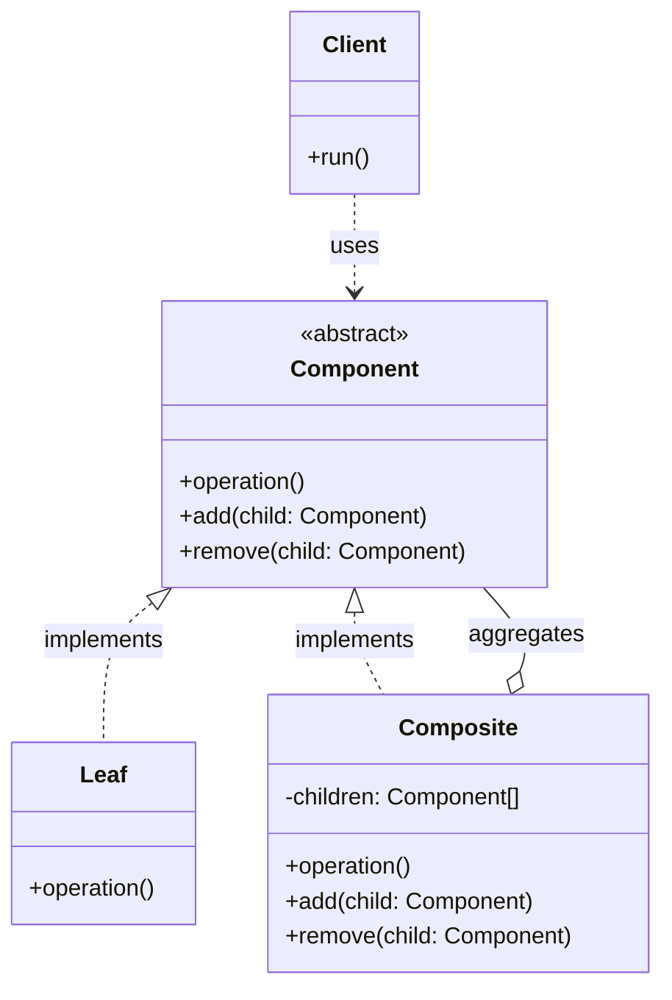
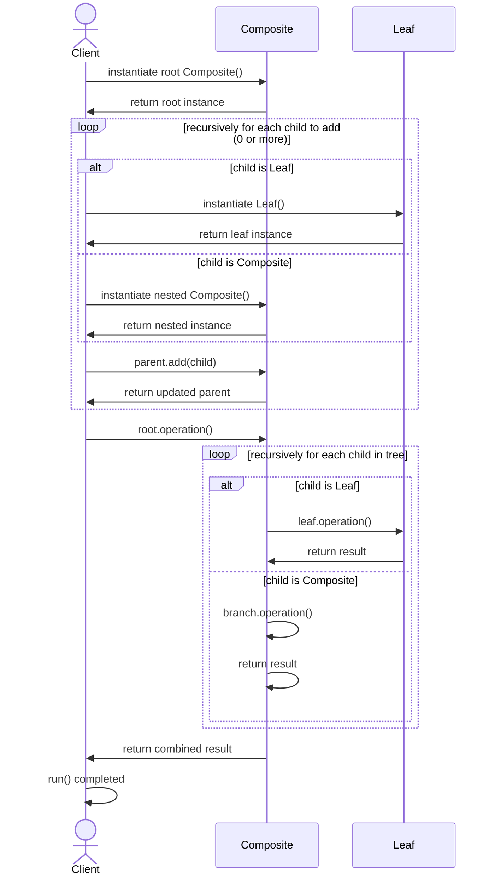

# Classic GoF Composite

## On this page

- [What is the GoF Composite?](#what-is-the-gof-composite)
- [Why the traditional GoF model matters](#why-the-traditional-gof-composite-model-is-more-important-)
- [Class diagram — Component, Leaf, Composite](#class-diagram)
- [Sequence diagram — build and traverse the tree](#sequence-diagram)
- [Python example (folder and file)](#code-example)
- [Key takeaways](#key-takeaways)

## What is the GoF Composite?

The [previous page](1600_composite.md) used **one class** for everything — a comment with no replies (or zero children) acts as a leaf, and a comment with replies acts as a branch (parent nodes). That works well, but it is a **simplified** version of Composite.

**This page** covers the **traditional GoF Composite** — two separate classes: one for **single items** (Leaf) and one for **groups** (Composite).

In that traditional model, tree structures are built from three roles:

| Role | Purpose |
|---|---|
| **Component** | Common interface for every node in the tree |
| **Leaf** | A single item that cannot have children |
| **Composite** | A container that holds other **Component** objects |

The **Client** calls the same operation — such as `size_kb()` or `display()` — on a file or a folder without checking the node type.

**Category:** Structural POV

## Why the **traditional GoF Composite** model is more important ?

The previously explained [simplest composite model](1600_composite.md) uses one class for every node. That works for comment threads — any reply can get more replies. But **file and folder** trees do not fit: a file should never hold other files, yet the unified class would still expose `add()`.

The traditional GoF model separates **Leaf** (file) from **Composite** (folder). Invalid operations are blocked by design, not by empty lists or runtime checks. That is why folder/file — and any domain where singles and groups behave differently — needs the classic pattern.

## Class Diagram



<br/>

**Component** defines the shared interface. **Leaf** implements it for single items. **Composite** stores a list of **Component** objects and forwards operations to them.

<br/>

## Sequence Diagram



## Code example

```python
"""
GoF Composite pattern demo — folder and file tree.

Run:
    python composite_gof_demo.py

Classic split: File (Leaf) and Folder (Composite) share FileSystemComponent.
"""

from __future__ import annotations

from abc import ABC, abstractmethod


class FileSystemComponent(ABC):
    """Component — common interface for files and folders."""

    @abstractmethod
    def name(self) -> str:
        pass

    @abstractmethod
    def size_kb(self) -> float:
        pass

    @abstractmethod
    def display(self, indent: int = 0) -> None:
        pass


class File(FileSystemComponent):
    """Leaf — a file cannot contain other items."""

    def __init__(self, file_name: str, size_kb: float) -> None:
        self._name = file_name
        self._size_kb = size_kb

    def name(self) -> str:
        return self._name

    def size_kb(self) -> float:
        return self._size_kb

    def display(self, indent: int = 0) -> None:
        prefix = "  " * indent
        print(f"{prefix}- {self._name} ({self._size_kb} KB)")


class Folder(FileSystemComponent):
    """Composite — a folder contains files and other folders."""

    def __init__(self, folder_name: str) -> None:
        self._name = folder_name
        self._children: list[FileSystemComponent] = []

    def add(self, component: FileSystemComponent) -> None:
        self._children.append(component)

    def name(self) -> str:
        return self._name

    def size_kb(self) -> float:
        return sum(child.size_kb() for child in self._children)

    def display(self, indent: int = 0) -> None:
        prefix = "  " * indent
        print(f"{prefix}+ {self._name}/ (total {self.size_kb()} KB)")
        for child in self._children:
            child.display(indent + 1)


def main() -> None:
    print("=== GoF Composite: folder and file tree ===\n")

    project = Folder("project")

    src = Folder("src")
    src.add(File("main.py", 12.0))
    src.add(File("utils.py", 4.5))

    docs = Folder("docs")
    docs.add(File("readme.md", 2.0))

    project.add(src)
    project.add(docs)
    project.add(File("LICENSE", 1.0))

    project.display(0)
    print(f"\nTotal project size: {project.size_kb()} KB")


if __name__ == "__main__":
    main()
```

**Output:**
```
=== GoF Composite: folder and file tree ===

+ project/ (total 19.5 KB)
  + src/ (total 16.5 KB)
    - main.py (12.0 KB)
    - utils.py (4.5 KB)
  + docs/ (total 2.0 KB)
    - readme.md (2.0 KB)
  - LICENSE (1.0 KB)

Total project size: 19.5 KB
```

Source: [`composite_gof_demo.py`](../code/1610_composite_gof/composite_gof_demo.py)

## Key takeaways

| GoF role | Class in this example |
|---|---|
| **Component** | `FileSystemComponent` — shared interface |
| **Leaf** | `File` — single file, no children |
| **Composite** | `Folder` — holds files and subfolders |
| **Client** | `main()` — builds the tree and calls `display()` / `size_kb()` on the root |

- GoF Composite uses **separate Leaf and Composite classes** when the domain treats singles and groups differently.
- For comment-style trees where every node is the same kind of object, see [1600_composite.md](1600_composite.md).
- Run the demo yourself: `python composite_gof_demo.py` inside `code/1610_composite_gof/`.

<br/>
<p>
    <span style="float: left;">
        <a href="1600_composite.md">Previous: Composite (unified model)</a>
        &nbsp;
        <a href="1700_proxy.md">Next: Proxy</a>
    </span>
    <span style="float: right;">
        <a href="../../README.md">Home</a>
        &nbsp;|&nbsp;
        <a href="index.md">Back to Design Patterns Index</a>
    </span>
</p>
