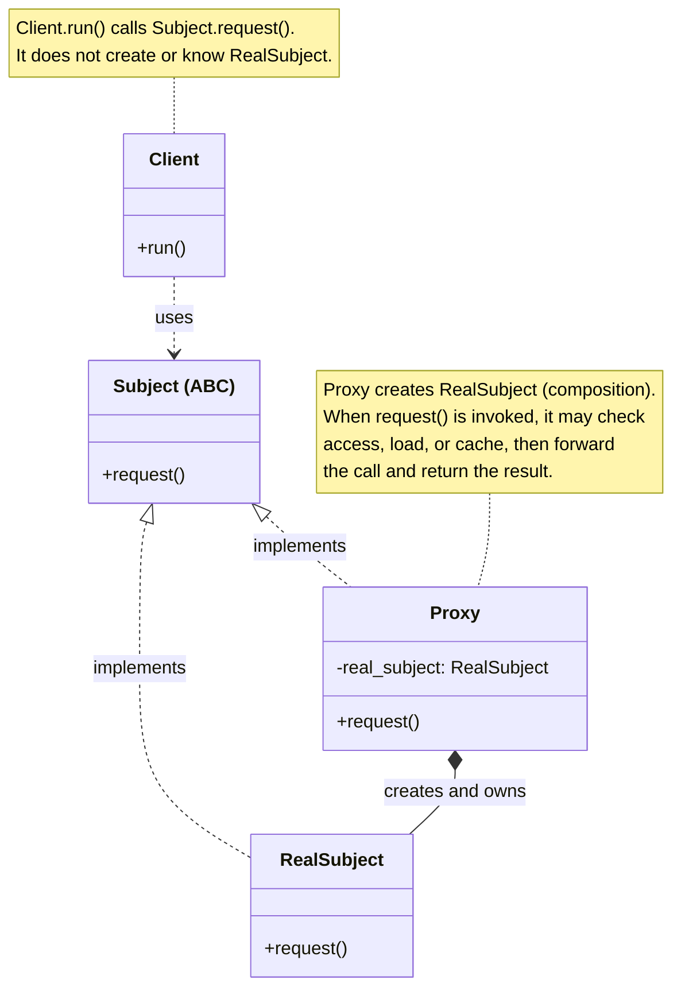
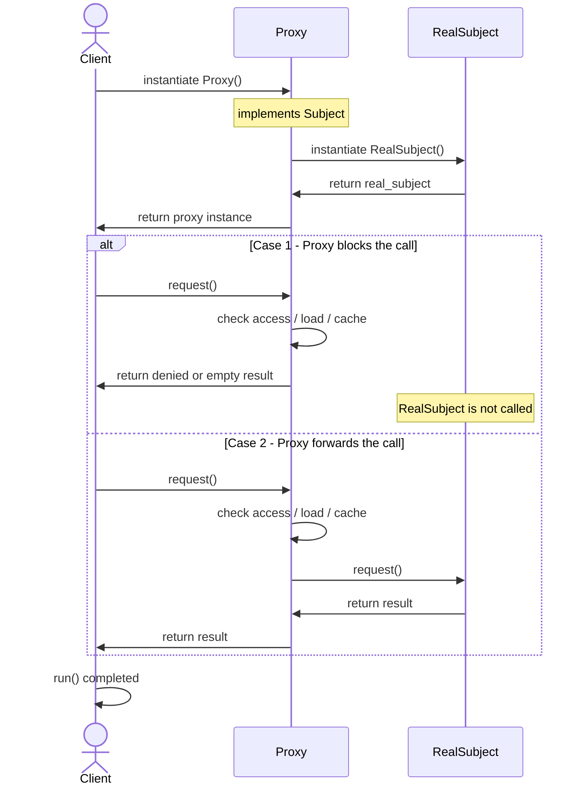

# Proxy Design Pattern

## On this page

- [What is it?](#what-is-the-proxy-pattern)
- [When should you use it?](#when-should-you-use-it)
- [Class diagram — Client, Subject, Proxy, RealSubject](#class-diagram)
- [Sequence diagram — Proxy creates and guards RealSubject](#sequence-diagram)
- [Python example (ECU access)](#code-example)
- [Key takeaways — GoF roles in code](#key-takeaways)

## What is the Proxy pattern?

Proxy stands in front of a real object and controls access to it. Like a workshop tool that must be unlocked before it talks to the real ECU.

**Category:** Structural POV


## When should you use it?

Use a Proxy when you want a stand-in that looks like the real object, but does extra work before (or instead of) calling it.

Common cases:

- **Access control** — allow the call only after a check (like unlocking the ECU in the example below).
- **Lazy loading** — create or load the real object only when it is first needed, not at startup.
- **Caching** — store a previous result and return it again without hitting the real object every time.
- **Remote access** — talk to an object that lives elsewhere (another process or machine) through a local stand-in.

The Client still calls the same methods. The Proxy decides *whether*, *when*, and *how* the real object is used.

## Class Diagram



<br/>

The **Client** depends only on **Subject**. **Proxy** creates and owns **RealSubject** (**composition**). The Client never builds the real object — the Proxy decides whether (and when) to forward `request()`.

<br/>

## Sequence Diagram



<br/>

## Code example

```python
"""
Proxy pattern demo: stand-in for the real ECU.

Run:
    python proxy_demo.py

The proxy creates the real ECU and checks access before calling it.
"""

from abc import ABC, abstractmethod


class EngineControlUnit(ABC):
    @abstractmethod
    def read_status(self) -> str:
        pass


class RealECU(EngineControlUnit):
    """The real object — slow or remote hardware."""

    def read_status(self) -> str:
        print("  [Real ECU] Reading sensors...")
        return "Engine OK"


class ECUProxy(EngineControlUnit):
    """Proxy — creates and owns RealECU; controls access to it."""

    def __init__(self) -> None:
        self._real_ecu = RealECU()
        self._locked = True

    def unlock(self) -> None:
        self._locked = False
        print("  [Proxy] Access unlocked")

    def read_status(self) -> str:
        if self._locked:
            print("  [Proxy] Blocked — unlock first")
            return "Access denied"

        print("  [Proxy] Forwarding to real ECU")
        return self._real_ecu.read_status()


def main() -> None:
    print("=== Proxy: ECU access ===\n")

    proxy = ECUProxy()

    print("Without unlock:", proxy.read_status())
    print()
    proxy.unlock()
    print("After unlock:", proxy.read_status())


if __name__ == "__main__":
    main()
```

**Output:**
```
=== Proxy: ECU access ===

  [Proxy] Blocked — unlock first
Without unlock: Access denied

  [Proxy] Access unlocked
  [Proxy] Forwarding to real ECU
  [Real ECU] Reading sensors...
After unlock: Engine OK
```

Source: [`proxy_demo.py`](../code/1700_proxy/proxy_demo.py)

## Key takeaways

| Role | Class in this example |
|---|---|
| **Subject** | `EngineControlUnit` — interface Client uses |
| **Real subject** | `RealECU` — the real object |
| **Proxy** | `ECUProxy` — creates/owns `RealECU`, checks access, then forwards |

- Client creates only `ECUProxy` — never `RealECU`. The proxy owns the real object (**composition**) and decides when it runs.
- Run the demo yourself: `python proxy_demo.py` inside `code/1700_proxy/`.

<br/>
<p>
    <span style="float: left;">
        <a href="1610_composite_gof.md">Previous: GoF Composite</a>
        &nbsp;
        <a href="1800_facade.md">Next: Facade</a>
    </span>
    <span style="float: right;">
        <a href="../../README.md">Home</a>
        &nbsp;|&nbsp;
        <a href="index.md">Back to Design Patterns Index</a>
    </span>
</p>
