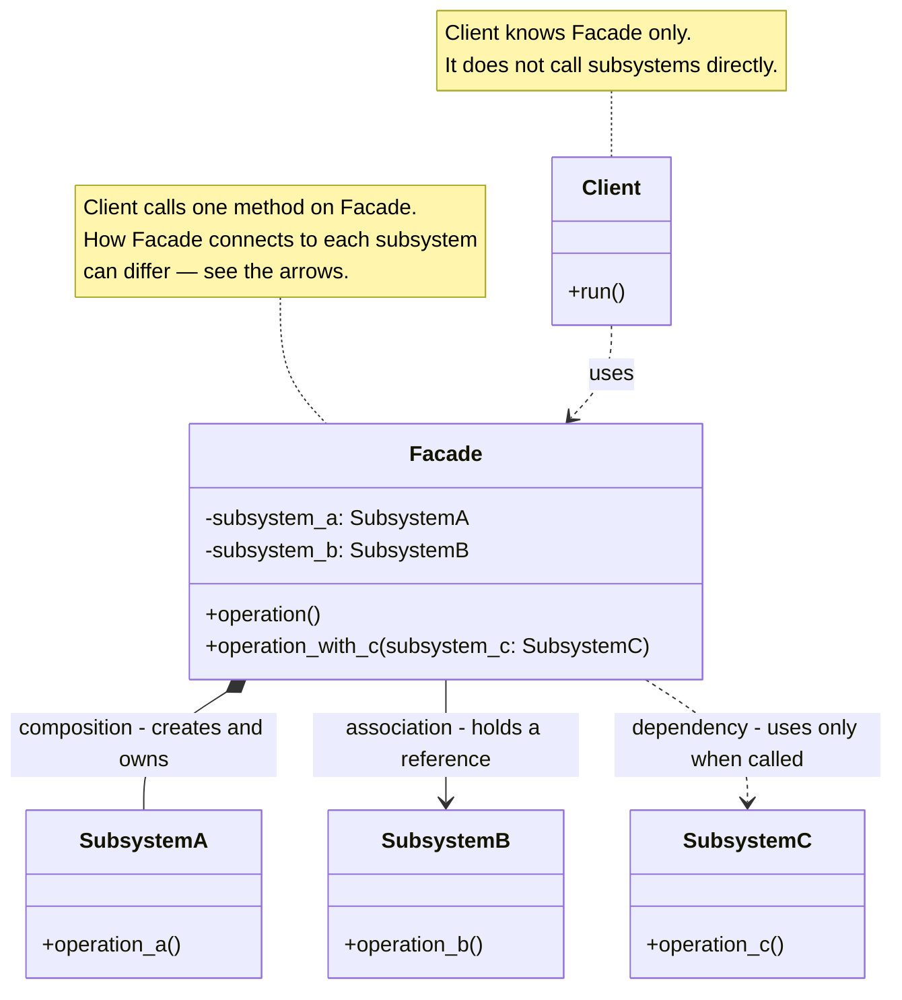
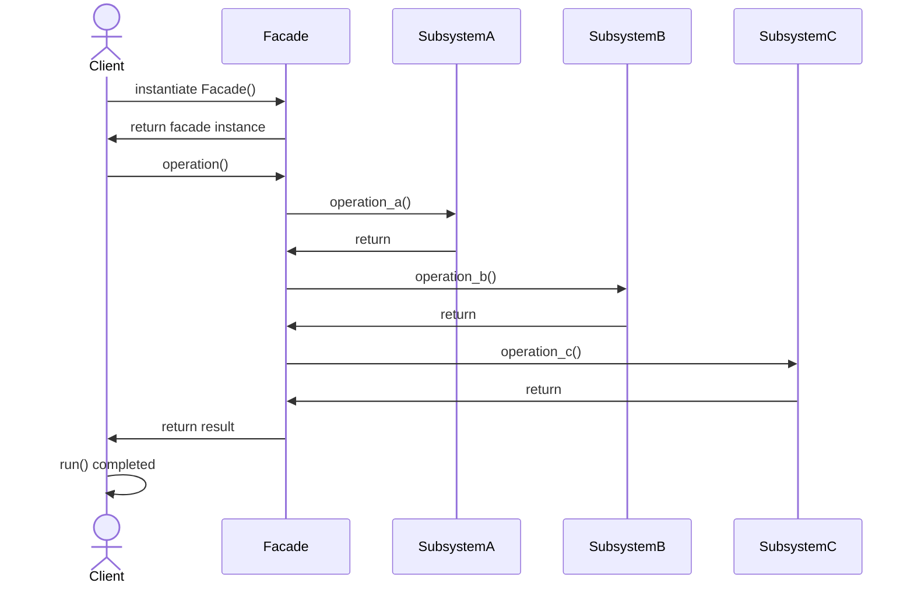

# Facade Design Pattern

## On this page

- [What is the Facade pattern?](#what-is-the-facade-pattern)
- [Car analogy](#car-analogy)
- [When should you use it?](#when-should-you-use-it)
- [Class diagram — Client, Facade, Subsystems](#class-diagram)
- [Sequence diagram — Client calls Facade](#sequence-diagram)
- [Code example](#code-example)
- [Key idea](#key-idea)

## What is the Facade pattern?

Facade gives you **one simple entry point** for a system that has many moving parts underneath.

Without a Facade, the Client must call several subsystems in the right order — sensors, steering, braking, and so on. With a Facade, the Client presses one “button” (one method), and the Facade talks to those subsystems for you.

Think of **auto-park**: you choose Park once. Behind that single call, the car checks sensors, turns the wheel, and brakes. You do not drive each subsystem yourself.

**Category:** Structural POV

## Car analogy

Auto-park feature encapsulates complex subsystems into one interface.

## When should you use it?

Use it when many subsystems must be easy to use from one entry point.

## Class Diagram



<br/>

The **Client** uses only **Facade**.

Composition, association, and dependency are shown in the diagram only to illustrate that **all of these relationship types are possible** between Facade and its subsystems. A real design usually picks one style (or a mix) that fits the ownership story — it does not need every arrow at once.

<br/>

## Sequence Diagram



<br/>

The Client calls **Facade** once. Facade talks to the subsystems and returns one result. The Client never calls the subsystems directly.

<br/>

## Code example

```python
"""
Facade pattern demo: one-button auto-park interface.

Run:
    python facade_demo.py

AutoPark hides steering, sensors, and braking subsystems behind a single call.
"""

from dataclasses import dataclass


@dataclass
class ParkingSpot:
    label: str
    width_m: float


class UltrasonicSensors:
    def scan(self, spot: ParkingSpot) -> bool:
        fits = spot.width_m >= 2.1
        print(f"  [Sensors] Scanning {spot.label}: space {'OK' if fits else 'too tight'}")
        return fits


class PowerSteering:
    def turn_wheels(self, angle_deg: float) -> None:
        print(f"  [Steering] Turning wheels to {angle_deg} degrees")


class AutoBrake:
    def hold(self) -> None:
        print("  [Brake] Holding vehicle during maneuver")

    def release(self) -> None:
        print("  [Brake] Released - parking complete")


class AutoParkFacade:
    """Single button the driver presses; subsystems stay hidden."""

    def __init__(self) -> None:
        self._sensors = UltrasonicSensors()
        self._steering = PowerSteering()
        self._brake = AutoBrake()

    def park(self, spot: ParkingSpot) -> bool:
        print(f"[AutoPark] Starting park into {spot.label}")
        if not self._sensors.scan(spot):
            print("[AutoPark] Aborted - spot unavailable")
            return False

        self._brake.hold()
        self._steering.turn_wheels(-35)
        self._steering.turn_wheels(0)
        self._brake.release()
        print("[AutoPark] Success - vehicle parked")
        return True


def main() -> None:
    print("=== Facade: auto-park button ===\n")

    auto_park = AutoParkFacade()
    auto_park.park(ParkingSpot("Slot B12", 2.4))

    print()
    auto_park.park(ParkingSpot("Slot A03", 1.8))


if __name__ == "__main__":
    main()
```

**Output:**
```
=== Facade: auto-park button ===

[AutoPark] Starting park into Slot B12
  [Sensors] Scanning Slot B12: space OK
  [Brake] Holding vehicle during maneuver
  [Steering] Turning wheels to -35 degrees
  [Steering] Turning wheels to 0 degrees
  [Brake] Released - parking complete
[AutoPark] Success - vehicle parked

[AutoPark] Starting park into Slot A03
  [Sensors] Scanning Slot A03: space too tight
[AutoPark] Aborted - spot unavailable
```

Source: [`facade_demo.py`](../code/1800_facade/facade_demo.py)

## Key idea

- The pattern solves a recurring design problem in a reusable way.
- In this example, the car analogy makes the roles of each class easy to remember.
- Run the demo yourself: `python facade_demo.py` inside `code/1800_facade/`.

<br/>
<p>
    <span style="float: left;">
        <a href="1700_proxy.md">Previous: Proxy</a>
        &nbsp;
        <a href="1900_bridge.md">Next: Bridge</a>
    </span>
    <span style="float: right;">
        <a href="../../README.md">Home</a>
        &nbsp;|&nbsp;
        <a href="index.md">Back to Design Patterns Index</a>
    </span>
</p>
