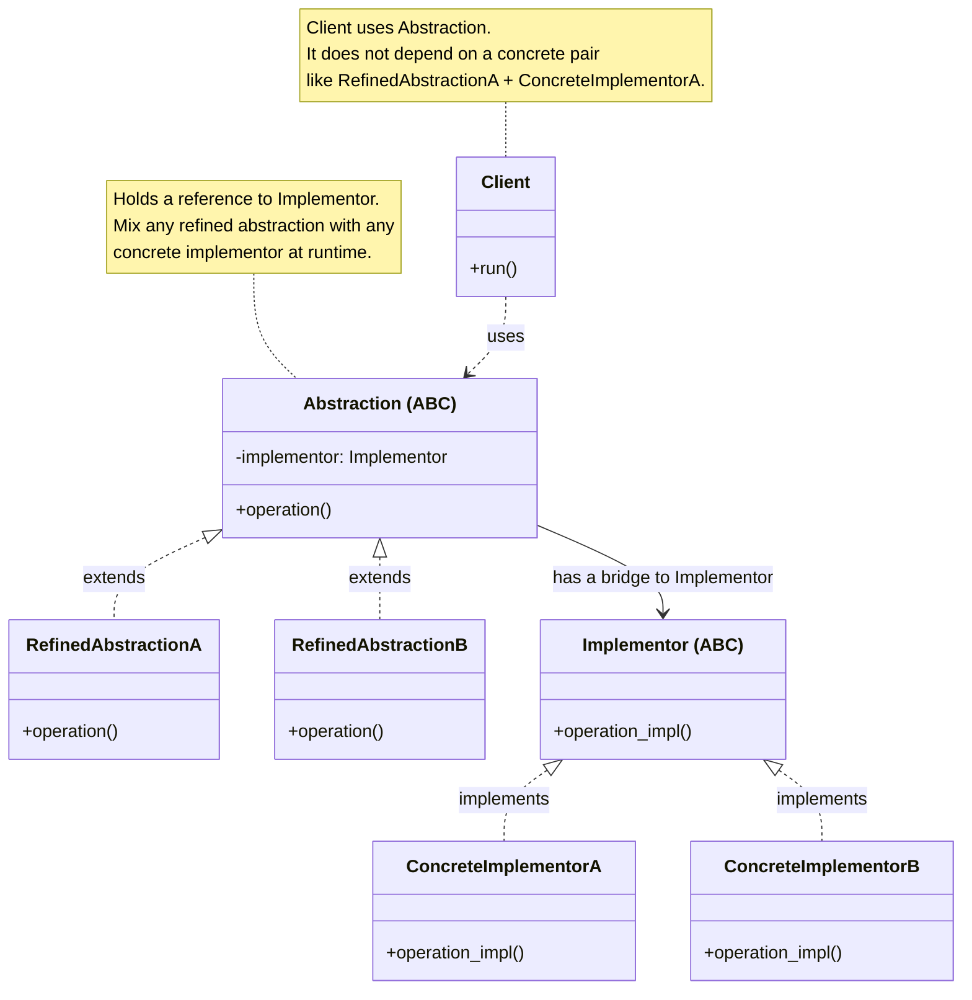
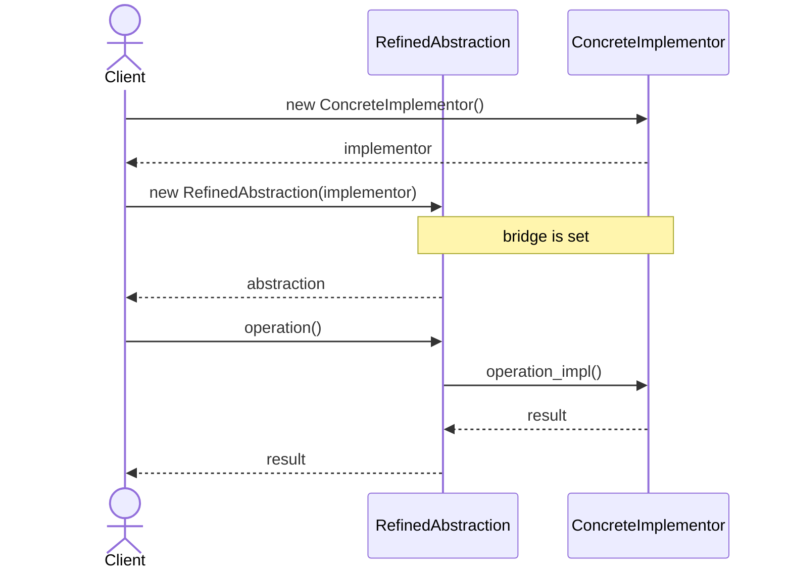

# Bridge Design Pattern

## On this page

- [What is the Bridge pattern?](#what-is-the-bridge-pattern)
- [Car analogy](#car-analogy)
- [When should you use it?](#when-should-you-use-it)
- [Class diagram — Abstraction and Implementor](#class-diagram)
- [Sequence diagram](#sequence-diagram)
- [Code example](#code-example)

## What is the Bridge pattern?

Bridge keeps two parts of a design **separate so each can change on its own**.

One part is the **abstraction** — the thing the Client uses day to day (for example, a vehicle built on a chassis). The other part is the **implementation** — the detail that does the work (for example, the engine). A **bridge** is the link between them: the abstraction holds a reference to an implementation, instead of hard-coding one subclass for every mix.

Without Bridge, you often get an explosion of classes: SedanPetrol, SedanElectric, SUVPetrol, SUVElectric, and so on. With Bridge, chassis types and engine types stay in their own families. You mix them at runtime — same sedan chassis with petrol or electric, same SUV chassis with either engine — without rewriting the chassis hierarchy.

**Category:** Structural POV

## Car analogy

Decouples engine from chassis so they can vary independently.

## When should you use it?

Use it when two dimensions of variation must evolve independently.

## Class Diagram



<br/>

**Abstraction** is what the Client uses. **RefinedAbstractionA** and **RefinedAbstractionB** are two abstraction-side variants — the diagram shows two, but you can add more. **Implementor** is the separate side that does the real work. The **bridge** is the reference from Abstraction to Implementor — so you can combine any refined abstraction with `ConcreteImplementorA` or `ConcreteImplementorB` without multiplying subclasses.

<br/>

## Sequence Diagram



<br/>

Every step is a request with a response: create the **Implementor**, create the **RefinedAbstraction** with that implementor (the bridge), then call `operation()` → `operation_impl()` and return the result back through the same path. Swap either side — any refined abstraction with any concrete implementor — and the call path stays the same.

<br/>

## Code example

```python
"""
Bridge pattern demo — GoF roles (vehicle context).

Run:
    python bridge_demo.py

AbstractionVehicle holds an ImplementorEngine reference (the bridge).
RefinedAbstraction subclasses add chassis details; engine types stay separate.
"""

from abc import ABC, abstractmethod


class ImplementorEngine(ABC):
    """Implementor — engine side of the bridge."""

    @abstractmethod
    def operation_impl(self) -> tuple[str, int]:
        pass


class ConcreteImplementorAPetrolEngine(ImplementorEngine):
    def operation_impl(self) -> tuple[str, int]:
        return "Petrol engine ignited", 110


class ConcreteImplementorBElectricMotor(ImplementorEngine):
    def operation_impl(self) -> tuple[str, int]:
        return "Electric motor online", 150


class AbstractionVehicle(ABC):
    """Abstraction — holds the bridge to an ImplementorEngine."""

    def __init__(self, model: str, implementor: ImplementorEngine) -> None:
        self.model = model
        self._implementor = implementor

    @abstractmethod
    def operation(self) -> None:
        pass


class RefinedAbstractionSedanVehicle(AbstractionVehicle):
    """RefinedAbstraction — sedan chassis; delegates engine work to Implementor."""

    def operation(self) -> None:
        start_msg, power_kw = self._implementor.operation_impl()
        print(f"{self.model}: {start_msg}")
        print("  Chassis: sedan unibody")
        print(f"  Power: {power_kw} kW")
        print("  Payload limit: 450 kg")


class RefinedAbstractionSUVVehicle(AbstractionVehicle):
    """RefinedAbstraction — SUV chassis; same bridge, different abstraction."""

    def operation(self) -> None:
        start_msg, power_kw = self._implementor.operation_impl()
        print(f"{self.model}: {start_msg}")
        print("  Chassis: SUV ladder frame")
        print(f"  Power: {power_kw} kW")
        print("  Payload limit: 750 kg")


class ClientVehicleShowroom:
    """Client — uses AbstractionVehicle only; not a concrete pair."""

    def __init__(self, vehicle: AbstractionVehicle) -> None:
        self._vehicle = vehicle

    def run(self) -> None:
        self._vehicle.operation()


def main() -> None:
    print("=== Bridge pattern demo ===\n")

    configs: list[tuple[str, AbstractionVehicle]] = [
        (
            "Sedan + electric motor",
            RefinedAbstractionSedanVehicle(
                "City Sedan EV", ConcreteImplementorBElectricMotor()
            ),
        ),
        (
            "SUV + petrol engine",
            RefinedAbstractionSUVVehicle(
                "Family SUV", ConcreteImplementorAPetrolEngine()
            ),
        ),
        (
            "SUV + electric motor",
            RefinedAbstractionSUVVehicle(
                "Adventure SUV EV", ConcreteImplementorBElectricMotor()
            ),
        ),
    ]

    for label, vehicle in configs:
        print(f"Case — {label}")
        print(f"  ClientVehicleShowroom uses {vehicle.__class__.__name__}")
        ClientVehicleShowroom(vehicle).run()
        print()


if __name__ == "__main__":
    main()
```

**Output:**
```
=== Bridge pattern demo ===

Case — Sedan + electric motor
  ClientVehicleShowroom uses RefinedAbstractionSedanVehicle
City Sedan EV: Electric motor online
  Chassis: sedan unibody
  Power: 150 kW
  Payload limit: 450 kg

Case — SUV + petrol engine
  ClientVehicleShowroom uses RefinedAbstractionSUVVehicle
Family SUV: Petrol engine ignited
  Chassis: SUV ladder frame
  Power: 110 kW
  Payload limit: 750 kg

Case — SUV + electric motor
  ClientVehicleShowroom uses RefinedAbstractionSUVVehicle
Adventure SUV EV: Electric motor online
  Chassis: SUV ladder frame
  Power: 150 kW
  Payload limit: 750 kg
```

Source: [`bridge_demo.py`](../code/1900_bridge/bridge_demo.py)

<br/>
<p>
    <span style="float: left;">
        <a href="1800_facade.md">Previous: Facade</a>
        &nbsp;
        <a href="2000_decorator.md">Next: Decorator</a>
    </span>
    <span style="float: right;">
        <a href="../../README.md">Home</a>
        &nbsp;|&nbsp;
        <a href="index.md">Back to Design Patterns Index</a>
    </span>
</p>
