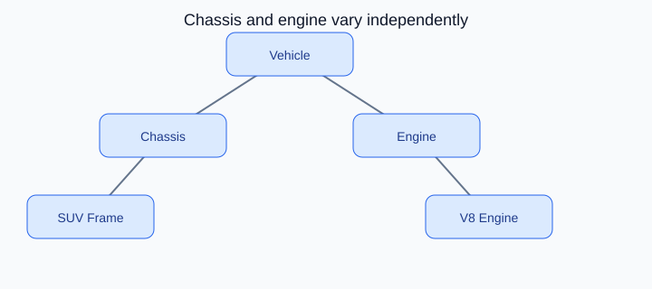

# Bridge Design Pattern

<p align="center">
    
</p>

<p align="center"><strong>Fig:</strong> Chassis and engine vary independently</p>

## What is the Bridge pattern?

Bridge splits abstraction from implementation. The same chassis platform can pair with different engine types without tight coupling.

**Category:** Structural POV

## Car analogy

Decouples engine from chassis so they can vary independently.

## When should you use it?

Use it when two dimensions of variation must evolve independently.

## Code example

```python
"""
Bridge pattern demo: engine and chassis vary independently.

Run:
    python bridge_demo.py

Vehicle ties an Engine implementation to a Chassis without inheritance explosion.
"""

from abc import ABC, abstractmethod


class Engine(ABC):
    @abstractmethod
    def start(self) -> str:
        pass

    @abstractmethod
    def power_kw(self) -> int:
        pass


class PetrolEngine(Engine):
    def start(self) -> str:
        return "Petrol engine ignited"

    def power_kw(self) -> int:
        return 110


class ElectricMotor(Engine):
    def start(self) -> str:
        return "Electric motor online"

    def power_kw(self) -> int:
        return 150


class Chassis(ABC):
    @abstractmethod
    def frame_type(self) -> str:
        pass

    @abstractmethod
    def max_payload_kg(self) -> int:
        pass


class SedanChassis(Chassis):
    def frame_type(self) -> str:
        return "sedan unibody"

    def max_payload_kg(self) -> int:
        return 450


class SUVChassis(Chassis):
    def frame_type(self) -> str:
        return "SUV ladder frame"

    def max_payload_kg(self) -> int:
        return 750


class Vehicle:
    """Bridge between engine and chassis - mix any pair at runtime."""

    def __init__(self, model: str, engine: Engine, chassis: Chassis) -> None:
        self.model = model
        self._engine = engine
        self._chassis = chassis

    def drive_off(self) -> None:
        print(f"{self.model}: {self._engine.start()}")
        print(f"  Chassis: {self._chassis.frame_type()}")
        print(f"  Power: {self._engine.power_kw()} kW")
        print(f"  Payload limit: {self._chassis.max_payload_kg()} kg")


def main() -> None:
    print("=== Bridge: engine + chassis combos ===\n")

    configs = [
        Vehicle("City Sedan EV", ElectricMotor(), SedanChassis()),
        Vehicle("Family SUV", PetrolEngine(), SUVChassis()),
        Vehicle("Adventure SUV EV", ElectricMotor(), SUVChassis()),
    ]

    for car in configs:
        car.drive_off()
        print()


if __name__ == "__main__":
    main()
```

**Output:**
```
=== Bridge: engine + chassis combos ===

City Sedan EV: Electric motor online
  Chassis: sedan unibody
  Power: 150 kW
  Payload limit: 450 kg

Family SUV: Petrol engine ignited
  Chassis: SUV ladder frame
  Power: 110 kW
  Payload limit: 750 kg

Adventure SUV EV: Electric motor online
  Chassis: SUV ladder frame
  Power: 150 kW
  Payload limit: 750 kg
```

Source: [`bridge_demo.py`](../code/1900_bridge/bridge_demo.py)

## Key idea

- The pattern solves a recurring design problem in a reusable way.
- In this example, the car analogy makes the roles of each class easy to remember.
- Run the demo yourself: `python bridge_demo.py` inside `code/1900_bridge/`.

<p align="right">
    <a href="1800_facade.md">Previous: Facade</a>
    <a href="2000_decorator.md">Next: Decorator</a>
</p>
