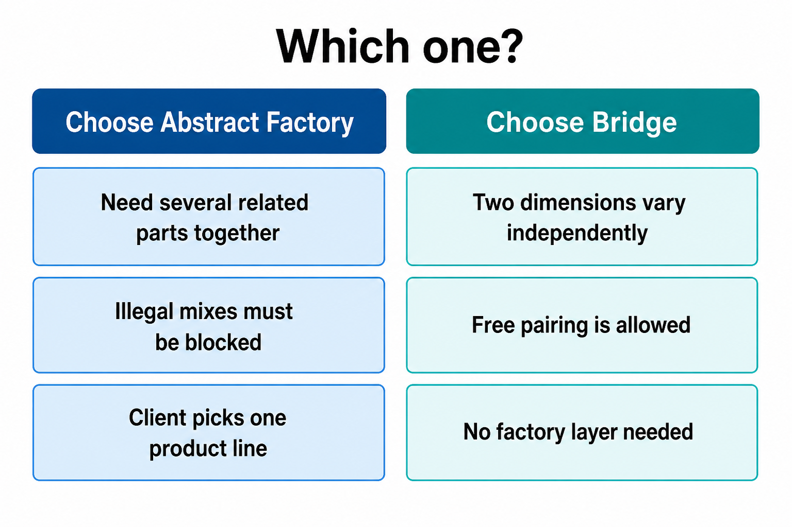

# Bridge vs Abstract Factory

## On this page

- [The common confusion](#the-common-confusion)
- [Picture — how they differ](#picture--how-they-differ)
- [Quick comparison](#quick-comparison)
- [Why keep Abstract Factory?](#why-keep-abstract-factory)
- [Which one to choose](#which-one-to-choose)

## The common confusion

After [Bridge](1900_bridge.md) and [Abstract Factory](1300_abstract_factory.md), this puzzle shows up:

> **Wait — aren't these the same idea?**
>
> 1. Both help create combinations of objects.
> 2. Both avoid a class explosion (no SedanPetrol, SedanElectric, SUVPetrol, … for every mix).
> 3. Both let the Client work through one main entry point instead of many concrete classes.
> 4. Both connect different “sides” of a design so those sides can vary.
> 5. Bridge still uses fewer classes — it does **not** need an `AbstractFactory` layer.
> 6. So… **what is the importance of the Abstract Factory design pattern?**

**Short answer:** they solve different jobs.

- **Bridge** — structure: mix two sides freely at runtime.
- **Abstract Factory** — creation: build a **matched family** as one unit.

## Picture — how they differ

  

| [Abstract Factory](1300_abstract_factory.md) | [Bridge](1900_bridge.md) |
|---|---|
| Client talks to a **factory** | Client talks to an **abstraction** |
| Factory creates **several related products** | Abstraction holds **one implementor** |
| Parts stay in one family | Any pair can be mixed |
| Extra factory class is intentional | No factory class in the pattern |

## Quick comparison

| | Abstract Factory | Bridge |
|---|---|---|
| **POV** | Creational | Structural |
| **Question** | Which product line do I create? | Which implementor does this use? |
| **Mixing** | Keep family consistent | Free mix allowed |
| **Class count** | More (factory + products) | Fewer (just the bridge link) |

## Why keep Abstract Factory?

Bridge looks lighter — and it is, when free mixing is fine.

You still need Abstract Factory when:

1. You create **several related parts** (engine + body + …), not one link.
2. **Wrong mixes must be blocked** (sedan engine with SUV body is not allowed).
3. The Client should only pick a **product line**, not wire concrete classes.

The factory is the place that says: “these parts belong together.”

## Which one to choose

  

**Tip:** they can work together. A factory may create an Abstraction already linked to the right Implementor — factory chooses the legal pair; Bridge defines how they collaborate.

 

    
        <a href="1900_bridge.md">Previous: Bridge</a>
        &nbsp;
        <a href="2000_decorator.md">Next: Decorator</a>
    
    
        <a href="../../README.md">Home</a>
        &nbsp;|&nbsp;
        <a href="index.md">Back to Design Patterns Index</a>
    

