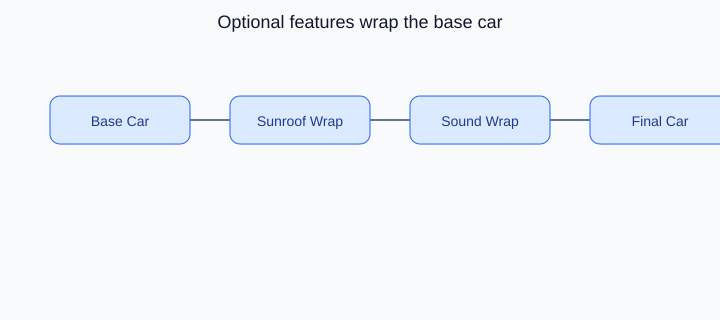

# Decorator Design Pattern

## On this page

- [What is the Decorator pattern?](#what-is-the-decorator-pattern)
- [Car analogy](#car-analogy)
- [When should you use it?](#when-should-you-use-it)
- [Code example](#code-example)
- [Key idea](#key-idea)

<p align="center">
    
</p>

<p align="center"><strong>Fig:</strong> Optional features wrap the base car</p>

## What is the Decorator pattern?

Decorator adds features by wrapping an object. You can stack sunroof, sound, and safety packages on a base car without changing the base class.

**Category:** Structural POV

## Car analogy

Wraps a real object to change "access behavior" without altering the object.

## When should you use it?

Use it when behavior should be added flexibly at runtime.

## Code example

```python
"""
Decorator pattern demo: optional features wrapped around a base car.

Run:
    python decorator_demo.py

Each decorator adds behavior without modifying the underlying car class.
"""

from abc import ABC, abstractmethod


class Car(ABC):
    @abstractmethod
    def description(self) -> str:
        pass

    @abstractmethod
    def price_inr(self) -> int:
        pass


class BaseCar(Car):
    def __init__(self, model: str, base_price: int) -> None:
        self._model = model
        self._base_price = base_price

    def description(self) -> str:
        return self._model

    def price_inr(self) -> int:
        return self._base_price


class CarFeatureDecorator(Car):
    def __init__(self, car: Car) -> None:
        self._car = car


class SunroofDecorator(CarFeatureDecorator):
    def description(self) -> str:
        return f"{self._car.description()} + panoramic sunroof"

    def price_inr(self) -> int:
        return self._car.price_inr() + 85000


class PremiumSoundDecorator(CarFeatureDecorator):
    def description(self) -> str:
        return f"{self._car.description()} + premium sound system"

    def price_inr(self) -> int:
        return self._car.price_inr() + 45000


class ADASDecorator(CarFeatureDecorator):
    def description(self) -> str:
        return f"{self._car.description()} + ADAS safety pack"

    def price_inr(self) -> int:
        return self._car.price_inr() + 120000


def main() -> None:
    print("=== Decorator: build-your-own car ===\n")

    car: Car = BaseCar("Compact Hatch", 650000)
    print(f"Base: {car.description()} - Rs {car.price_inr():,}")

    car = SunroofDecorator(car)
    car = PremiumSoundDecorator(car)
    car = ADASDecorator(car)

    print(f"\nConfigured: {car.description()}")
    print(f"Final price: Rs {car.price_inr():,}")


if __name__ == "__main__":
    main()
```

**Output:**
```
=== Decorator: build-your-own car ===

Base: Compact Hatch - Rs 650,000

Configured: Compact Hatch + panoramic sunroof + premium sound system + ADAS safety pack
Final price: Rs 900,000
```

Source: [`decorator_demo.py`](../code/2000_decorator/decorator_demo.py)

## Key idea

- The pattern solves a recurring design problem in a reusable way.
- In this example, the car analogy makes the roles of each class easy to remember.
- Run the demo yourself: `python decorator_demo.py` inside `code/2000_decorator/`.

<p align="right">
    <a href="1900_bridge.md">Previous: Bridge</a>
    <a href="2100_template_method.md">Next: Template Method</a>
</p>

<p align="right">
    <a href="index.md">Back to Design Patterns Index</a>
</p>
