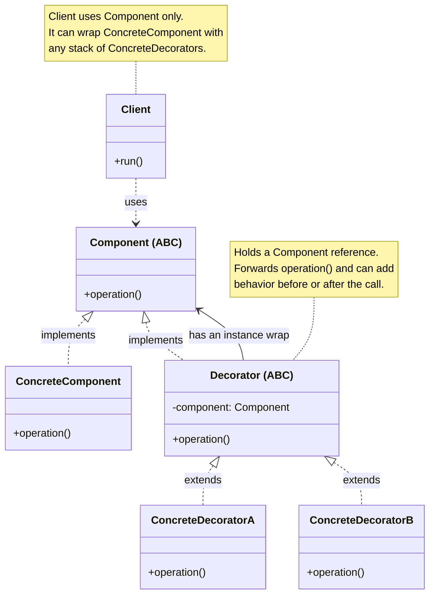
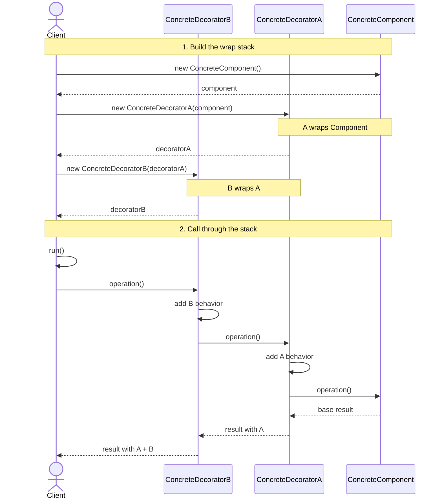

# Decorator Design Pattern

## On this page

- [What is the Decorator pattern?](#what-is-the-decorator-pattern)
- [Car analogy](#car-analogy)
- [When should you use it?](#when-should-you-use-it)
- [Class diagram](#class-diagram)
- [Sequence diagram](#sequence-diagram)
- [Code example](#code-example)
- [Key idea](#key-idea)

## What is the Decorator pattern?

Decorator lets you **add behavior to an object by wrapping it**, without changing the object's class or the Client's call surface.

Both the base object and every wrapper share the same **Component** interface. A decorator holds a reference to another Component, forwards `operation()` to it, and can add work before or after that call. Because each wrapper is itself a Component, you can stack several wrappers — wrap a wrap — and choose the stack at runtime.

Without Decorator, optional features often force a subclass explosion: BaseCar, CarWithSunroof, CarWithSunroofAndSound, CarWithSunroofAndSoundAndADAS, and so on. With Decorator, the base car stays simple. Each feature is a small wrapper you compose as needed.

This is the **object-oriented Decorator design pattern** — not the same thing as Python's `@decorator` syntax. They share a name; the pattern wraps an *object instance*, while `@decorator` wraps a *function or class* at definition time. See [Python `@decorator` vs Design Patterns](1510_python_decorator.md) for the distinction.

**Category:** Structural POV

## Car analogy

Think of configuring a car on the showroom floor. You start with a base model, then optionally add a sunroof, premium sound, or an ADAS safety pack. Each option wraps the car you already have and adds to the description and price — without rewriting the base car class. Stack the options you want; leave off the ones you don't.

## When should you use it?

Use Decorator when you need to add responsibilities to objects **flexibly at runtime**, without baking every combination into subclasses.

Common cases:

- **Optional features** — turn capabilities on or off by wrapping (or not wrapping) the base object.
- **Stackable behavior** — combine several enhancements in any order (logging, pricing add-ons, formatting).
- **Open for extension** — add a new feature as a new decorator class instead of editing the base class or growing a deep inheritance tree.
- **Same interface for Client** — the Client still calls `operation()` on a Component; it does not need to know how many wrappers sit in front of the base object.

Prefer Decorator when features are independent add-ons. If you need a stand-in that *controls access* to a real object (lock, lazy load, cache), that is closer to [Proxy](1700_proxy.md).

## Class Diagram



<br/>

**Component** is the shared interface. **ConcreteComponent** is the base object. **Decorator** also implements **Component** and **wraps** another Component — so you can stack `ConcreteDecoratorA` and `ConcreteDecoratorB` around the base without changing it.

<br/>

## Sequence Diagram



<br/>

Full flow in two parts:

1. **Build the wrap stack** — create **ConcreteComponent**, wrap it with **ConcreteDecoratorA**, then wrap that with **ConcreteDecoratorB**. The Client holds only the outer decorator.
2. **Call through the stack** — `run()` calls `operation()` on B. Each decorator adds its behavior, then forwards inward. **ConcreteComponent** returns the base result; each decorator adds its contribution on the way back out.

The Client never talks to the inner objects after wrapping — one call on the outer decorator runs the whole chain.

<br/>

## Code example

```python
"""
Decorator pattern demo: optional features wrapped around a base car.

Run:
    python decorator_demo.py

Each decorator adds behavior without modifying the underlying car class.
"""

from abc import ABC, abstractmethod


class Car(ABC):
    @abstractmethod
    def description(self) -> str:
        pass

    @abstractmethod
    def price_inr(self) -> int:
        pass


class BaseCar(Car):
    def __init__(self, model: str, base_price: int) -> None:
        self._model = model
        self._base_price = base_price

    def description(self) -> str:
        return self._model

    def price_inr(self) -> int:
        return self._base_price


class CarFeatureDecorator(Car):
    def __init__(self, car: Car) -> None:
        self._car = car


class SunroofDecorator(CarFeatureDecorator):
    def description(self) -> str:
        return f"{self._car.description()} + panoramic sunroof"

    def price_inr(self) -> int:
        return self._car.price_inr() + 85000


class PremiumSoundDecorator(CarFeatureDecorator):
    def description(self) -> str:
        return f"{self._car.description()} + premium sound system"

    def price_inr(self) -> int:
        return self._car.price_inr() + 45000


class ADASDecorator(CarFeatureDecorator):
    def description(self) -> str:
        return f"{self._car.description()} + ADAS safety pack"

    def price_inr(self) -> int:
        return self._car.price_inr() + 120000


def main() -> None:
    print("=== Decorator: build-your-own car ===\n")

    car: Car = BaseCar("Compact Hatch", 650000)
    print(f"Base: {car.description()} - Rs {car.price_inr():,}")

    car = SunroofDecorator(car)
    car = PremiumSoundDecorator(car)
    car = ADASDecorator(car)

    print(f"\nConfigured: {car.description()}")
    print(f"Final price: Rs {car.price_inr():,}")


if __name__ == "__main__":
    main()
```

**Output:**
```
=== Decorator: build-your-own car ===

Base: Compact Hatch - Rs 650,000

Configured: Compact Hatch + panoramic sunroof + premium sound system + ADAS safety pack
Final price: Rs 900,000
```

Source: [`decorator_demo.py`](../code/2000_decorator/decorator_demo.py)

## Key idea

- The pattern solves a recurring design problem in a reusable way.
- In this example, the car analogy makes the roles of each class easy to remember.
- Run the demo yourself: `python decorator_demo.py` inside `code/2000_decorator/`.

<br/>
<p>
    <span style="float: left;">
        <a href="1900_bridge.md">Previous: Bridge</a>
        &nbsp;
        <a href="2100_template_method.md">Next: Template Method</a>
    </span>
    <span style="float: right;">
        <a href="../../README.md">Home</a>
        &nbsp;|&nbsp;
        <a href="index.md">Back to Design Patterns Index</a>
    </span>
</p>
