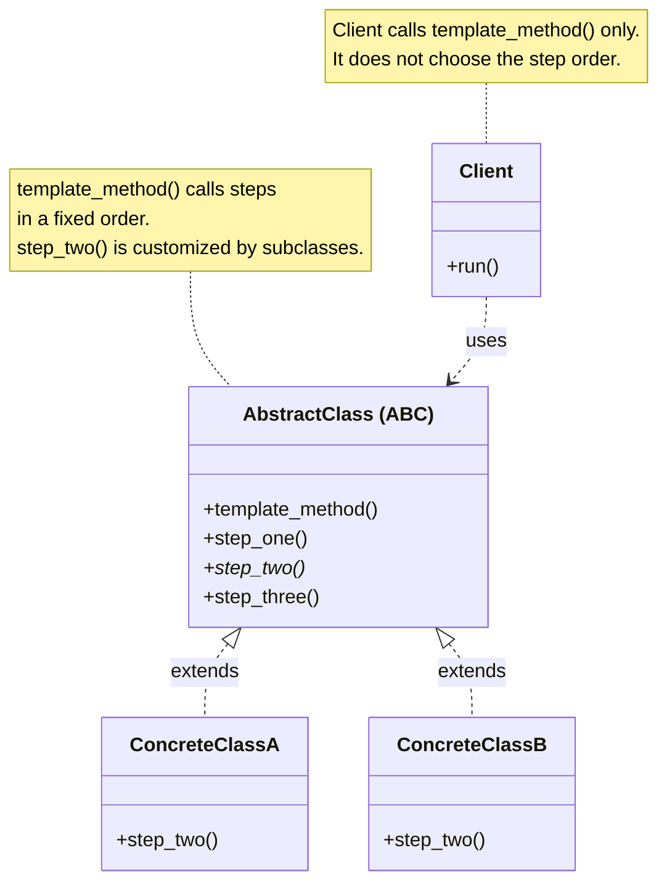
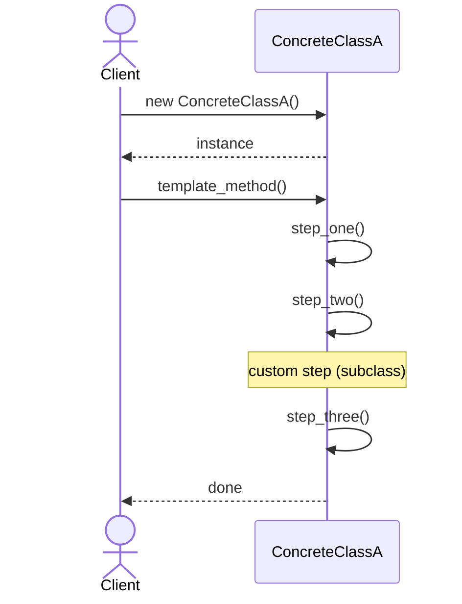

# Template Method Design Pattern

## On this page

- [What is the Template Method pattern?](#what-is-the-template-method-pattern)
- [Car analogy](#car-analogy)
- [When should you use it?](#when-should-you-use-it)
- [Class diagram](#class-diagram)
- [Sequence diagram](#sequence-diagram)
- [Code example](#code-example)
- [Key idea](#key-idea)

## What is the Template Method pattern?

Template Method defines fixed steps with customizable parts. Hatchback and sedan share the same build flow but implement rear design differently.

The pattern puts the shared workflow in one place — usually a method on an abstract base class (the **template method**). That method calls the steps in a fixed order. Some steps are already implemented in the base class. Other steps are left abstract (or have a default) so subclasses fill them in.

The Client calls the template method once — for example `build_car()`. It does not decide the order of chassis, engine, rear, and paint. Subclasses only change the steps that truly differ.

Without Template Method, each car type often copies the same sequence and only tweaks one part. When the shared flow changes, you must edit every copy. With Template Method, the skeleton stays in one method. Hatchback and sedan override only `design_rear()` (and similar hooks). The order of steps stays under the base class’s control.

**Category:** Behavioral POV

## Car analogy

Think of a car’s overall design as a template — chassis, engine, rear, then paint. That sequence does not change from model to model. What *does* change is the rear: a hatchback gets a liftgate; a sedan gets a trunk lid. The plant still runs the same build line; only the rear-design station is customized.

## When should you use it?

Use it when several classes follow the **same steps in the same order**, but one or more steps need different behavior.

Clear signs you need Template Method:

- The workflow is shared (chassis → engine → rear → paint).
- Only a few steps change (hatchback rear vs sedan rear).
- You want that shared order defined **once** in a base class, not copied into every subclass.

If you need to replace the whole algorithm at runtime with a different object, use [Strategy](2300_strategy.md) instead.

## Class Diagram



<br/>

**AbstractClass** owns the fixed workflow in `template_method()`. Shared steps stay here. Subclasses like **ConcreteClassA** and **ConcreteClassB** override only the custom step (`step_two()`).

<br/>

## Sequence Diagram



<br/>

**Client** creates a concrete class and calls `template_method()` once. The template runs the steps in order — shared steps and the custom `step_two()` — then returns. Swap `ConcreteClassA` for `ConcreteClassB` and only the custom step changes.

<br/>

## Code example

```python
"""
Template Method pattern demo: car body design with customizable rear.

Run:
    python template_method_demo.py

The overall design flow is fixed; hatchback and sedan customize the rear step.
"""

from abc import ABC, abstractmethod


class CarDesign(ABC):
    """Template: same build steps, subclasses customize rear design."""

    def build_car(self) -> None:
        print(f"[Design] Starting {self.model_name()} build")
        self.fit_chassis()
        self.mount_engine()
        self.design_rear()
        self.apply_paint()
        print(f"[Design] {self.model_name()} ready for production\n")

    def fit_chassis(self) -> None:
        print("  [Chassis] Frame welded and aligned")

    def mount_engine(self) -> None:
        print("  [Engine] Turbo unit mounted and calibrated")

    @abstractmethod
    def design_rear(self) -> None:
        pass

    @abstractmethod
    def model_name(self) -> str:
        pass

    def apply_paint(self) -> None:
        print("  [Paint] Base coat and clear coat applied")


class HatchbackDesign(CarDesign):
    def model_name(self) -> str:
        return "Hatchback"

    def design_rear(self) -> None:
        print("  [Rear] Liftgate with integrated spoiler and wide glass")


class SedanDesign(CarDesign):
    def model_name(self) -> str:
        return "Sedan"

    def design_rear(self) -> None:
        print("  [Rear] Trunk lid with chrome trim and LED tail lamps")


def main() -> None:
    print("=== Template Method: car body design ===\n")

    HatchbackDesign().build_car()
    SedanDesign().build_car()


if __name__ == "__main__":
    main()
```

**Output:**
```
=== Template Method: car body design ===

[Design] Starting Hatchback build
  [Chassis] Frame welded and aligned
  [Engine] Turbo unit mounted and calibrated
  [Rear] Liftgate with integrated spoiler and wide glass
  [Paint] Base coat and clear coat applied
[Design] Hatchback ready for production

[Design] Starting Sedan build
  [Chassis] Frame welded and aligned
  [Engine] Turbo unit mounted and calibrated
  [Rear] Trunk lid with chrome trim and LED tail lamps
  [Paint] Base coat and clear coat applied
[Design] Sedan ready for production
```

Source: [`template_method_demo.py`](../code/2100_template_method/template_method_demo.py)

## Key idea

- The pattern solves a recurring design problem in a reusable way.
- In this example, the car analogy makes the roles of each class easy to remember.
- Run the demo yourself: `python template_method_demo.py` inside `code/2100_template_method/`.

<br/>
<p>
    <span style="float: left;">
        <a href="2000_decorator.md">Previous: Decorator</a>
        &nbsp;
        <a href="2200_observer.md">Next: Observer</a>
    </span>
    <span style="float: right;">
        <a href="../../README.md">Home</a>
        &nbsp;|&nbsp;
        <a href="index.md">Back to Design Patterns Index</a>
    </span>
</p>
