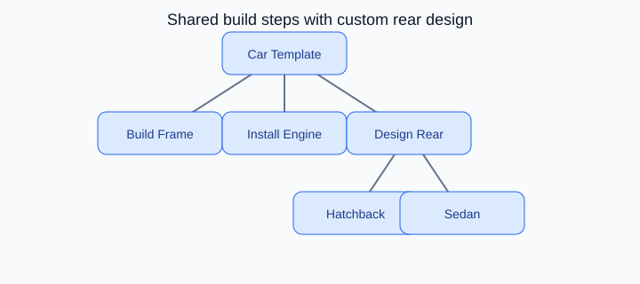

# Template Method Design Pattern

## On this page

- [What is the Template Method pattern?](#what-is-the-template-method-pattern)
- [Car analogy](#car-analogy)
- [When should you use it?](#when-should-you-use-it)
- [Code example](#code-example)
- [Key idea](#key-idea)

<p align="center">
    
</p>

<p align="center"><strong>Fig:</strong> Shared build steps with custom rear design</p>

## What is the Template Method pattern?

Template Method defines fixed steps with customizable parts. Hatchback and sedan share the same build flow but implement rear design differently.

**Category:** Behavioral POV

## Car analogy

Think of a car's overall design as a template—its rear design is a customizable step.

## When should you use it?

Use it when several classes share the same workflow but differ in specific steps.

## Code example

```python
"""
Template Method pattern demo: car body design with customizable rear.

Run:
    python template_method_demo.py

The overall design flow is fixed; hatchback and sedan customize the rear step.
"""

from abc import ABC, abstractmethod


class CarDesign(ABC):
    """Template: same build steps, subclasses customize rear design."""

    def build_car(self) -> None:
        print(f"[Design] Starting {self.model_name()} build")
        self.fit_chassis()
        self.mount_engine()
        self.design_rear()
        self.apply_paint()
        print(f"[Design] {self.model_name()} ready for production\n")

    def fit_chassis(self) -> None:
        print("  [Chassis] Frame welded and aligned")

    def mount_engine(self) -> None:
        print("  [Engine] Turbo unit mounted and calibrated")

    @abstractmethod
    def design_rear(self) -> None:
        pass

    @abstractmethod
    def model_name(self) -> str:
        pass

    def apply_paint(self) -> None:
        print("  [Paint] Base coat and clear coat applied")


class HatchbackDesign(CarDesign):
    def model_name(self) -> str:
        return "Hatchback"

    def design_rear(self) -> None:
        print("  [Rear] Liftgate with integrated spoiler and wide glass")


class SedanDesign(CarDesign):
    def model_name(self) -> str:
        return "Sedan"

    def design_rear(self) -> None:
        print("  [Rear] Trunk lid with chrome trim and LED tail lamps")


def main() -> None:
    print("=== Template Method: car body design ===\n")

    HatchbackDesign().build_car()
    SedanDesign().build_car()


if __name__ == "__main__":
    main()
```

**Output:**
```
=== Template Method: car body design ===

[Design] Starting Hatchback build
  [Chassis] Frame welded and aligned
  [Engine] Turbo unit mounted and calibrated
  [Rear] Liftgate with integrated spoiler and wide glass
  [Paint] Base coat and clear coat applied
[Design] Hatchback ready for production

[Design] Starting Sedan build
  [Chassis] Frame welded and aligned
  [Engine] Turbo unit mounted and calibrated
  [Rear] Trunk lid with chrome trim and LED tail lamps
  [Paint] Base coat and clear coat applied
[Design] Sedan ready for production
```

Source: [`template_method_demo.py`](../code/2100_template_method/template_method_demo.py)

## Key idea

- The pattern solves a recurring design problem in a reusable way.
- In this example, the car analogy makes the roles of each class easy to remember.
- Run the demo yourself: `python template_method_demo.py` inside `code/2100_template_method/`.

<p align="right">
    <a href="2000_decorator.md">Previous: Decorator</a>
    <a href="2200_observer.md">Next: Observer</a>
</p>

<p align="right">
    <a href="index.md">Back to Design Patterns Index</a>
</p>
