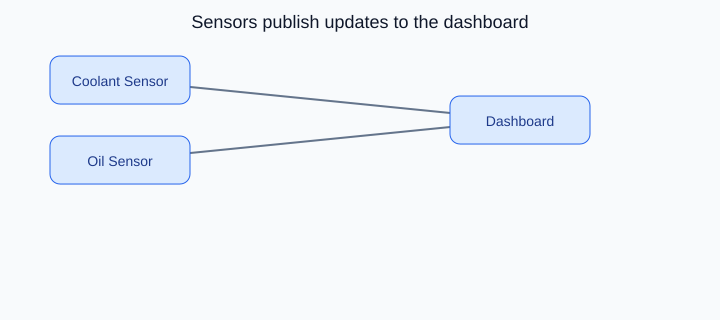

# Observer Design Pattern

## On this page

- [What is the Observer pattern?](#what-is-the-observer-pattern)
- [Car analogy](#car-analogy)
- [When should you use it?](#when-should-you-use-it)
- [Code example](#code-example)
- [Key idea](#key-idea)

<p align="center">
    
</p>

<p align="center"><strong>Fig:</strong> Sensors publish updates to the dashboard</p>

## What is the Observer pattern?

Observer lets objects subscribe to changes. When a sensor reading changes, every attached dashboard listener gets updated automatically.

**Category:** Behavioral POV

## Car analogy

Sensors notify the dashboard when engine temperature increases.

## When should you use it?

Use it when one event source must notify many listeners without tight coupling.

## Code example

```python
"""
Observer pattern demo: sensors notify the dashboard.

Run:
    python observer_demo.py

Engine sensors publish readings; the dashboard updates automatically.
"""

from abc import ABC, abstractmethod


class DashboardObserver(ABC):
    @abstractmethod
    def update(self, sensor: str, value: float, unit: str) -> None:
        pass


class DigitalDashboard(DashboardObserver):
    def update(self, sensor: str, value: float, unit: str) -> None:
        print(f"  [Dashboard] {sensor}: {value}{unit}")


class CoolantSensor:
    def __init__(self) -> None:
        self._observers: list[DashboardObserver] = []
        self._temperature_c = 85.0

    def attach(self, observer: DashboardObserver) -> None:
        self._observers.append(observer)

    def _notify(self, sensor: str, value: float, unit: str) -> None:
        for observer in self._observers:
            observer.update(sensor, value, unit)

    def read_temperature(self) -> None:
        print(f"[CoolantSensor] Reading {self._temperature_c}C")
        self._notify("Coolant temp", self._temperature_c, "C")

    def simulate_overheat(self) -> None:
        self._temperature_c = 108.0
        print("[CoolantSensor] Overheat detected!")
        self._notify("Coolant temp", self._temperature_c, "C")


class OilPressureSensor:
    def __init__(self) -> None:
        self._observers: list[DashboardObserver] = []

    def attach(self, observer: DashboardObserver) -> None:
        self._observers.append(observer)

    def read_pressure(self, psi: float) -> None:
        print(f"[OilSensor] Reading {psi} psi")
        for observer in self._observers:
            observer.update("Oil pressure", psi, " psi")


def main() -> None:
    print("=== Observer: sensors and dashboard ===\n")

    dashboard = DigitalDashboard()
    coolant = CoolantSensor()
    oil = OilPressureSensor()
    coolant.attach(dashboard)
    oil.attach(dashboard)

    coolant.read_temperature()
    oil.read_pressure(32.5)
    print()
    coolant.simulate_overheat()


if __name__ == "__main__":
    main()
```

**Output:**
```
=== Observer: sensors and dashboard ===

[CoolantSensor] Reading 85.0C
  [Dashboard] Coolant temp: 85.0C
[OilSensor] Reading 32.5 psi
  [Dashboard] Oil pressure: 32.5 psi

[CoolantSensor] Overheat detected!
  [Dashboard] Coolant temp: 108.0C
```

Source: [`observer_demo.py`](../code/2200_observer/observer_demo.py)

## Key idea

- The pattern solves a recurring design problem in a reusable way.
- In this example, the car analogy makes the roles of each class easy to remember.
- Run the demo yourself: `python observer_demo.py` inside `code/2200_observer/`.

<p align="right">
    <a href="2100_template_method.md">Previous: Template Method</a>
    <a href="2300_strategy.md">Next: Strategy</a>
</p>

<p align="right">
    <a href="index.md">Back to Design Patterns Index</a>
</p>
