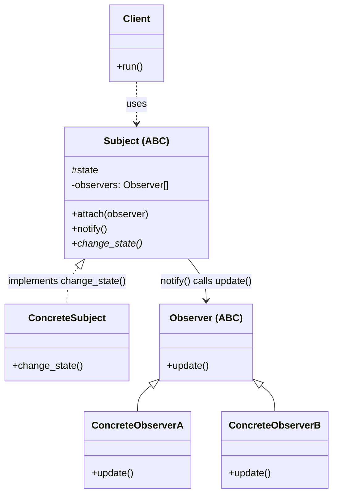
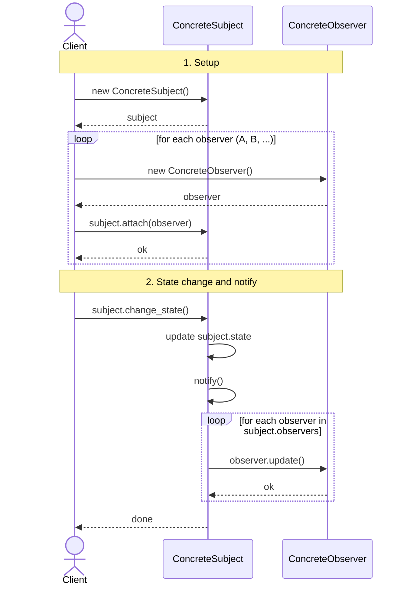

# Observer Design Pattern

## On this page

- [What is the Observer pattern?](#what-is-the-observer-pattern)
- [Car analogy](#car-analogy)
- [When should you use it?](#when-should-you-use-it)
- [Class diagram](#class-diagram)
- [Sequence diagram](#sequence-diagram)
- [Code example](#code-example)
- [Key idea](#key-idea)

## What is the Observer pattern?

Observer lets objects subscribe to changes. When a sensor reading changes, every attached dashboard listener gets updated automatically.

**Category:** Behavioral POV

## Car analogy

Sensors notify the dashboard when engine temperature increases.

## When should you use it?

Use it when one event source must notify many listeners without tight coupling.

## Class Diagram



<br/>

How to read the diagram:

1. **Client** uses **Subject** (attaches observers, then asks for a state change).
2. **Subject** keeps `#state` and `-observers: Observer[]`.
3. **ConcreteSubject** implements `change_state()` and updates `#state`.
4. After the state change, `notify()` runs: for each observer in the list, it calls `observer.update()`.
5. **ConcreteObserverA** and **ConcreteObserverB** implement `update()`.

<br/>

## Sequence Diagram



<br/>

Read it in two parts:

1. **Setup** — Client creates `subject`, then for each observer: create it and `attach` it.
2. **Notify** — Client calls `change_state()`. Subject updates `#state`, calls `notify()`, then loops and calls `update()` on every attached observer.

<br/>

## Code example

```python
"""
Observer pattern demo: one sensor notifies the dashboard.

Run:
    python observer_demo.py
"""

from abc import ABC, abstractmethod


class Observer(ABC):
    @abstractmethod
    def update(self, temperature_c: float) -> None:
        pass


class Dashboard(Observer):
    def update(self, temperature_c: float) -> None:
        print(f"  [Dashboard] Coolant: {temperature_c}C")


class CoolantSensor:
    """Subject — notifies attached observers when temperature changes."""

    def __init__(self) -> None:
        self._observers: list[Observer] = []
        self._temperature_c = 85.0

    def attach(self, observer: Observer) -> None:
        self._observers.append(observer)

    def set_temperature(self, temperature_c: float) -> None:
        self._temperature_c = temperature_c
        print(f"[Sensor] Temperature is now {temperature_c}C")
        for observer in self._observers:
            observer.update(temperature_c)


def main() -> None:
    print("=== Observer: sensor -> dashboard ===\n")

    sensor = CoolantSensor()
    sensor.attach(Dashboard())

    sensor.set_temperature(85.0)
    sensor.set_temperature(108.0)


if __name__ == "__main__":
    main()
```

**Output:**
```
=== Observer: sensor -> dashboard ===

[Sensor] Temperature is now 85.0C
  [Dashboard] Coolant: 85.0C
[Sensor] Temperature is now 108.0C
  [Dashboard] Coolant: 108.0C
```

Source: [`observer_demo.py`](../code/2200_observer/observer_demo.py)

## Key idea

- The pattern solves a recurring design problem in a reusable way.
- In this example, the car analogy makes the roles of each class easy to remember.
- Run the demo yourself: `python observer_demo.py` inside `code/2200_observer/`.

<br/>
<p>
    <span style="float: left;">
        <a href="2100_template_method.md">Previous: Template Method</a>
        &nbsp;
        <a href="2300_strategy.md">Next: Strategy</a>
    </span>
    <span style="float: right;">
        <a href="../../README.md">Home</a>
        &nbsp;|&nbsp;
        <a href="index.md">Back to Design Patterns Index</a>
    </span>
</p>
