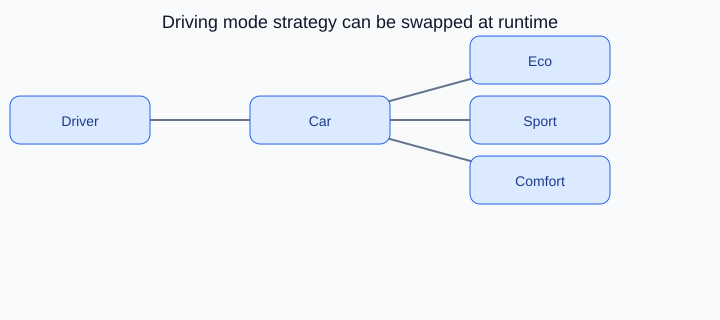

# Strategy Design Pattern

<p align="center">
    
</p>

<p align="center"><strong>Fig:</strong> Driving mode strategy can be swapped at runtime</p>

## What is the Strategy pattern?

Strategy swaps algorithms at runtime. The driver picks eco, sport, or comfort mode and the car changes behavior without rewriting the car class.

**Category:** Behavioral POV

## Car analogy

Choose between eco, sport, or comfort driving modes while driving.

## When should you use it?

Use it when you have multiple interchangeable behaviors for the same task.

## Code example

```python
"""
Strategy pattern demo: eco, sport, and comfort driving modes.

Run:
    python strategy_demo.py

The driver swaps driving behavior without changing the car class.
"""

from abc import ABC, abstractmethod


class DrivingMode(ABC):
    @abstractmethod
    def accelerate(self) -> str:
        pass

    @abstractmethod
    def fuel_use(self) -> str:
        pass


class EcoMode(DrivingMode):
    def accelerate(self) -> str:
        return "Gentle throttle, early upshift"

    def fuel_use(self) -> str:
        return "18 km/l estimated"


class SportMode(DrivingMode):
    def accelerate(self) -> str:
        return "Sharp throttle, holds lower gears"

    def fuel_use(self) -> str:
        return "11 km/l estimated"


class ComfortMode(DrivingMode):
    def accelerate(self) -> str:
        return "Smooth power delivery, soft suspension"

    def fuel_use(self) -> str:
        return "15 km/l estimated"


class Car:
    def __init__(self, mode: DrivingMode) -> None:
        self._mode = mode

    def set_mode(self, mode: DrivingMode) -> None:
        self._mode = mode

    def drive(self) -> None:
        print(f"  Acceleration: {self._mode.accelerate()}")
        print(f"  Fuel economy: {self._mode.fuel_use()}")


def main() -> None:
    print("=== Strategy: driving modes ===\n")

    car = Car(EcoMode())
    print("[Mode] Eco")
    car.drive()

    print("\n[Mode] Sport")
    car.set_mode(SportMode())
    car.drive()

    print("\n[Mode] Comfort")
    car.set_mode(ComfortMode())
    car.drive()


if __name__ == "__main__":
    main()
```

**Output:**
```
=== Strategy: driving modes ===

[Mode] Eco
  Acceleration: Gentle throttle, early upshift
  Fuel economy: 18 km/l estimated

[Mode] Sport
  Acceleration: Sharp throttle, holds lower gears
  Fuel economy: 11 km/l estimated

[Mode] Comfort
  Acceleration: Smooth power delivery, soft suspension
  Fuel economy: 15 km/l estimated
```

Source: [`strategy_demo.py`](../code/2300_strategy/strategy_demo.py)

## Key idea

- The pattern solves a recurring design problem in a reusable way.
- In this example, the car analogy makes the roles of each class easy to remember.
- Run the demo yourself: `python strategy_demo.py` inside `code/2300_strategy/`.

<p align="right">
    <a href="2200_observer.md">Previous: Observer</a>
    <a href="2400_command.md">Next: Command</a>
</p>
