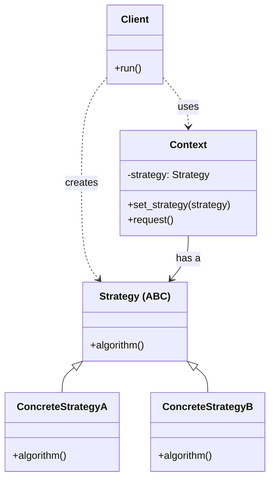
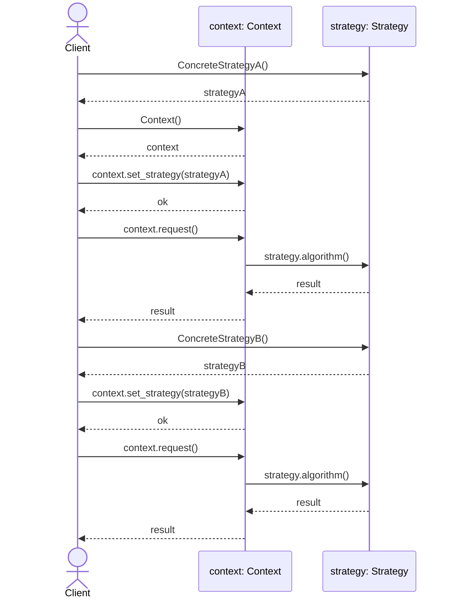

# Strategy Design Pattern

## On this page

- [What is the Strategy pattern?](#what-is-the-strategy-pattern)
- [Car analogy](#car-analogy)
- [When should you use it?](#when-should-you-use-it)
- [Class diagram](#class-diagram)
- [Sequence diagram](#sequence-diagram)
- [Code example](#code-example)
- [Key idea](#key-idea)

## What is the Strategy pattern?

Strategy swaps algorithms at runtime. The driver picks eco, sport, or comfort mode and the car changes behavior without rewriting the car class.

**Category:** Behavioral POV

## Car analogy

Choose between eco, sport, or comfort driving modes while driving.

## When should you use it?

Use it when you have multiple interchangeable behaviors for the same task.

## Class Diagram



<br/>

How to read the diagram:

1. **Client** creates strategies with `ConcreteStrategyA()` / `ConcreteStrategyB()`, and context with `Context()`.
2. **Client** calls `context.set_strategy(strategy)`.
3. **Client** calls `context.request()`.
4. `context` calls `strategy.algorithm()`.
5. Swap with `context.set_strategy(otherStrategy)` — same `context`, different behavior.

<br/>

## Sequence Diagram



<br/>

**Client** creates `context` with `Context()`, then calls `context.set_strategy(strategyA)` and `context.request()`. Inside that call, `context` uses `strategy.algorithm()`. Later **Client** calls `context.set_strategy(strategyB)` and `context.request()` again — same `context`, different strategy.

<br/>

## Code example

```python
"""
Strategy pattern demo. Run: python strategy_demo.py
"""

from abc import ABC, abstractmethod


# --- Strategy ---

class DrivingMode(ABC):
    @abstractmethod
    def accelerate(self) -> str:
        pass

    @abstractmethod
    def fuel_use(self) -> str:
        pass


class EcoMode(DrivingMode):
    def accelerate(self) -> str:
        return "Gentle throttle, early upshift"

    def fuel_use(self) -> str:
        return "18 km/l estimated"


class SportMode(DrivingMode):
    def accelerate(self) -> str:
        return "Sharp throttle, holds lower gears"

    def fuel_use(self) -> str:
        return "11 km/l estimated"


class ComfortMode(DrivingMode):
    def accelerate(self) -> str:
        return "Smooth power delivery, soft suspension"

    def fuel_use(self) -> str:
        return "15 km/l estimated"


# --- Context ---

class Car:
    def __init__(self, mode: DrivingMode) -> None:
        self._mode = mode

    def set_mode(self, mode: DrivingMode) -> None:
        self._mode = mode

    def drive(self) -> None:
        print(f"  Acceleration: {self._mode.accelerate()}")
        print(f"  Fuel economy: {self._mode.fuel_use()}")


# --- Demo ---

def main() -> None:
    print("=== Strategy: driving modes ===\n")

    car = Car(EcoMode())
    print("[Mode] Eco")
    car.drive()

    print("\n[Mode] Sport")
    car.set_mode(SportMode())
    car.drive()

    print("\n[Mode] Comfort")
    car.set_mode(ComfortMode())
    car.drive()


if __name__ == "__main__":
    main()
```

**Output:**
```
=== Strategy: driving modes ===

[Mode] Eco
  Acceleration: Gentle throttle, early upshift
  Fuel economy: 18 km/l estimated

[Mode] Sport
  Acceleration: Sharp throttle, holds lower gears
  Fuel economy: 11 km/l estimated

[Mode] Comfort
  Acceleration: Smooth power delivery, soft suspension
  Fuel economy: 15 km/l estimated
```

Source: [`strategy_demo.py`](../code/2300_strategy/strategy_demo.py)

## Key idea

- The pattern solves a recurring design problem in a reusable way.
- In this example, the car analogy makes the roles of each class easy to remember.
- Run the demo yourself: `python strategy_demo.py` inside `code/2300_strategy/`.

<br/>
<p>
    <span style="float: left;">
        <a href="2200_observer.md">Previous: Observer</a>
        &nbsp;
        <a href="2310_strategy_vs_bridge.md">Next: Strategy vs Bridge</a>
    </span>
    <span style="float: right;">
        <a href="../../README.md">Home</a>
        &nbsp;|&nbsp;
        <a href="index.md">Back to Design Patterns Index</a>
    </span>
</p>
