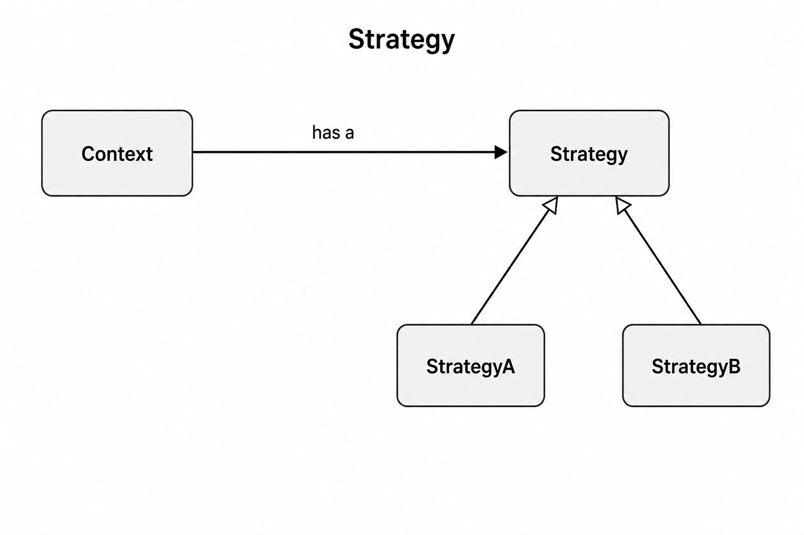

# Strategy vs Bridge

## On this page

- [The common confusion](#the-common-confusion)
- [Why Strategy is behavioral and Bridge is structural](#why-strategy-is-behavioral-and-bridge-is-structural)
- [Core shapes](#core-shapes)
- [Quick comparison](#quick-comparison)
- [Which one to choose](#which-one-to-choose)

## The common confusion

After [Strategy](2300_strategy.md) and [Bridge](1900_bridge.md), this puzzle shows up:

> **Wait — aren't these the same idea?**
>
> 1. Both use a **has-a** reference to another object.
> 2. Both avoid a class explosion from mixing behaviors.
> 3. Both let you swap that linked object at runtime.
> 4. Both uses same pattern:
>     - **Strategy:** `ins_context.request()` → `ins_strategy.algorithm()`
>     - **Bridge:** `ins_abstraction.operation()` → `ins_implementor.operation_impl()`
> 5. So… **how do Strategy and Bridge differ?**

**Short answer:** same wiring shape, different job.

- **Strategy** — You hold one Context instance and swap **how one of its behaviors works** at runtime (behavioral POV — *how you use it*).
- **Bridge** — You split the design into **two class hierarchies** — Abstraction and Implementor. Each can grow on its own, and you combine a class from one side with a class from the other to get the result you want (structural POV — *how you organize it*).

## Why Strategy is behavioral and Bridge is structural

**Strategy** is behavioral because the main thing you change is **how an object acts**.

**Bridge** is structural because the main thing you change is **how classes are arranged**.

<u>**From a structural POV, Strategy is a lighter Bridge:**</u> **Context** has a **Strategy** the same way **Abstraction** has an **Implementor** — names differ, the class wiring looks the same. Full **Bridge** grows both hierarchies so you can mix many combinations. **Strategy** keeps that wiring thin and uses it only to swap behavior at runtime.

## Core shapes

  

**Strategy:** one **Context**, many interchangeable **strategies**. Client usually talks to Context and swaps the algorithm.

  

**Bridge:** **two** hierarchies — Abstraction (and refined forms) **and** Implementor. Client mixes any refined abstraction with any implementor.

## Quick comparison

| | [**Strategy**](2300_strategy.md) | [**Bridge**](1900_bridge.md) |
|---|---|---|
| **POV** | Behavioral | Structural |
| **Question** | Which algorithm should Context use now? | How do abstraction and implementation stay independent? |
| **What varies** | Mostly the strategy side | Both sides (abstraction × implementor) |
| **Client focus** | One Context; swap strategies | Often builds pairs/combinations: refined abstraction + implementor |
| **Typical car story** | Same car, switch Eco / Sport / Comfort | Chassis family × engine family |

## Which one to choose

Choose **Strategy** when:

1. You have **one** main object (Context) whose **algorithm** must change.
2. The different options are **behaviors for the same task** (sort, drive mode, payment).
3. You do not need a second hierarchy of “kinds of Context.”

Choose **Bridge** when:

1. You have **two dimensions** that must evolve separately (chassis × engine, UI × platform).
2. You need **refined abstractions** *and* concrete implementors — not just swap the plug-in side.
3. You care about **structure** (how parts are linked), not only runtime behavior swap.

**Tip:** If only the algorithm changes, call it Strategy. If both hierarchies matter, call it Bridge.

 

    
        <a href="2300_strategy.md">Previous: Strategy</a>
        &nbsp;
        <a href="2400_command.md">Next: Command</a>
    
    
        <a href="../../README.md">Home</a>
        &nbsp;|&nbsp;
        <a href="index.md">Back to Design Patterns Index</a>
    

