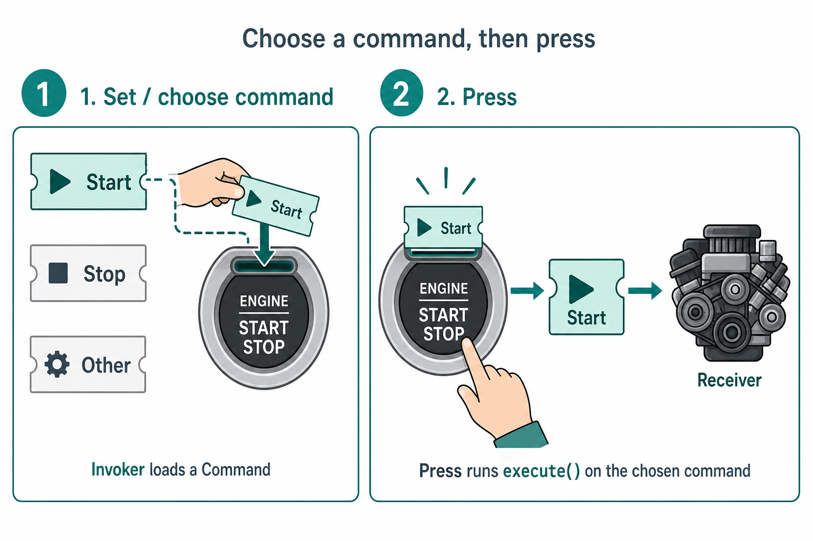
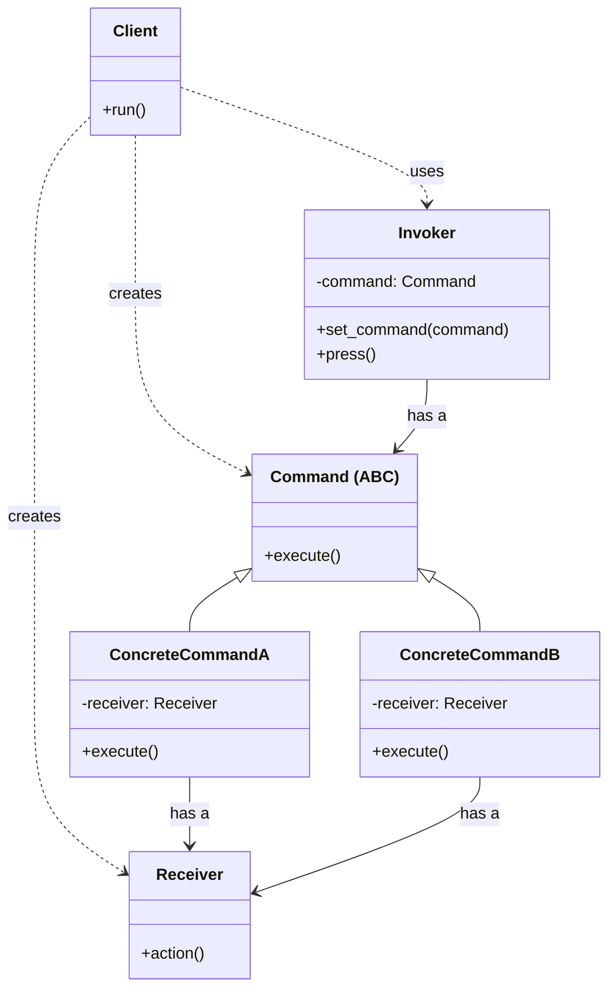
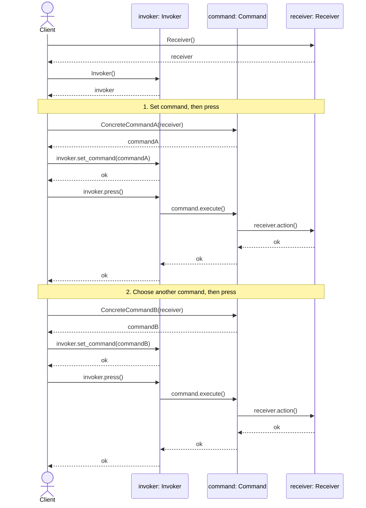

# Command Design Pattern

## On this page

- [What is the Command pattern?](#what-is-the-command-pattern)
- [Car analogy](#car-analogy)
- [When should you use it?](#when-should-you-use-it)
- [Class diagram](#class-diagram)
- [Sequence diagram](#sequence-diagram)
- [Code example](#code-example)
- [Key idea](#key-idea)

## What is the Command pattern?

Command turns a request into an object. A start button does not start the engine directly—it sends a command object that can be queued, logged, or undone.

**Category:** Behavioral POV

## Car analogy

Pressing a button sends a command to start the engine.

## When should you use it?

Use it for buttons, undo/redo, job queues, or remote actions.

<p align="center">
  
</p>

**Two steps:**

1. **Set / choose** — the Invoker (button) is given one Command (start, stop, …).
2. **Press** — the Invoker runs `execute()` on that command; the command controls the Receiver (engine).

The button never talks to the engine directly.

## Class Diagram



<br/>

How to read the diagram:

1. **Client** creates `Receiver`, `Command`s, and `Invoker`.
2. **Invoker** has a **Command** (`set_command`).
3. **Invoker** calls `command.execute()` on press — it does not know the Receiver.
4. **ConcreteCommand** has a **Receiver** and calls `receiver.action()` inside `execute()`.

<br/>

## Sequence Diagram



<br/>

**Client** sets a command on the invoker, then presses. Invoker only calls `command.execute()`. The command talks to the receiver. Swap the command and press again — same invoker, different action.

<br/>

## Code example

```python
"""
Command pattern demo. Run: python command_demo.py
"""

from abc import ABC, abstractmethod


# --- Receiver ---

class Engine:
    def __init__(self) -> None:
        self.running = False

    def start(self) -> None:
        if self.running:
            print("  [Engine] Already running")
            return
        self.running = True
        print("  [Engine] Ignition on - engine started")

    def stop(self) -> None:
        if not self.running:
            print("  [Engine] Already stopped")
            return
        self.running = False
        print("  [Engine] Engine stopped")


# --- Command ---

class Command(ABC):
    @abstractmethod
    def execute(self) -> None:
        pass


class EngineCommand(Command):
    def __init__(self, engine: Engine) -> None:
        self._engine = engine


class StartEngineCommand(EngineCommand):
    def execute(self) -> None:
        print("[Command] StartEngine.execute()")
        self._engine.start()


class StopEngineCommand(EngineCommand):
    def execute(self) -> None:
        print("[Command] StopEngine.execute()")
        self._engine.stop()


# --- Invoker ---

class StartStopButton:
    def __init__(self) -> None:
        self._command: Command | None = None

    def set_command(self, command: Command) -> None:
        self._command = command

    def press(self) -> None:
        print("[Button] Pressed")
        if self._command:
            self._command.execute()


# --- Demo ---

def main() -> None:
    print("=== Command: start/stop button ===\n")

    engine = Engine()
    button = StartStopButton()

    button.set_command(StartEngineCommand(engine))
    button.press()

    print()
    button.set_command(StopEngineCommand(engine))
    button.press()


if __name__ == "__main__":
    main()
```

**Output:**
```
=== Command: start/stop button ===

[Button] Pressed
[Command] StartEngine.execute()
  [Engine] Ignition on - engine started

[Button] Pressed
[Command] StopEngine.execute()
  [Engine] Engine stopped
```

Source: [`command_demo.py`](../code/2400_command/command_demo.py)

## Key idea

The real benefit of Command is **decoupling the invoker-button from the engine**. The Invoker only knows `execute()` — it does not know whether the action is start, stop, or something else. You can swap commands, queue them, log them, or undo them later without changing the invoker-button or the engine. The request becomes an object you can pass around.

- In this example, the car start/stop button makes each GoF role easy to remember.
- Run the demo yourself: `python command_demo.py` inside `code/2400_command/`.

<br/>
<p>
    <span style="float: left;">
        <a href="2310_strategy_vs_bridge.md">Previous: Strategy vs Bridge</a>
        &nbsp;
        <a href="2500_state.md">Next: State</a>
    </span>
    <span style="float: right;">
        <a href="../../README.md">Home</a>
        &nbsp;|&nbsp;
        <a href="index.md">Back to Design Patterns Index</a>
    </span>
</p>
