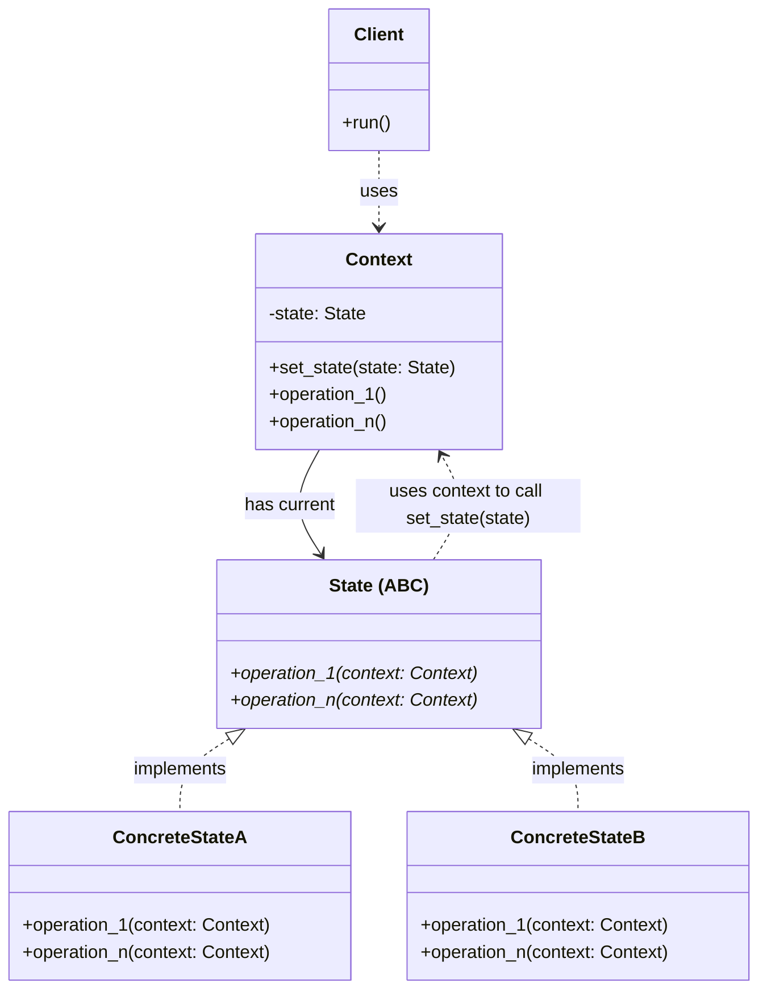
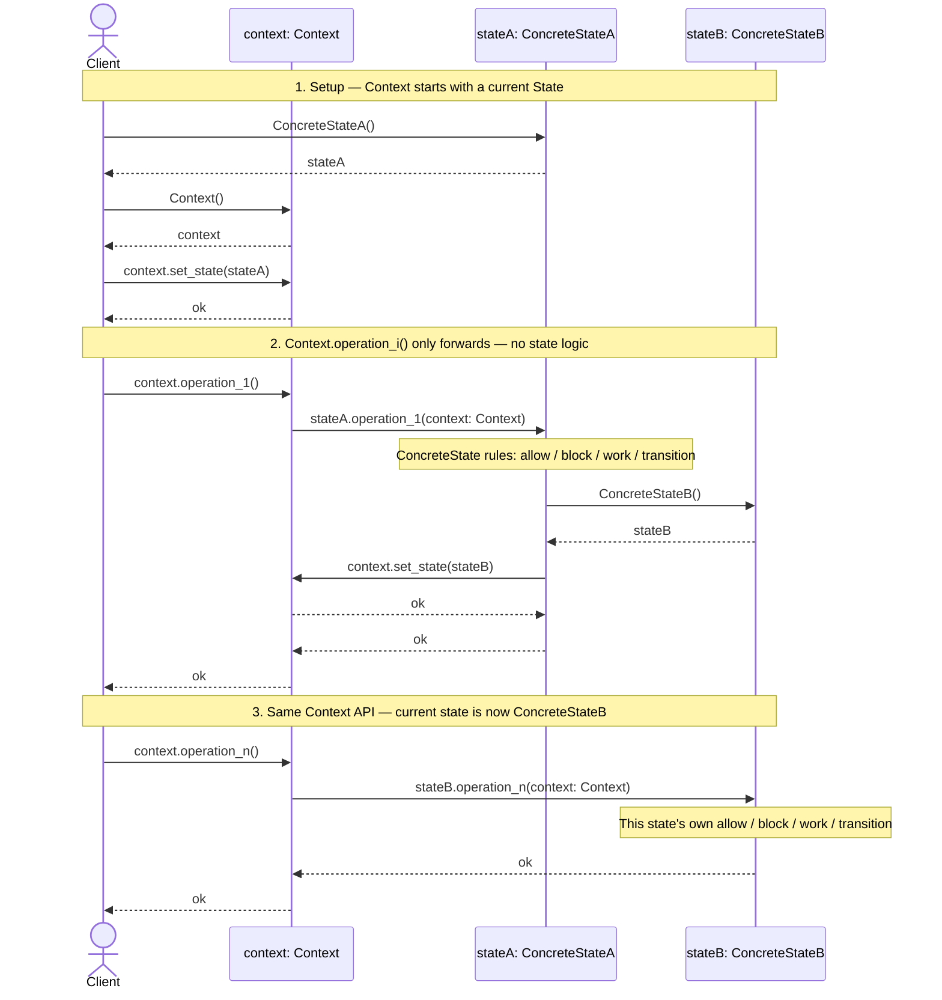

# State Design Pattern

## On this page

- [What is the State pattern?](#what-is-the-state-pattern)
- [Car analogy](#car-analogy)
- [When should you use it?](#when-should-you-use-it)
- [Class diagram](#class-diagram)
  - [How the State pattern works?](#how-the-state-pattern-works)
  - [Design](#design)
  - [Call path](#call-path)
- [Sequence diagram](#sequence-diagram)
- [Code example](#code-example)
- [Key idea](#key-idea)

## What is the State pattern?

State lets an object change behavior when its internal state changes. The same `start` / `accelerate` / `stop` calls do different things depending on whether the car is Off, Idle, or Driving.

**Category:** Behavioral POV

## Car analogy

A car reacts differently to the same controls in Off, Idle, and Driving.

## When should you use it?

Use it when an object has a few clear states and the same request should behave differently in each one.

## Class Diagram



<br/>

### How the State pattern works?

| Piece | Meaning |
|:------|:--------|
| **Resource / Context** | The object you control — it exposes several **operations** (in GoF terms, the **Context**). |
| **Modes / States** | That same resource has several **states** — e.g. Off, On, Running, Error. |
| **Actions / Operations** | Calls you make on the resource — e.g. `switch_on()` or `switch_off()` on a device. |
| **Rules** | In each state, an operation may be **allowed**, **blocked**, or **change** the state. Example: in **Off**, calling `switch_off()` again is blocked; in **On**, `switch_off()` does its work and then moves the device to **Off**. |

<br/>

### Design

1. Define a `Resource` class (GoF name: **Context**).
2. Declare every supported operation on that resource: `operation_1()` … `operation_n()`.
3. List every **state** (mode) the resource can be in.
4. For each identified state, add one **ConcreteState** class.
5. On each ConcreteState, define matching `operation_i(resource)` methods — the same operations as on Resource.
6. Add `Resource.set_state(state)` so the resource can switch its current state.
7. Inside each `ConcreteState.operation_i(...)`, write the step-by-step rules: **allow**, **block**, other work, and **transitions** (via `resource.set_state(...)`).
8. `Resource.operation_i()` must **not** contain state logic itself. It only calls `current_state.operation_i(self)`. All state-based behavior lives in `ConcreteState.operation_i()` — that is the decoupling.
9. Initialize the Resource with a **starting state** (this sets the current state instance of Resource instance).
10. Call operations on the Resource. Each call reaches `current_state.operation_i(self)`, so the current ConcreteState fully owns allow / block / transition for that operation.

<br/>

### Call path

`Client` → `Context.operation_i()` → `current_state.operation_i(context)` → ConcreteState applies allow / block / work → may call `context.set_state(...)`.

<br/>

## Sequence Diagram



<br/>

**Client** talks only to **Context**. `Context.operation_i()` just calls `current_state.operation_i(context)`. The **ConcreteState** decides allow / block / work and may call `context.set_state(...)`. The next `operation_i()` hits the new current state — same API, different rules.

<br/>

## Code example

```python
"""
State pattern demo. Run: python state_demo.py
"""

from abc import ABC, abstractmethod


# --- State ---

class CarState(ABC):
    @abstractmethod
    def start(self, car: "Car") -> None:
        pass

    @abstractmethod
    def accelerate(self, car: "Car") -> None:
        pass

    @abstractmethod
    def stop(self, car: "Car") -> None:
        pass


class OffState(CarState):
    def start(self, car: "Car") -> None:
        print("  [Car] Engine started (Off -> Idle)")
        car.set_state(IdleState())

    def accelerate(self, car: "Car") -> None:
        print("  [Car] Can't move - engine is off")

    def stop(self, car: "Car") -> None:
        print("  [Car] Already off")


class IdleState(CarState):
    def start(self, car: "Car") -> None:
        print("  [Car] Already running")

    def accelerate(self, car: "Car") -> None:
        print("  [Car] Moving (Idle -> Driving)")
        car.set_state(DrivingState())

    def stop(self, car: "Car") -> None:
        print("  [Car] Engine stopped (Idle -> Off)")
        car.set_state(OffState())


class DrivingState(CarState):
    def start(self, car: "Car") -> None:
        print("  [Car] Already driving")

    def accelerate(self, car: "Car") -> None:
        print("  [Car] Already moving")

    def stop(self, car: "Car") -> None:
        print("  [Car] Slowed to idle (Driving -> Idle)")
        car.set_state(IdleState())


# --- Context ---

class Car:
    def __init__(self) -> None:
        self._state: CarState = OffState()

    def set_state(self, state: CarState) -> None:
        self._state = state

    def start(self) -> None:
        self._state.start(self)

    def accelerate(self) -> None:
        self._state.accelerate(self)

    def stop(self) -> None:
        self._state.stop(self)


# --- Demo ---

def main() -> None:
    print("=== State: car power (Off / Idle / Driving) ===\n")

    car = Car()

    car.accelerate()   # ignored - still Off
    car.start()        # Off -> Idle
    car.accelerate()   # Idle -> Driving
    car.accelerate()   # already Driving
    car.stop()         # Driving -> Idle
    car.stop()         # Idle -> Off


if __name__ == "__main__":
    main()
```

**Output:**
```
=== State: car power (Off / Idle / Driving) ===

  [Car] Can't move - engine is off
  [Car] Engine started (Off -> Idle)
  [Car] Moving (Idle -> Driving)
  [Car] Already moving
  [Car] Slowed to idle (Driving -> Idle)
  [Car] Engine stopped (Idle -> Off)
```

Source: [`state_demo.py`](../code/2500_state/state_demo.py)

## Key idea

- Same methods on `Car`; each state class decides what happens and when to switch.
- Flow: **Off → Idle → Driving → Idle → Off**.
- Run the demo yourself: `python state_demo.py` inside `code/2500_state/`.

<br/>
<p>
    <span style="float: left;">
        <a href="2400_command.md">Previous: Command</a>
        &nbsp;
        <a href="2600_iterator.md">Next: Iterator</a>
    </span>
    <span style="float: right;">
        <a href="../../README.md">Home</a>
        &nbsp;|&nbsp;
        <a href="index.md">Back to Design Patterns Index</a>
    </span>
</p>
