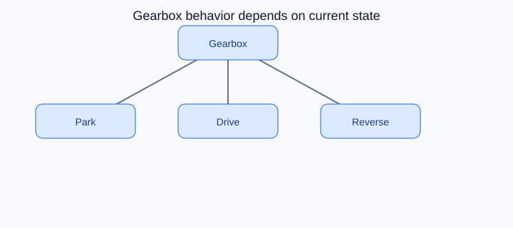

# State Design Pattern

## On this page

- [What is the State pattern?](#what-is-the-state-pattern)
- [Car analogy](#car-analogy)
- [When should you use it?](#when-should-you-use-it)
- [Code example](#code-example)
- [Key idea](#key-idea)

<p align="center">
    
</p>

<p align="center"><strong>Fig:</strong> Gearbox behavior depends on current state</p>

## What is the State pattern?

State lets an object change behavior when its internal state changes. An automatic gearbox acts differently in park, drive, and reverse.

**Category:** Behavioral POV

## Car analogy

Auto gear vehicles shift gear based on the vehicle's current state.

## When should you use it?

Use it when an object has many states and behavior changes with each state.

## Code example

```python
"""
State pattern demo: automatic gear shifts by vehicle state.

Run:
    python state_demo.py

Gear behavior changes as the car moves through park and drive states.
"""

from abc import ABC, abstractmethod


class GearState(ABC):
    @abstractmethod
    def shift_up(self, car: "AutomaticCar") -> None:
        pass

    @abstractmethod
    def shift_down(self, car: "AutomaticCar") -> None:
        pass

    @abstractmethod
    def label(self) -> str:
        pass


class ParkState(GearState):
    def label(self) -> str:
        return "P"

    def shift_up(self, car: "AutomaticCar") -> None:
        print("  [Gearbox] P -> D1")
        car.set_state(DriveState(1))

    def shift_down(self, car: "AutomaticCar") -> None:
        print("  [Gearbox] Already in park")


class DriveState(GearState):
    def __init__(self, gear: int) -> None:
        self._gear = gear

    def label(self) -> str:
        return f"D{self._gear}"

    def shift_up(self, car: "AutomaticCar") -> None:
        if self._gear < 6:
            self._gear += 1
            print(f"  [Gearbox] Upshift to D{self._gear}")
        else:
            print("  [Gearbox] Already in top gear")

    def shift_down(self, car: "AutomaticCar") -> None:
        if self._gear > 1:
            self._gear -= 1
            print(f"  [Gearbox] Downshift to D{self._gear}")
        else:
            print("  [Gearbox] D1 -> P")
            car.set_state(ParkState())


class AutomaticCar:
    def __init__(self) -> None:
        self._state: GearState = ParkState()

    def set_state(self, state: GearState) -> None:
        self._state = state

    def shift_up(self) -> None:
        self._state.shift_up(self)

    def shift_down(self) -> None:
        self._state.shift_down(self)

    def show_gear(self) -> None:
        print(f"Gear: {self._state.label()}")


def main() -> None:
    print("=== State: automatic gearbox ===\n")

    car = AutomaticCar()
    car.show_gear()
    car.shift_up()
    car.shift_up()
    car.shift_up()
    car.show_gear()
    car.shift_down()
    car.shift_down()
    car.show_gear()


if __name__ == "__main__":
    main()
```

**Output:**
```
=== State: automatic gearbox ===

Gear: P
  [Gearbox] P -> D1
  [Gearbox] Upshift to D2
  [Gearbox] Upshift to D3
Gear: D3
  [Gearbox] Downshift to D2
  [Gearbox] Downshift to D1
Gear: D1
```

Source: [`state_demo.py`](../code/2500_state/state_demo.py)

## Key idea

- The pattern solves a recurring design problem in a reusable way.
- In this example, the car analogy makes the roles of each class easy to remember.
- Run the demo yourself: `python state_demo.py` inside `code/2500_state/`.

<p align="right">
    <a href="2400_command.md">Previous: Command</a>
    <a href="2600_iterator.md">Next: Iterator</a>
</p>

<p align="right">
    <a href="index.md">Back to Design Patterns Index</a>
</p>
