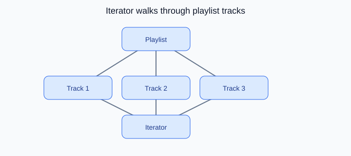

# Iterator Design Pattern

<p align="center">
    
</p>

<p align="center"><strong>Fig:</strong> Iterator walks through playlist tracks</p>

## What is the Iterator pattern?

Iterator walks through a collection without exposing its internal structure. Next and previous buttons move through a playlist one track at a time.

**Category:** Behavioral POV

## Car analogy

Cycle through music tracks or navigation waypoints.

## When should you use it?

Use it when clients should traverse a collection in a standard way.

## Code example

```python
"""
Iterator pattern demo: cycle through music tracks.

Run:
    python iterator_demo.py

The playlist exposes an iterator so the head unit walks tracks one by one.
"""

from abc import ABC, abstractmethod


class Iterator(ABC):
    @abstractmethod
    def has_next(self) -> bool:
        pass

    @abstractmethod
    def next_track(self) -> str:
        pass


class Playlist:
    def __init__(self, tracks: list[str]) -> None:
        self._tracks = tracks

    def create_iterator(self) -> Iterator:
        return _PlaylistIterator(self._tracks)


class _PlaylistIterator(Iterator):
    def __init__(self, tracks: list[str]) -> None:
        self._tracks = tracks
        self._index = 0

    def has_next(self) -> bool:
        return self._index < len(self._tracks)

    def next_track(self) -> str:
        track = self._tracks[self._index]
        self._index += 1
        return track


class HeadUnit:
    def play_all(self, playlist: Playlist) -> None:
        iterator = playlist.create_iterator()
        track_num = 1
        while iterator.has_next():
            track = iterator.next_track()
            print(f"  [{track_num}] Now playing: {track}")
            track_num += 1


def main() -> None:
    print("=== Iterator: music playlist ===\n")

    road_trip = Playlist(
        [
            "Highway Star - Deep Purple",
            "Life is a Highway - Tom Cochrane",
            "Radar Love - Golden Earring",
        ]
    )

    print("[HeadUnit] Starting playlist")
    HeadUnit().play_all(road_trip)
    print("[HeadUnit] Playlist finished")


if __name__ == "__main__":
    main()
```

**Output:**
```
=== Iterator: music playlist ===

[HeadUnit] Starting playlist
  [1] Now playing: Highway Star - Deep Purple
  [2] Now playing: Life is a Highway - Tom Cochrane
  [3] Now playing: Radar Love - Golden Earring
[HeadUnit] Playlist finished
```

Source: [`iterator_demo.py`](../code/2600_iterator/iterator_demo.py)

## Key idea

- The pattern solves a recurring design problem in a reusable way.
- In this example, the car analogy makes the roles of each class easy to remember.
- Run the demo yourself: `python iterator_demo.py` inside `code/2600_iterator/`.

<p align="right">
    <a href="2500_state.md">Previous: State</a>
    <a href="2700_interpreter.md">Next: Interpreter</a>
</p>
