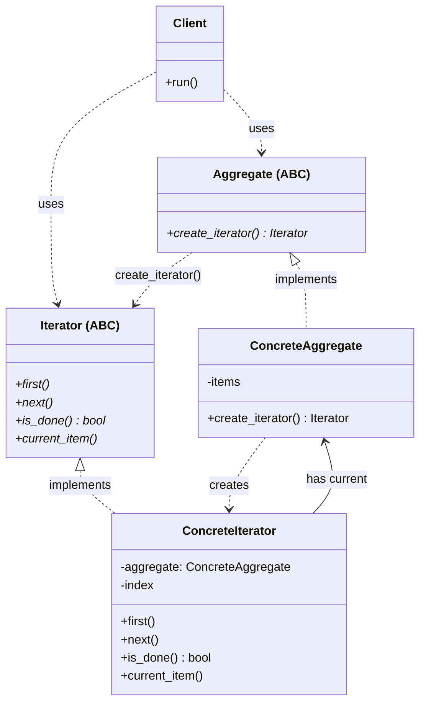
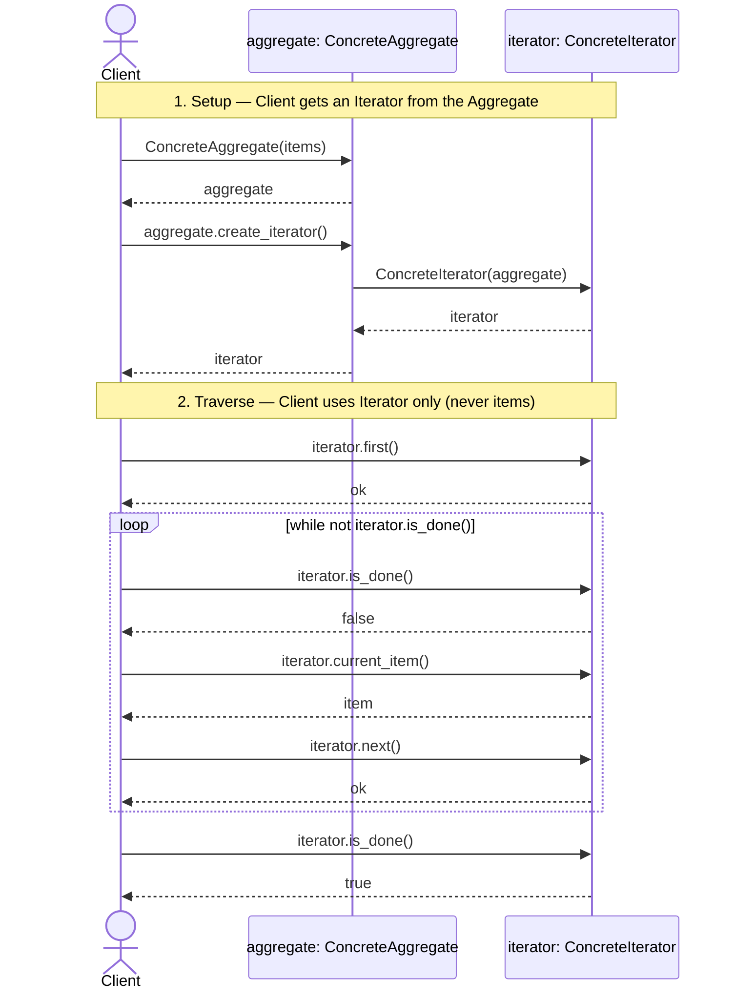

# Iterator Design Pattern

## On this page

- [What is the Iterator pattern?](#what-is-the-iterator-pattern)
- [Car analogy](#car-analogy)
- [When should you use it?](#when-should-you-use-it)
- [Class diagram](#class-diagram)
- [Sequence diagram](#sequence-diagram)
- [Code example](#code-example)
- [Key idea](#key-idea)

## What is the Iterator pattern?

Iterator walks through a collection without exposing its internal structure. Next and previous buttons move through a playlist one track at a time.

> **Note:** Do not confuse this design pattern with Python’s built-in **iterators** and **generators**. They share ideas (walk items one by one) but also differ in important ways. Python iterators/generators are a **language feature** — they do not have to follow GoF Iterator rules.

**Category:** Behavioral POV

## Car analogy

Cycle through music tracks or navigation waypoints.

## When should you use it?

Use it when clients should traverse a collection in a standard way.

## Class Diagram



<br/>

## Sequence Diagram



<br/>

**Client** asks the **Aggregate** for an **Iterator**, then walks with `first` / `is_done` / `current_item` / `next`. The collection’s internals stay hidden inside **ConcreteAggregate** / **ConcreteIterator**.

<br/>

## Code example

```python
"""
Iterator pattern demo. Run: python iterator_demo.py
"""

from abc import ABC, abstractmethod


# --- Iterator ---

class Iterator(ABC):
    """GoF Iterator: traverse without exposing the aggregate's structure."""

    @abstractmethod
    def first(self) -> None:
        pass

    @abstractmethod
    def next(self) -> None:
        pass

    @abstractmethod
    def is_done(self) -> bool:
        pass

    @abstractmethod
    def current_item(self) -> str:
        pass


class PlaylistIterator(Iterator):
    """GoF ConcreteIterator: holds position; knows Playlist internals."""

    def __init__(self, playlist: "Playlist") -> None:
        self._playlist = playlist
        self._index = 0

    def first(self) -> None:
        self._index = 0

    def next(self) -> None:
        self._index += 1

    def is_done(self) -> bool:
        return self._index >= len(self._playlist._tracks)

    def current_item(self) -> str:
        return self._playlist._tracks[self._index]


# --- Aggregate ---

class Aggregate(ABC):
    """GoF Aggregate: factory for an Iterator over this collection."""

    @abstractmethod
    def create_iterator(self) -> Iterator:
        pass


class Playlist(Aggregate):
    """GoF ConcreteAggregate: stores tracks; creates PlaylistIterator."""

    def __init__(self, tracks: list[str]) -> None:
        self._tracks = list(tracks)

    def create_iterator(self) -> Iterator:
        return PlaylistIterator(self)


# --- Client ---

class HeadUnit:
    """GoF Client: uses Aggregate + Iterator only — never reads _tracks."""

    def play_all(self, aggregate: Aggregate) -> None:
        iterator = aggregate.create_iterator()
        iterator.first()

        n = 1
        while not iterator.is_done():
            track = iterator.current_item()
            print(f"  [{n}] Now playing: {track}")
            n += 1
            iterator.next()


# --- Demo ---

def main() -> None:
    print("=== Iterator: music playlist ===\n")

    road_trip = Playlist(
        [
            "Highway Star - Deep Purple",
            "Life is a Highway - Tom Cochrane",
            "Radar Love - Golden Earring",
        ]
    )

    print("[Client] Starting playlist")
    HeadUnit().play_all(road_trip)
    print("[Client] Playlist finished")


if __name__ == "__main__":
    main()
```


**Output:**
```
=== Iterator: music playlist ===

[Client] Starting playlist
  [1] Now playing: Highway Star - Deep Purple
  [2] Now playing: Life is a Highway - Tom Cochrane
  [3] Now playing: Radar Love - Golden Earring
[Client] Playlist finished
```

Source: [`iterator_demo.py`](../code/2600_iterator/iterator_demo.py)

## Key idea

- **Client** never walks the collection’s internals — only `create_iterator()` then `first` / `current_item` / `next` / `is_done`.
- **ConcreteIterator** owns the traversal state; **ConcreteAggregate** owns the data.
- Run the demo yourself: `python iterator_demo.py` inside `code/2600_iterator/`.

<br/>
<p>
    <span style="float: left;">
        <a href="2500_state.md">Previous: State</a>
        &nbsp;
        <a href="2700_interpreter.md">Next: Interpreter</a>
    </span>
    <span style="float: right;">
        <a href="../../README.md">Home</a>
        &nbsp;|&nbsp;
        <a href="index.md">Back to Design Patterns Index</a>
    </span>
</p>
