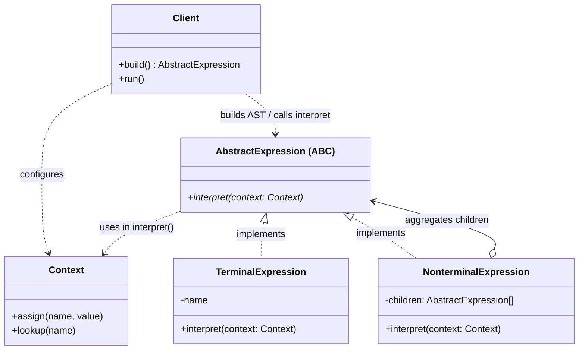
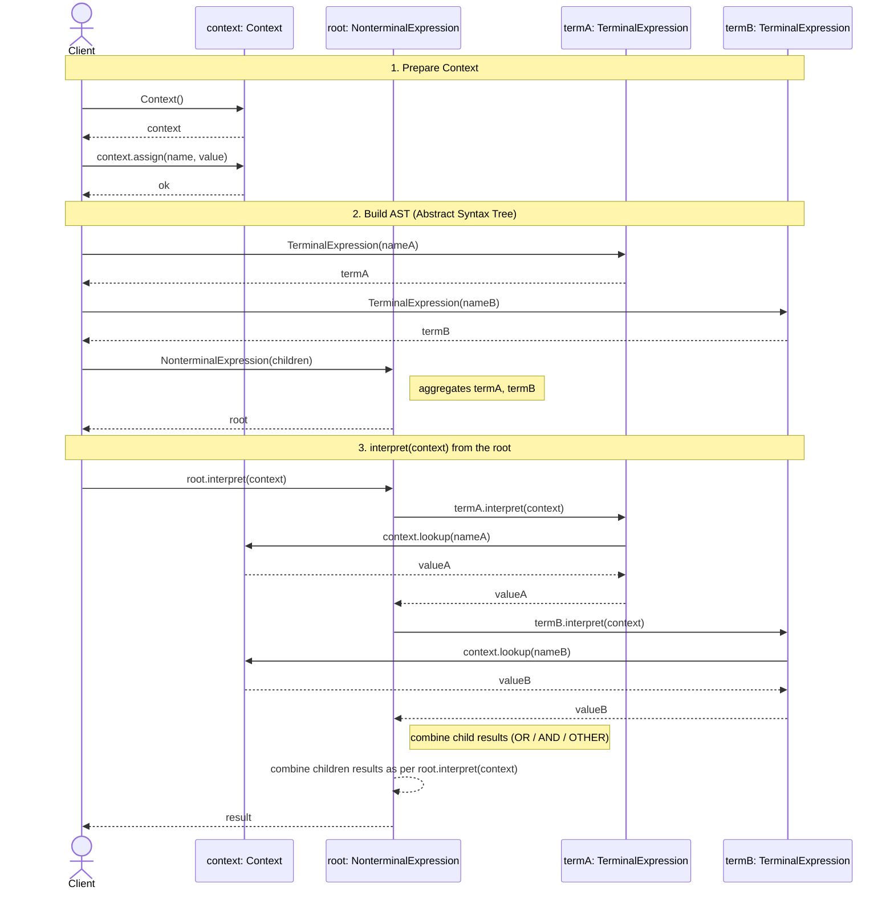

# Interpreter Design Pattern

## On this page

- [What is the Interpreter pattern?](#what-is-the-interpreter-pattern)
- [Car analogy](#car-analogy)
- [When should you use it?](#when-should-you-use-it)
- [Class diagram](#class-diagram)
- [Sequence diagram](#sequence-diagram)
- [Code example](#code-example)
  - [AST shape (aggregation)](#ast-shape-aggregation)
  - [GoF roles in this demo](#gof-roles-in-this-demo)
- [Key idea](#key-idea)

## What is the Interpreter pattern?

Interpreter evaluates sentences in a small language by walking an abstract syntax tree. Each grammar rule becomes an expression object that can `interpret(context)`.

**Category:** Behavioral POV

## Car analogy

Driving rules like **rain OR fog** and **rain AND night** decide assists (fog lamps, slow down).

## When should you use it?

Use it for simple rule languages, boolean/math expressions, or small DSLs — not for full programming languages.

## Class Diagram



<br/>

How to read the diagram (GoF Interpreter):

1. **Client** builds an AST (Abstract Syntax Tree) of **AbstractExpression** nodes and prepares **Context**.
2. **AbstractExpression** declares `interpret(context)`.
   - **TerminalExpression** is a leaf variable (e.g. `rain`) — looks up **Context**.
   - **NonterminalExpression** (**aggregation** `o--`) keeps a collection of child expressions and combines their `interpret` results (e.g. `OrExpression`, `AndExpression`).
3. Start at the root: `expression.interpret(context)`.

<br/>

## Sequence Diagram



<br/>

**Client** prepares **Context**, builds the AST (**NonterminalExpression** aggregating **TerminalExpression** children), then calls `root.interpret(context)`. The Nonterminal delegates to each child; each Terminal looks up **Context**; the Nonterminal combines the child results and returns.

<br/>

## Code example

Tiny boolean grammar: `<var>` | `<expr> OR <expr>` | `<expr> AND <expr>`

`OrExpression` / `AndExpression` are Nonterminals that **aggregate** child `AbstractExpression`s (`_children`).

```python
"""
Interpreter pattern demo. Run: python interpreter_demo.py
"""

from abc import ABC, abstractmethod


# --- Context ---

class Context:
    """GoF Context: global info used while interpreting (variable bindings)."""

    def __init__(self) -> None:
        self._bindings: dict[str, bool] = {}

    def assign(self, name: str, value: bool) -> None:
        self._bindings[name.lower()] = value

    def lookup(self, name: str) -> bool:
        return self._bindings.get(name.lower(), False)


# --- AbstractExpression ---

class AbstractExpression(ABC):
    """GoF AbstractExpression: interpret(context) for one grammar node."""

    @abstractmethod
    def interpret(self, context: Context) -> bool:
        pass


# --- TerminalExpression ---

class TerminalExpression(AbstractExpression):
    """GoF TerminalExpression: a variable / leaf (e.g. rain, fog, night)."""

    def __init__(self, name: str) -> None:
        self._name = name.lower()

    def interpret(self, context: Context) -> bool:
        return context.lookup(self._name)


# --- NonterminalExpression ---

class OrExpression(AbstractExpression):
    """
    GoF NonterminalExpression: aggregates child AbstractExpressions.
    Grammar: <expr> OR <expr> OR ...
    """

    def __init__(self, *children: AbstractExpression) -> None:
        self._children: list[AbstractExpression] = list(children)

    def interpret(self, context: Context) -> bool:
        return any(child.interpret(context) for child in self._children)


class AndExpression(AbstractExpression):
    """
    GoF NonterminalExpression: aggregates child AbstractExpressions.
    Grammar: <expr> AND <expr> AND ...
    """

    def __init__(self, *children: AbstractExpression) -> None:
        self._children: list[AbstractExpression] = list(children)

    def interpret(self, context: Context) -> bool:
        return all(child.interpret(context) for child in self._children)


# --- Client ---

class Client:
    """GoF Client: builds the AST, then calls interpret(context)."""

    def get_context_from_string(self, text: str) -> Context:
        """Split tokens like rain=true fog=false and build a Context."""
        context = Context()
        for token in text.split():
            name, raw_value = token.split("=", 1)
            context.assign(name, raw_value.lower() in ("true", "1", "yes"))
        return context

    def run(self, expression: AbstractExpression, context: Context) -> None:
        result = expression.interpret(context)
        print(f"    [Expression] Evaluates to {result}")


# --- Demo ---

def main() -> None:
    print("=== Interpreter: boolean driving rules ===\n")

    client = Client()

    # Same AST rules, different Context values → different results
    fog_lamps = OrExpression(
        TerminalExpression("rain"),
        TerminalExpression("fog"),
    )
    slow_down = AndExpression(
        TerminalExpression("rain"),
        TerminalExpression("night"),
    )

    print("--- Set 1: rain=true fog=false night=true ---")
    context1 = client.get_context_from_string("rain=true fog=false night=true")
    print("  FOG LAMP")
    client.run(fog_lamps, context1)
    print("  SLOW DOWN")
    client.run(slow_down, context1)

    print()
    print("--- Set 2: rain=false fog=false night=true ---")
    context2 = client.get_context_from_string("rain=false fog=false night=true")
    print("  FOG LAMP")
    client.run(fog_lamps, context2)
    print("  SLOW DOWN")
    client.run(slow_down, context2)


if __name__ == "__main__":
    main()
```

**Output:**
```
=== Interpreter: boolean driving rules ===

--- Set 1: rain=true fog=false night=true ---
  FOG LAMP
    [Expression] Evaluates to True
  SLOW DOWN
    [Expression] Evaluates to True

--- Set 2: rain=false fog=false night=true ---
  FOG LAMP
    [Expression] Evaluates to False
  SLOW DOWN
    [Expression] Evaluates to False
```

### AST shape (aggregation)

Two rules. Each Nonterminal **aggregates** Terminal children:

```text
FOG LAMP                         SLOW DOWN
────────                         ─────────

    OrExpression                   AndExpression
         |                              |
    +----+----+                    +----+----+
    |         |                    |         |
 Terminal  Terminal             Terminal  Terminal
 ("rain")  ("fog")              ("rain")  ("night")
```

Source: [`interpreter_demo.py`](../code/2700_interpreter/interpreter_demo.py)

### GoF roles in this demo

| Role | Class in demo | Responsibility |
|:-----|:--------------|:---------------|
| **Context** | `Context` | Holds boolean bindings (`rain`, `fog`, `night`) |
| **AbstractExpression** | `AbstractExpression` | Declares `interpret(context: Context) -> bool` — every node must answer True/False |
| **TerminalExpression** | `TerminalExpression` | `interpret(context: Context) -> bool` — look up variable `name` in `context` (e.g. is `rain` true?) |
| **NonterminalExpression** | `OrExpression`, `AndExpression` | `interpret(context: Context) -> bool` — call `child.interpret(context)` on each child, then combine with **OR** or **AND** |
| **Client** | `Client` | Builds the expression tree (AST) and calls `expression.interpret(context)` |

## Key idea

- Build the AST **once**; swap **Context** and the same rules yield different results.
- **NonterminalExpression** **aggregates** child `AbstractExpression`s (`_children`) and combines their results.
- **TerminalExpression** only looks up **Context**; it has no children.
- Run the demo yourself: `python interpreter_demo.py` inside `code/2700_interpreter/`.

<br/>
<p>
    <span style="float: left;">
        <a href="2600_iterator.md">Previous: Iterator</a>
        &nbsp;
        <a href="2800_chain_of_responsibility.md">Next: Chain of Responsibility</a>
    </span>
    <span style="float: right;">
        <a href="../../README.md">Home</a>
        &nbsp;|&nbsp;
        <a href="index.md">Back to Design Patterns Index</a>
    </span>
</p>
