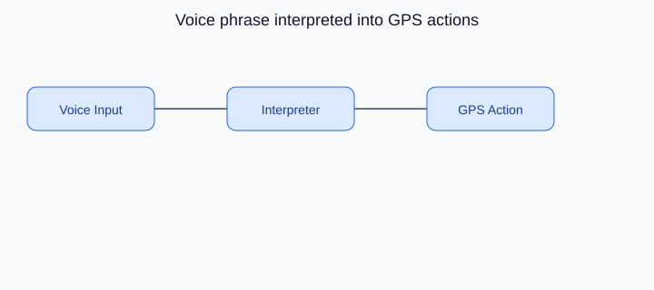

# Interpreter Design Pattern

## On this page

- [What is the Interpreter pattern?](#what-is-the-interpreter-pattern)
- [Car analogy](#car-analogy)
- [When should you use it?](#when-should-you-use-it)
- [Code example](#code-example)
- [Key idea](#key-idea)

<p align="center">
    
</p>

<p align="center"><strong>Fig:</strong> Voice phrase interpreted into GPS actions</p>

## What is the Interpreter pattern?

Interpreter evaluates sentences or expressions in a small language. A voice command is parsed into actions the navigation system understands.

**Category:** Behavioral POV

## Car analogy

Voice assistant interprets "Navigate to home" into GPS instructions.

## When should you use it?

Use it for simple rule languages, command parsers, or expression evaluators.

## Code example

```python
"""
Interpreter pattern demo: voice command to GPS instructions.

Run:
    python interpreter_demo.py

The voice assistant parses "navigate to home" into concrete navigation steps.
"""

from abc import ABC, abstractmethod


class Expression(ABC):
    @abstractmethod
    def interpret(self, context: dict[str, str]) -> str:
        pass


class DestinationExpression(Expression):
    def __init__(self, keyword: str) -> None:
        self._keyword = keyword.lower()

    def interpret(self, context: dict[str, str]) -> str:
        destination = context.get(self._keyword)
        if not destination:
            return f"Unknown destination: {self._keyword}"
        return destination


class NavigateCommand(Expression):
    def __init__(self, destination: Expression) -> None:
        self._destination = destination

    def interpret(self, context: dict[str, str]) -> str:
        address = self._destination.interpret(context)
        return (
            f"Set GPS route to {address}; "
            "enable turn-by-turn; estimate ETA from traffic"
        )


class VoiceAssistant:
    def __init__(self, context: dict[str, str]) -> None:
        self._context = context
        self._phrases: dict[str, Expression] = {
            "navigate to home": NavigateCommand(DestinationExpression("home")),
            "navigate to office": NavigateCommand(DestinationExpression("office")),
        }

    def listen(self, phrase: str) -> None:
        print(f'[Voice] Heard: "{phrase}"')
        command = self._phrases.get(phrase.lower())
        if not command:
            print("  [GPS] Sorry, I did not understand that command")
            return
        result = command.interpret(self._context)
        print(f"  [GPS] {result}")


def main() -> None:
    print("=== Interpreter: voice navigation ===\n")

    assistant = VoiceAssistant(
        {
            "home": "42 Maple Street, Springfield",
            "office": "Tech Park, Block C, Floor 5",
        }
    )

    assistant.listen("navigate to home")
    print()
    assistant.listen("navigate to office")
    print()
    assistant.listen("navigate to mars")


if __name__ == "__main__":
    main()
```

**Output:**
```
=== Interpreter: voice navigation ===

[Voice] Heard: "navigate to home"
  [GPS] Set GPS route to 42 Maple Street, Springfield; enable turn-by-turn; estimate ETA from traffic

[Voice] Heard: "navigate to office"
  [GPS] Set GPS route to Tech Park, Block C, Floor 5; enable turn-by-turn; estimate ETA from traffic

[Voice] Heard: "navigate to mars"
  [GPS] Sorry, I did not understand that command
```

Source: [`interpreter_demo.py`](../code/2700_interpreter/interpreter_demo.py)

## Key idea

- The pattern solves a recurring design problem in a reusable way.
- In this example, the car analogy makes the roles of each class easy to remember.
- Run the demo yourself: `python interpreter_demo.py` inside `code/2700_interpreter/`.

<p align="right">
    <a href="2600_iterator.md">Previous: Iterator</a>
    <a href="2800_chain_of_responsibility.md">Next: Chain of Responsibility</a>
</p>

<p align="right">
    <a href="index.md">Back to Design Patterns Index</a>
</p>
