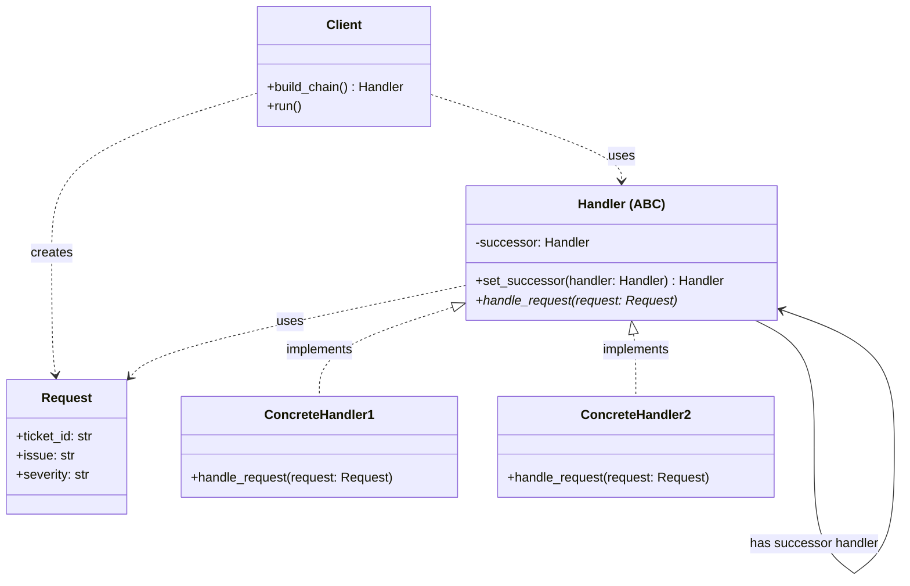
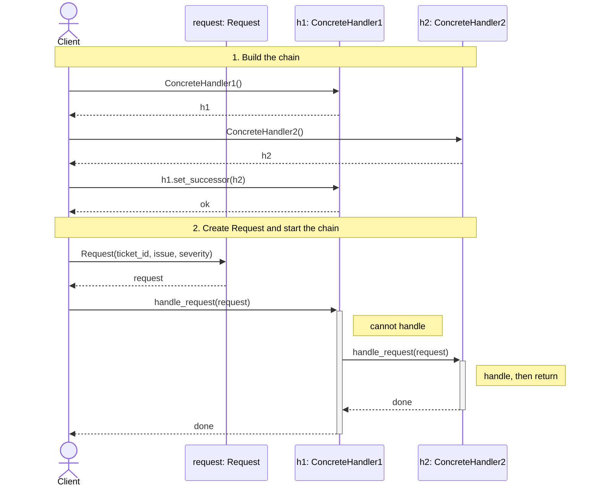

# Chain of Responsibility Design Pattern

## On this page

- [What is the Chain of Responsibility pattern?](#what-is-the-chain-of-responsibility-pattern)
- [Car analogy](#car-analogy)
- [When should you use it?](#when-should-you-use-it)
- [Class diagram](#class-diagram)
- [Sequence diagram](#sequence-diagram)
- [Code example](#code-example)
- [Key idea](#key-idea)

## What is the Chain of Responsibility pattern?

Chain of Responsibility passes a request along a chain until someone handles it. A service ticket may go through basic, specialist, and manager counters.

**Category:** Behavioral POV

## Car analogy

A service request passes through different service counters until one handles it.

## When should you use it?

Use it when more than one handler might process a request and the sender should not know which one will.

## Class Diagram



<br/>

How to read the diagram (GoF Chain of Responsibility):

1. A set of handlers and their sequence is defined first.
2. Then the Request / ticket is passed to the first Handler.
3. That Handler either processes it or transfers the ticket to the next handler.
4. Handle / skip / transfer decisions can change dynamically from ticket values or the current system status.

<br/>

## Sequence Diagram



<br/>

**Client** builds the chain, creates one **Request**, and calls `handle_request(request)` on the head. The same Request object moves along successors until a handler processes it and returns.

<br/>

## Code example

```python
"""
Chain of Responsibility pattern demo. Run: python chain_of_responsibility_demo.py
"""

from abc import ABC
from dataclasses import dataclass


# --- Request ---

@dataclass
class Request:
    """The request passed along the chain."""

    ticket_id: str
    issue: str
    severity: str


# --- Handler ---

class Handler(ABC):
    """GoF Handler: defines handle_request and maintains the successor link."""

    def __init__(self) -> None:
        self._successor: Handler | None = None

    def set_successor(self, successor: "Handler") -> "Handler":
        self._successor = successor
        return successor

    def handle_request(self, request: Request) -> None:
        """Default: do not handle here — forward to successor (if any)."""
        if self._successor is not None:
            self._successor.handle_request(request)
        else:
            print(f"  [Handler] Unhandled request {request.ticket_id}")


# --- ConcreteHandler ---

class ConcreteHandler1(Handler):
    """GoF ConcreteHandler: Quick Service — handles minor requests."""

    def handle_request(self, request: Request) -> None:
        if request.severity == "minor":
            # Handle the request, then return (stop the chain).
            print(f"  [Quick Service] Fixed {request.issue} ({request.ticket_id})")
            return
        # Cannot handle — forward to successor.
        print(f"  [Quick Service] Escalating {request.ticket_id}")
        super().handle_request(request)


class ConcreteHandler2(Handler):
    """GoF ConcreteHandler: Workshop — handles moderate requests."""

    def handle_request(self, request: Request) -> None:
        if request.severity == "moderate":
            # Handle the request, then return (stop the chain).
            print(f"  [Workshop] Scheduled {request.issue} ({request.ticket_id})")
            return
        # Cannot handle — forward to successor.
        print(f"  [Workshop] Escalating {request.ticket_id}")
        super().handle_request(request)


class ConcreteHandler3(Handler):
    """GoF ConcreteHandler: Manufacturer — handles critical requests."""

    def handle_request(self, request: Request) -> None:
        if request.severity == "critical":
            # Handle the request, then return (stop the chain).
            print(f"  [Manufacturer] Warranty claim for {request.issue}")
            return
        # Cannot handle — forward to successor.
        print(f"  [Manufacturer] Escalating {request.ticket_id}")
        super().handle_request(request)


# --- Client ---

class Client:
    """GoF Client: builds the chain and initiates the request."""

    def build_chain(self) -> Handler:
        handler1 = ConcreteHandler1()
        handler2 = ConcreteHandler2()
        handler3 = ConcreteHandler3()
        handler1.set_successor(handler2).set_successor(handler3)
        return handler1

    def run(self, handler: Handler, request: Request) -> None:
        print(f"[Client] {request.ticket_id}: {request.issue} ({request.severity})")
        handler.handle_request(request)


# --- Demo ---

def main() -> None:
    print("=== Chain of Responsibility: service counters ===\n")

    client = Client()
    chain = client.build_chain()

    requests = [
        Request("SR-101", "tyre pressure low", "minor"),
        Request("SR-102", "brake pad wear", "moderate"),
        Request("SR-103", "engine control fault", "critical"),
    ]

    for request in requests:
        client.run(chain, request)
        print()


if __name__ == "__main__":
    main()
```

**Output:**
```
=== Chain of Responsibility: service counters ===

[Client] SR-101: tyre pressure low (minor)
  [Quick Service] Fixed tyre pressure low (SR-101)

[Client] SR-102: brake pad wear (moderate)
  [Quick Service] Escalating SR-102
  [Workshop] Scheduled brake pad wear (SR-102)

[Client] SR-103: engine control fault (critical)
  [Quick Service] Escalating SR-103
  [Workshop] Escalating SR-103
  [Manufacturer] Warranty claim for engine control fault
```

Source: [`chain_of_responsibility_demo.py`](../code/2800_chain_of_responsibility/chain_of_responsibility_demo.py)

### GoF roles in this demo

| Role | Class in demo | Responsibility |
|:-----|:--------------|:---------------|
| **Handler** | `Handler` | `set_successor` + default `handle_request` (forward) |
| **ConcreteHandler** | `ConcreteHandler1` / `2` / `3` | Handle if responsible; else call `super().handle_request` |
| **Client** | `Client` | Build the chain; send `handle_request` to the first handler |
| **Request** | `Request` | The object passed along the chain |

## Key idea

- **Client** does not know which handler will process the request — only the chain head.
- Each **ConcreteHandler** either handles or forwards via the **Handler** successor link.
- Run the demo yourself: `python chain_of_responsibility_demo.py` inside `code/2800_chain_of_responsibility/`.

<br/>
<p>
    <span style="float: left;">
        <a href="2700_interpreter.md">Previous: Interpreter</a>
        &nbsp;
        <a href="9000_summary_design_patterns.md">Next: Summary</a>
    </span>
    <span style="float: right;">
        <a href="../../README.md">Home</a>
        &nbsp;|&nbsp;
        <a href="index.md">Back to Design Patterns Index</a>
    </span>
</p>
