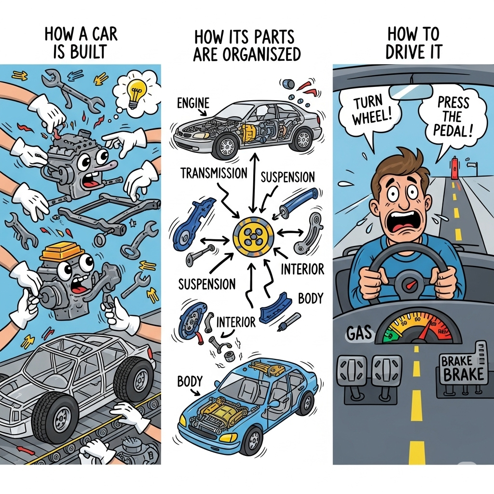

# Different types of Design Patterns

Here onwards, as I previously stated, lets call it as `Design Patterns From Different Point Of View` (or POV) instead of **Different Types of Design Patterns**

    

## 🔧 1. Creational POV  
**_"How the car is built"_**  
These patterns deal with object creation mechanisms, aiming to make the process more flexible and reusable.

| Pattern             | Car Analogy                                                                 |
|---------------------|------------------------------------------------------------------------------|
| [**Singleton**](#)           | Only one engine control unit (ECU) exists—shared across the system.         |
| [**Prototype**](#)           | Clone and update an existing car design to make a new car design.           |
| [**Factory Method**](#)      | A car factory decides which model to produce based on order type.           |
| [**Abstract Factory**](#)    | A manufacturer decides which factory to use based on a bulk order.          |
| [**Builder**](#)             | Build a car step-by-step: chassis fitting, engine fitting, electric work, paint. |

## 🧩 2. Structural POV  
**_"How the spare parts are organized"_**  
These patterns focus on how classes and objects are composed to form larger structures.

| Pattern             | Car Analogy                                                                 |
|---------------------|------------------------------------------------------------------------------|
| [**Adapter**](#)            | Like an adapter between an Indian plug and a European socket.             |
| [**Composite**](#)          | Repeating object structure like a tree (e.g., folder/file structure).     |
| [**Proxy**](#)              | A remote system that simulates interaction with the real system.          |
| [**Facade**](#)             | Auto-park feature encapsulates complex subsystems into one interface.     |
| [**Bridge**](#)             | Decouples engine from chassis so they can vary independently.             |
| [**Decorator**](#)          | Wraps a real object to change "access behavior" without altering the object.|

## 🏁 3. Behavioral POV  
**_"How the car behaves while driving and what changes its behaviour"_**  
These patterns manage algorithms, relationships, and responsibilities between objects.

| Pattern                   | Car Analogy                                                                 |
|---------------------------|------------------------------------------------------------------------------|
| [**Template Method**](#)         | Think of a car's overall design as a template—its 'rear design' is a customizable template method. Hatchbacks and sedans implement this method differently, altering the car's behavior. |
| [**Observer**](#)                | Sensors notify the dashboard when engine temperature increases.         |
| [**Strategy**](#)                | Choose between eco, sport, or comfort driving modes while driving.      |
| [**Command**](#)                 | Pressing a (solid) button sends a command to start the engine.          |
| [**State**](#)                   | Auto gear vehicles shifts gear based on the vehicle’s current state.    |
| [**Iterator**](#)                | Cycle through music tracks or navigation waypoints.                     |
| [**Interpreter**](#)             | Voice assistant interprets “Navigate to home” into GPS instructions.    |
| [**Chain of Responsibility**](#) | A service request passes through different service counters until one (or more) handles it. |
