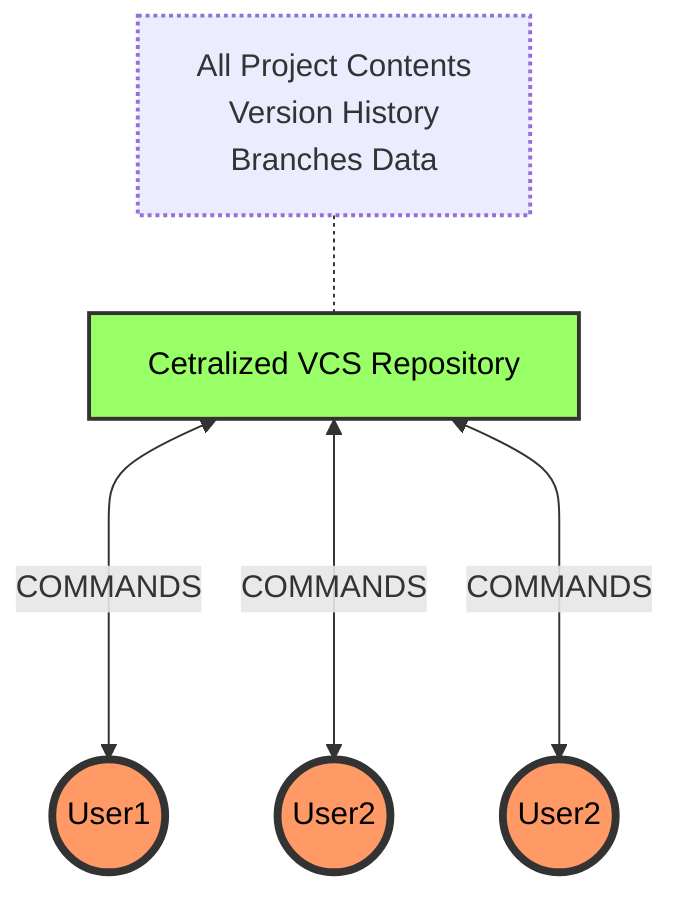

# 🗄️ Centralized Version Control System (eg: subversion)

**Fig:** Cenralized Version Control System

A **Centralized VCS** stores all `project files, history, and branches` in a single central server.

First, users connect to the central server to:

- Access the latest version (or any specific version)
- Download the project to their computer

> **Note:** All history and branch details remain stored on the server — not on the user's machine.

# 🌐 Distributed Version Control System (eg: git)

  

**Fig:** Distributed Version Control System

In a **Distributed Version Control System (DVCS)** like Git, data is stored in a distributed manner, you can store same data in multiple server repository. Also, it allows client to pull complete copy of the repository—including all files, version history, and commit metadata.

- Since client get the entire history, client can go back to any previous versions without connecting to the server.
- Git supports multiple remote servers, allowing developers to push and pull from different sources.

> - A **Git server** is simply a machine that allows **Git clients** to fetch and push changes.  
> - There’s no fundamental difference between a Git server and a Git client—both run the same Git software.  
> - By default, installing Git provides client-side tools. However, you can configure a machine with server capabilities (e.g., via SSH access and repository permissions) to act as a Git server.
