# 🗄️ Architecture of Distributed VCS

```mermaid
%%{
  init: {
    "architecture-beta": {
      "width": 500
    }
  }
}%%
architecture-beta
    group repo1(server)[REPOSITORY]

    service cmd1(client)[Commands] in repo1
    service trp1(internet)[Transport] in repo1
    service stg1(disk)[Objects Refs History] in repo1
    service idx1(database)[Index] in repo1

    cmd1:T -- B:trp1
    cmd1:T -- B:stg1
    cmd1:T -- B:idx1
```

**Fig:** Architecture diagram of different layers in a git repository

The above diagram shows a very high level architectural diagram of a single repository of a distributed version control system (git).

It contains following layers:
 - Commands: This layer responsible for interpreting the user commands (for eg, git pull, git push, etc).

 - Transport: This layer facilitates communication between the client and the server.
    - The client is the machine initiating operations like fetching or pushing changes, while the server is the remote repository that receives and processes these requests.
    - Git’s transport layer supports multiple protocols, including ssh://, https://, git://, and file://, to handle the requests.
    - A standard Git installation typically includes only the client-side tools, which allow interaction with remote servers such as GitHub, GitLab, Bitbucket, or in-house configured Git servers.
    - That means, other users (from other machines) cannot push changes to your local repository or pull updates from it unless you explicitly configure it to act as a server.
    - However, Git does allow you to configure a repository with server capabilities. Once set up, others can:
        - Clone your repository
        - Fetch updates
        - Push their changes to your repository

 - Objects Refs History: This is a core internal layer in Git that manage file storage, version history, and branch tracking.
 
 - Index: The `index` is Git’s `staging area`—a middle layer between your `working directory` and the `repository`.
    - You can safely move your current changes in `working directory` to `Index` before moving them into `repository`
    - Also, you can remove contents from `index` if required
    - When you are doing a commit, what ever files/dirs available in `index` are actually moved to `repository`
    - Contents in `index` are managed by an index file
    - All operations relared to Index is managed by `Index Layer`