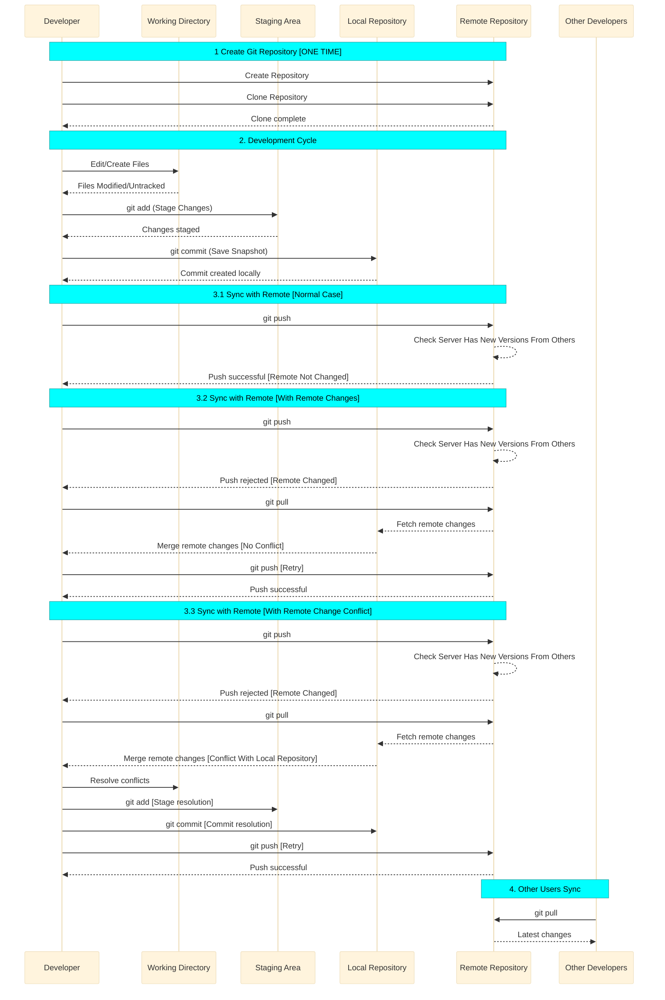

# 🔄 Git Operations Life Cycle

The Git life cycle describes how code changes move through different stages — from writing code to sharing it with others. Here's a simple breakdown:


## 1. 🛠️ Create a Git Repository [Local + Remote]
```code
1. Create a remote repository
2. Clone the created repo into local
```

A **Git repository** is simply your project directory with some extra **Git-related files and folders** inside it, that are added by Git.

- These files are created when you run Git commands to initialize a repository.
- Git uses them to track changes, manage branches, and store version history.
- A directory is recognized as a **Git repository** by verifying the presence of these special files/dirs (like the `.git` folder).

This is the **first step** in using Git and is typically a **one-time setup**.  
You create the repository using the appropriate Git commands.

The repo creation can be achieved as below:
 1. Create a repository directly in **Git server**
 2. clone it in to **client**.

## 2. 💻 Development Cycle

```code
1. Modifying working directory
2. Stage the changes
3. Commit the changes
```

During the standard development workflow, developers **modify their files, stage the changes, and commit them to the repository**. Let's explore each step in detail.

### 📝 Modifying Working Directory
Once the repository in cloned into client, Git know:
 1. what are the files and folders in the repo
 2. what are the contents of the repo
 3. who edited existing contents
 4. complete version history of the project.
 Git know these information through the **Git-related special files and folders** inside the repository.
**Git-related special files and folders** keep track of files and its contents (edit history of each versions. ie, latest version to first version).

Later, the files inside the repository will be edited (also new files will be added) by the users as the project is progressing.

- Status of the files in **working directory** can be categorized as:
  - **Untracked** (new files added and Git doesn’t know them yet)
  - **Tracked and _not Modified_** (existing files in current version of repo _that have **not** been changed_)
  - **Tracked and _Modified_** (existing files in current version of repo _that have been changed_ when comparing with last pulled/fetched/cloned version)

### ➕ Adding to the Staging Area (Index)

Before you commit changes in Git, you need to **stage** them first.

- Staging is like a **preview** of what will be included in your next commit.
- You can **add** or **remove** files from the staging area as needed.

Git uses a special file called the **index** to manage staging.

- When you add a modified to staging, Git records the file’s details in the index file.
- If you remove a file from staging, Git deletes its entry from the index file.
- Git checks the index file to know which files are currently staged and ready to be committed.

### ✅ Commit to Local Repository

Once your changes are staged, you can **commit** them to your local Git repository.

Here’s what happens during a commit:

- Git looks at all the files in the **staging area** (tracked in the index file).
- It creates a **new snapshot** of the project by combining:
  - All staged files +
  - All other unchanged files from the previous version
- This snapshot becomes a **new latest version** of your project.

> [!TIP]
> Commits are saved **locally** and become part of your project's version history.

## 3. ⬆️ Sync with Remote
```code
1. Push your changes into remote
2. Pull the changes done by other developers
3. Fix the conflicts
```

After you commit changes locally, you need to **push** them to the remote Git server.

- A **commit** creates a new version of your project in your local repository.
- You can make many commits locally, but the server **won’t know** about them until you push.
- When you push, Git sends all of your new commits to the server.
- The server adds these commits to its own version history, one by one.
- Other users can then **pull** your changes into their own local repositories.

### 🔄 Syncing with Remote: Normal Case + With Remote Changes + Conflict
If someone else has already pushed their changes to the server before you, Git may require you to **pull** their updates first (before **pushing** your changes). Git can compare your's and server's version history and can identify that some versions are missing in your version history. In that situation, server can conclude that somebody else pushed some changes before you.

- Then you have to pull and merge their changes into your local repository, before **pushing** your changes.
- This ensures your _local version history_ includes all recent commits from the server.
  - If both you and the other person changed the same file, Git may raise a **merge conflict**.
  - You’ll need to manually fix the conflict and commit a new resolved version.
- Only after this, you can **push** your updated commits to the server.
- Git will then accept your **push** because your local history containing all server-side commits.
- Your new commits will then be added **sequentially** to the server’s repository.

## 🔁 Summary Flow

```text
1. Setup servers and clients  # [One Time activity]
2. Create Repo → Clone Repo   # [One Time activity]
3. Edit Code → Stage Changes → Commit → "Push To Server" => Repeat

**"Push To Server" may contain following steps:** Pull From Server → "Merge + Conflict Resolution" → Push
```

These concepts will be explored in greater detail in subsequent sessions. But Finally, let me plot the entire flows in a sequence diagram below:


**Fig:** Git operations lifecycle sequence diagram